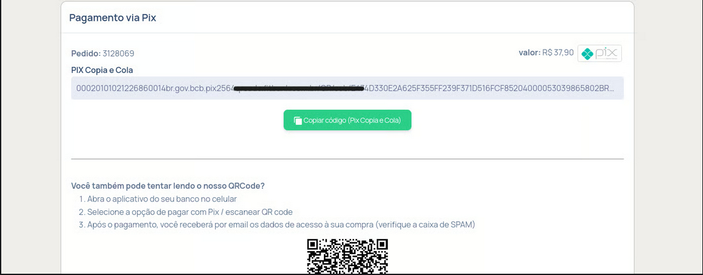
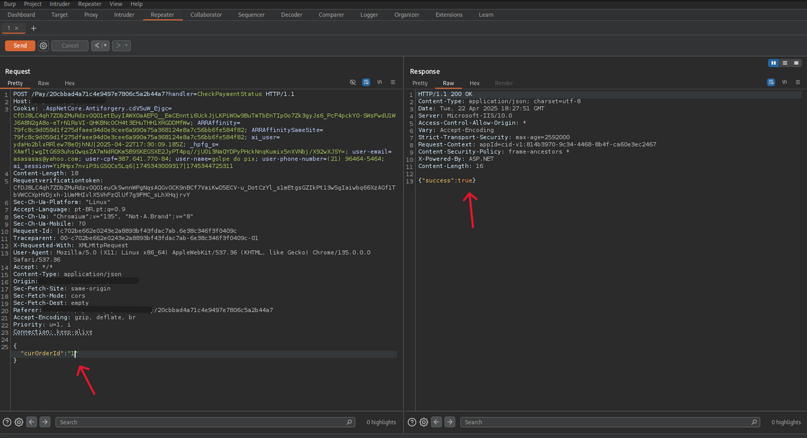
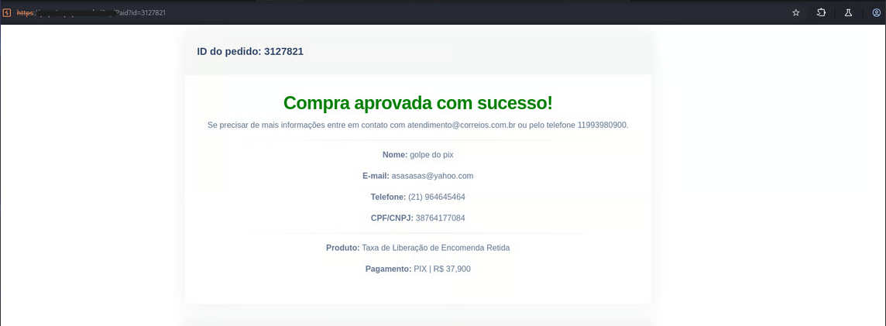
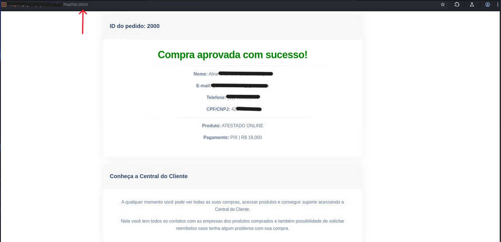
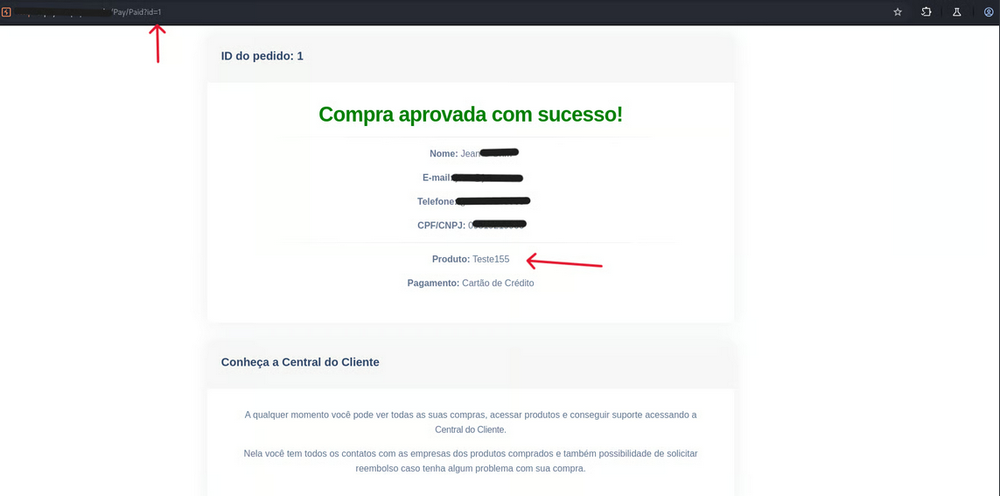

## Threat Context

Recently, one of our security analysts identified a critical **IDOR (Insecure Direct Object Reference)** vulnerability in a payment intermediary platform.

The discovery occurred during an active investigation into a scam involving fake delivery notifications from **Correios** (Brazilian Postal Service). This report details the fraud scenario, the technical investigation process, and the security risks uncovered. The flaw is severe and has likely been exploited for large-scale financial fraud.

> **Impact:** The vulnerability allows for the enumeration of transactions and the falsification of payment status, bypassing financial transfers entirely.

---

## 1. Anatomy of the Scam

The attack begins with a standard phishing vector but relies on a legitimate infrastructure for the financial transaction.


1.  **The Lure:** Fraudulent emails claiming a package delivery is pending due to unpaid customs fees or registration issues.
2.  **Data Harvesting:** Clicking the link redirects the victim to a fake page requesting:
    *   Full Name
    *   Government ID (CPF)
    *   Phone Number
    *   Email
3.  **The Pivot:** The user is then redirected to a page generating a **PIX QR Code**. Crucially, this page was hosted on the **legitimate domain** of a payment gateway company, lending credibility to the scam.

---

## 2. Technical Investigation

Using interception proxies (**Burp Suite**), our analyst inspected the requests generated by the payment page. The backend logic revealed a critical lack of authorization checks.

### The Logic Flaw
The system used `POST` requests to validate the payment status based solely on a sequential numeric ID (`transaction_id`).

```http
POST /api/validate-payment HTTP/1.1
Host: payment-gateway.target
Content-Type: application/json

{
  "id": 12345
}
```

By changing this ID to a low arbitrary value (e.g., `id=1`), the API returned `success:true`. This effectively marked the transaction as paid on the frontend interface without any actual banking confirmation.

### IDOR & Data Leakage

Beyond payment spoofing, manipulating the ID parameter in the receipt URL allowed access to previous transactions from other victims. This exposed sensitive PII (Personally Identifiable Information) of third parties without authentication, a direct violation of data protection laws (LGPD).






---

## 3. Vulnerability Summary

- **Endpoint Exposure:** `/Pay/Paid` accessible without proper authentication/authorization.
- **IDOR:** Trivial enumeration of third-party data via ID parameter manipulation.
- **Data Leakage:** Exposure of PII (Names, CPFs, Emails).
- **Fraud Scaling:** The lack of validation allows attackers to automate the "success" status for thousands of fake transactions.

---

## 4. OSINT Discoveries

Expanding the scope, we located a public staging instance of the platform hosted on Azure. This environment was indexed by Google, exposing development logs and potentially unpatched code to the open internet—a significant operational security failure.

---

## 5. Real World Impact

Subsequent OSINT research revealed that the payment company is cited in numerous public complaints. Many victims report falling for scams using this specific gateway infrastructure, with most stating they never received refunds.

---

## 6. Conclusion

This case demonstrates how a "simple" technical flaw like an IDOR can power complex, high-reach fraud operations. The absence of basic access controls in payment systems not only exposes users to financial loss but also compromises the integrity of the entire fintech ecosystem.