## Executive Summary

During the analysis of a sample distributed as a supposed "mod menu"/cheat for Counter-Strike 2, we identified a fully functional ransomware, written in C#, with complete routines for: 

*   AES+RSA Encryption
*   Destruction of Shadow Copies
*   Persistence via multiple vectors
*   Propagation via removable media
*   Wallpaper alteration
*   Ransom note (`read_it.txt`)
*   Use of a fixed, embedded RSA public key

The sample is simple, amateurish, and direct—the kind of malware that didn't get 5 minutes of QA but gained traction among users searching for CS2 hacks on Google.

And yes, it targets the Brazilian audience: the ransom message demands 200 reais via PIX.

## Infection Vector: The CS2 "Cheat"

The distribution follows the classic "free mod/hack download" scam. Nothing new, but always effective:

1.  Victim searches for "cheat/esp/aimbot CS2".
2.  Downloads the executable `cS2 m0d mEnU.exe`.
3.  Upon opening, there is no actual cheat.
4.  The ransomware immediately executes its persistence and encryption chain.

This social engineering works because it targets users who are:
*   Desperate for an advantage.
*   Technically inexperienced.
*   Willing to open unknown executables without hesitation.

The old "hack" as bait formula is still alive.

## Detailed Technical Analysis

The sample is a PE32 executable (.NET / Mono) containing all the routines of a common ransomware. The main structure is concentrated in the class: `ConsoleApplication7.Program`

Below, we break down the core components.

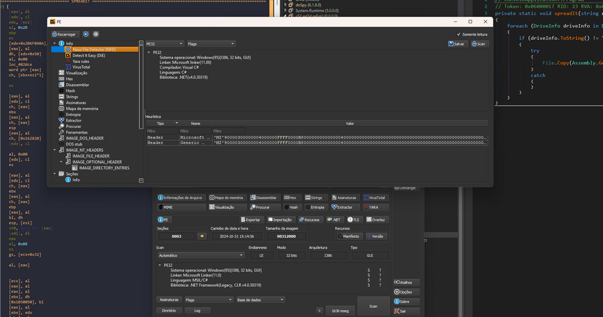

### 1. Persistence and Initial Execution

The malware uses multiple, redundant, and aggressive persistence mechanisms:

*   **`copyRoaming()` / `copyResistForAdmin()`**
    Copies itself to:
    `%AppData%\svchost.exe`

    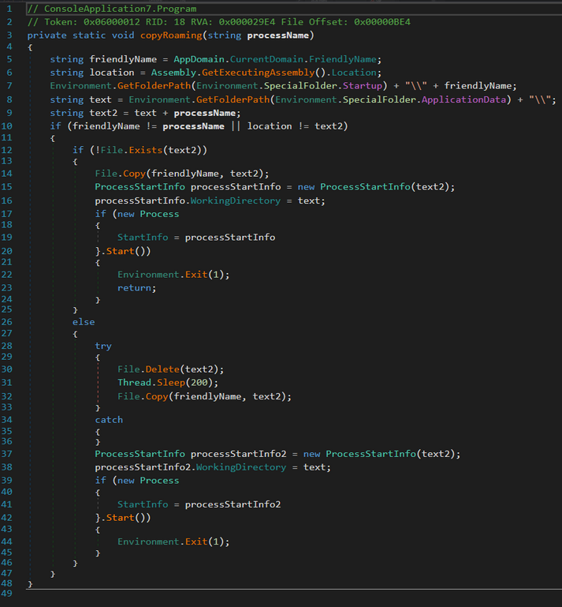

    The old masquerading trick to appear legitimate, found in many common ransomware builders.

*   **`addLinkToStartup()`**
    Creates a `.url` file in the Windows startup directory.

    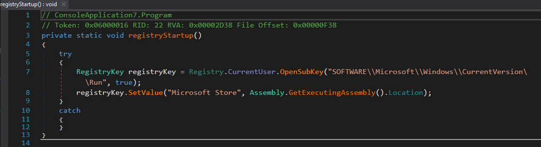

*   **`registryStartup()`**
    Creates persistence in:
    `HKCU\Software\Microsoft\Windows\CurrentVersion\Run`

### 2. Detection of Active Instance

The `AlreadyRunning()` method implements a simple mutex to prevent multiple simultaneous executions. Nothing sophisticated, but functional.

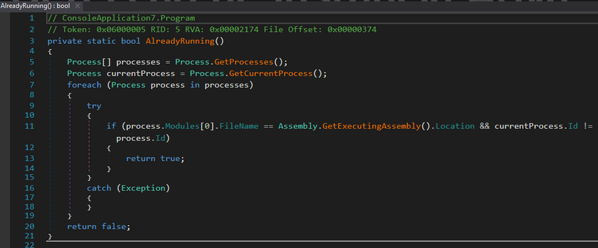

### 3. File Encryption (AES + RSA)

The ransomware's most important operation is in the method: `AES_Encrypt()`

It uses:
*   AES-256 CBC
*   `Rfc2898DeriveBytes` with PBKDF2-HMAC-SHA1
*   Fixed Salt: `[1,2,3,4,5,6,7,8]`
*   1000 iterations (extremely low)
*   Key and IV derived from the same KDF → deterministic IV based on password

A classic error: a fixed salt and low iteration count aid directed attacks if the AES password can be inferred or guessed.

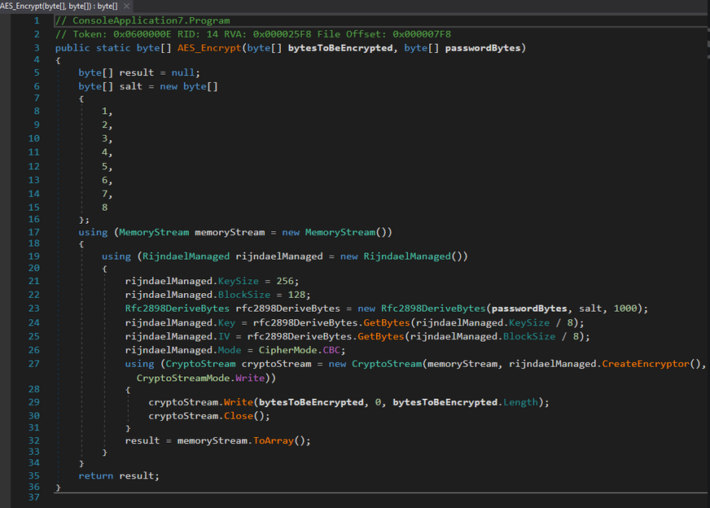

### 4. Protection of the AES Password with RSA (1024 bits)

The AES password is protected by the method: `RSAEncrypt()`

*   Uses `RSACryptoServiceProvider(1024)`
*   Mode `Encrypt(..., true)` → OAEP (SHA1)
*   The public key comes from:
    `rsaKey()`
    Which contains only:
    *   `<Exponent>AQAB</Exponent>` (65537)
    *   `<Modulus>` hardcoded in the binary

    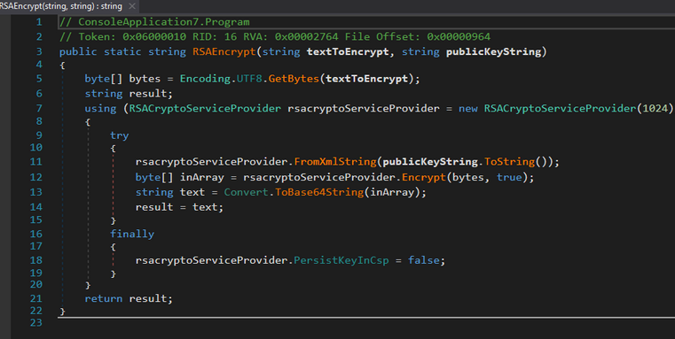

The adversary does not send the public key dynamically. There is no C2 communication to obtain the key. Everything is offline.

**Critical Point:**
RSA 1024 is weak. With significant computational power (cluster/cloud), it is possible to factor the modulus and reconstruct the private key. It's not trivial, but it's possible.

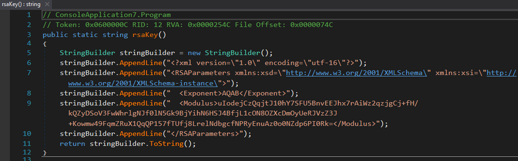

### 5. Directory Traversal and File Selection

The ransomware scans:
*   User directories
*   Common libraries (Documents, Pictures, Videos...)
*   External drives (except C:)

File filters include common work extensions:
`.txt .doc .docx .xls .xlsx .pdf .jpg .png .rar .zip .db ...`

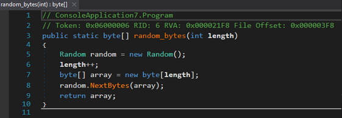

Large files undergo fake encryption: partial overwrite with garbage via:
`random_bytes()` `randomEncode()`
This feature speeds up the process and prevents system freezes.

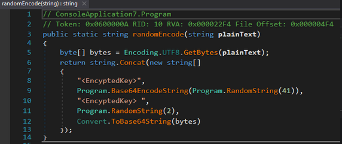

### 6. Destruction of Backups and System Recovery

When running with elevated privileges, it executes:
`deleteShadowCopies()`
`vssadmin delete shadows /all /quiet`

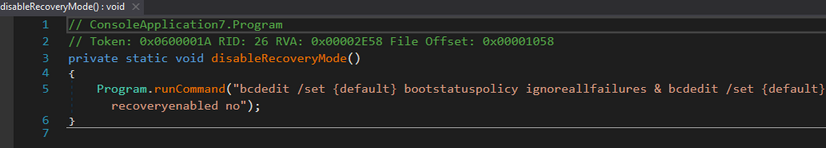
`wmic shadowcopy delete`
`deleteBackupCatalog()`
`disableRecoveryMode()`

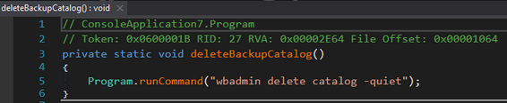

This is the complete anti-recovery package.

### 7. Propagation via USB

The `spreadIt()` method copies the malicious binary to any removable drive as:
`<pendrive>:\surprise.exe`
This is the typical USB worm attempt from the 2010s—simple and effective against home users.

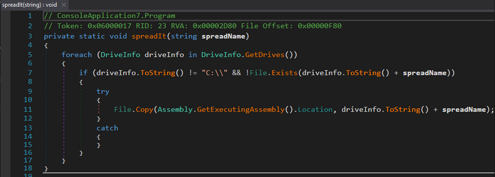

### 8. Wallpaper Alteration

The malware embeds a Base64-encoded image, saves it to `%TEMP%`, and sets it via:
`SystemParametersInfo(SPI_SETDESKWALLPAPER)`
This reinforces the psychological impact of the attack.

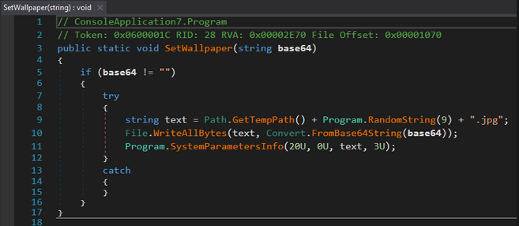

### 9. Ransom Note

The file `read_it.txt` is created in `AppData` and contains:
"Todos os seus arquivos foram criptografados Seu computador foi infectado por um vírus ransomware. ... O preço do software é de 200 reais. Pagamento somente em pix. pix=teste@gmail.com"
No Tor onions, contact forms, or multi-coin wallets.

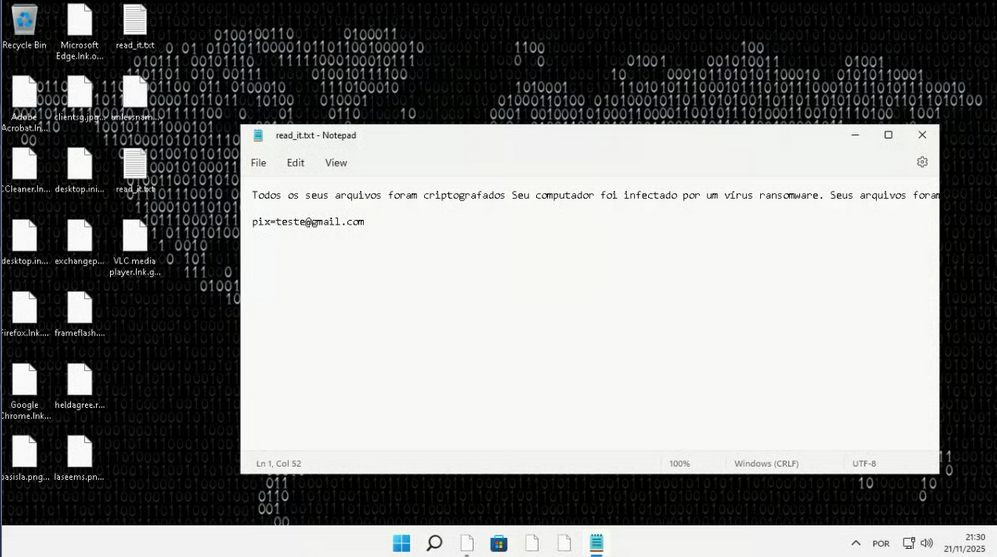

### 10. Cryptographic Considerations

**Identified Weak Points:**
*   PBKDF2 with 1000 iterations → low brute-force cost.
*   Fixed salt → AES-derived passwords could be reversible in specific scenarios.
*   Deterministic IV → lack of randomness weakens CBC.
*   RSA 1024-bit → susceptible to factoring with resources.
*   Hardcoded public key → same for all victims.

**Conclusion:**
There is a real possibility for future recovery if the RSA module is factored or the password generation pattern is exploited.

## 11. Indicators of Compromise (IOCs)

**Hashes:**
*   SHA256: `AF0E24781ED3683F04DD86A616E31490F36C2DA4CBB4FDDC76EFBD0FC4F15D55`

**Files:**
*   `%AppData%\svchost.exe`
*   `%AppData%\read_it.txt`
*   `%TEMP%\wallpaper.jpg` (decoded from embedded base64)

**Unique Strings:**
*   `<EncryptedKey>`
*   `"surprise.exe"`
*   `"Todos os seus arquivos foram criptografados"`
*   `"pix="`

**Registry:**
*   `HKCU\Software\Microsoft\Windows\CurrentVersion\Run\Microsoft Store`

**Mutexes:**
*   Identifiers like `7z459ajrk722yn8c5j4fg` or similar, depending on the version.

## 12. Is Decryption Possible?

Based on the analyzed elements:

**Theoretically Possible:**
*   Factoring the 1024-bit RSA (using CADO-NFS, msieve, yafu).
*   Or exploiting password generation flaws (if `CreatePassword()` uses `System.Random`, which is predictable).

**Not Trivial, but Feasible with:**
*   Computational resources.
*   Time.
*   Collaboration between incidents (if multiple samples reuse the same RSA key).

## 13. Conclusion

The analyzed sample is another case of ransomware created from public builders, adapted and distributed with bait targeting the Brazilian gaming audience—a growing trend.

By combining social engineering (fake cheat) + functional cryptography + aggressive persistence, the attacker achieves quick and silent compromise, even without C2 infrastructure.

Despite being technically amateurish, the implementation is dangerous enough to cause significant data loss.