## Executive Summary

This report documents the full infection chain of a **ValleyRAT** sample (tracked by the broader security community as part of the **Silver Fox / Winos4.0** cluster), detonated in ANY.RUN and subsequently dissected through static and memory forensics.

The sample masquerades as a DingTalk (钉钉) installer utility and abuses a **legitimately signed NVIDIA executable** (`nvsmartmaxapp64.exe`, part of the real "NvSmartMax" display-scaling component shipped with GeForce drivers) as a **DLL sideloading vector**. The malicious `NvSmartMax64.dll` decrypts a companion `.bin` blob, unpacks a final RAT core module in memory, and injects it into a legitimate `svchost.exe` process, which then establishes a **WebSocket-based C2 channel** (statically linked `libwebsockets` + `zlib`) to `206.238.115.209:1234/TCP`.

Persistence is achieved via three Scheduled Tasks masquerading as native Windows Update maintenance jobs.

| | |
|---|---|
| **Family** | ValleyRAT (Winos4.0 / Silver Fox cluster) |
| **Delivery vector** | Trojanized "DingTalk Downloader" SFX installer |
| **Sideload vector** | Legitimately signed NVIDIA `nvsmartmaxapp64.exe` |
| **Persistence** | 3x Scheduled Tasks under `\Microsoft\Windows\UpdateOrchestrator\` |
| **C2** | `206.238.115.209:1234/TCP` (WebSocket) |
| **Final injection target** | `svchost.exe -k netsvcs` |

---

## Initial Discovery

The sample (`dingtalk_downloader_v8.0.121.exe`) was submitted for dynamic detonation in **ANY.RUN**, which immediately tagged the run with `upx`, `valleyrat`, `rat`, `silverfox`, and `winos`, and flagged multiple malicious/suspicious processes in the tree.

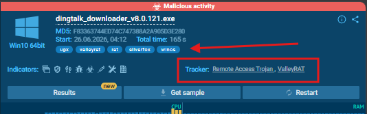
> *ANY.RUN verdict panel for `dingtalk_downloader_v8.0.121.exe`, showing a "Malicious activity" verdict and automatic tagging as `valleyrat`, `silverfox`, and `winos`.*

### Sample Identity (Stage 0 - Dropper)

| Field | Value |
|---|---|
| File name | `dingtalk_downloader_v8.0.121.exe` |
| MD5 | `F83363744ED74C747388A2A905D3E280` |
| SHA256 | `BB1CB60FF6EEB6009668354FE7AF609A5495D1AA8998582F8E819DEDCE833930` |
| Format | PE32+, x86-64, 8 sections |
| Packer | SFX |
| Compile timestamp | 2024-02-26 09:01:47 |

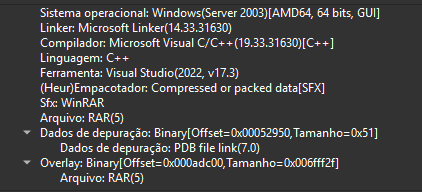
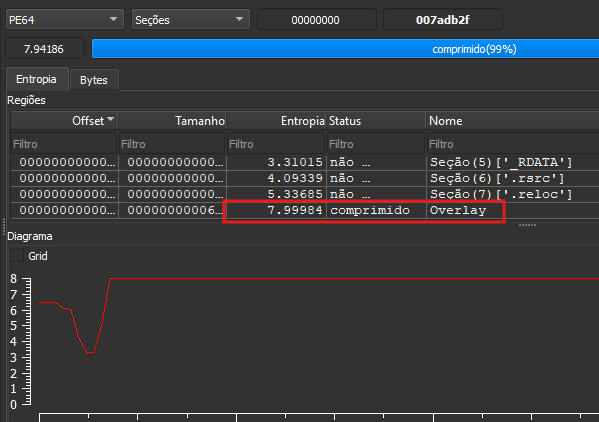
> *Detect It Easy identifying `dingtalk_downloader_v8.0.121.exe` as a PE64 binary packed with SFX.*
---

## Infection Chain Overview

```
dingtalk_downloader_v8.0.121.exe (WinRAR SFX)
  └─ nvsmartmaxapp64.exe          (legitimate, NVIDIA-signed, DLL sideload vector)
        └─ NvSmartMax64.dll        (malicious loader - obfuscated PE, RWX sections)
              └─ reads NvSmartMax64.bin (encrypted blob) → unpacks core module in memory
                    └─ injects into svchost.exe (-k netsvcs)
                          ├─ ValleyRAT core (.text region, no preserved PE header)
                          ├─ statically linked libwebsockets + zlib → C2 transport
                          └─ in-memory config: 206.238.115.209:1234/TCP (redundant slots)
```

---

## Dynamic Analysis (ANY.RUN)

### Process Tree

| PID | Process | Notes |
|---|---|---|
| 8728 | `dingtalk_downloader_v8.0.121.exe` | WinRAR SFX, writes `HKCU\SOFTWARE\WinRAR SFX` → `c:/uesr` |
| 6408 | `C:\uesr\dingtalk_downloader.exe` | Decoy "DingTalkDownloader Module", UPX-packed |
| 7512 → 5316 | `C:\uesr\nvsmartmaxapp64.exe` | Legitimate NVIDIA binary, flagged for untrusted (expired) certificate |
| 6832 | `C:\Program Files\Common Files\444.exe` | Same NVIDIA version info reused, runs as **SYSTEM**, "Runs injected code in another process" |
| 1236 | `svchost.exe -k netsvcs -p -s Schedule` | "Application launched itself"; creates 3 Scheduled Tasks |
| 7948 | `svchost.exe -k netsvcs` | **YARA hit: VALLEYRAT** - final injected process |

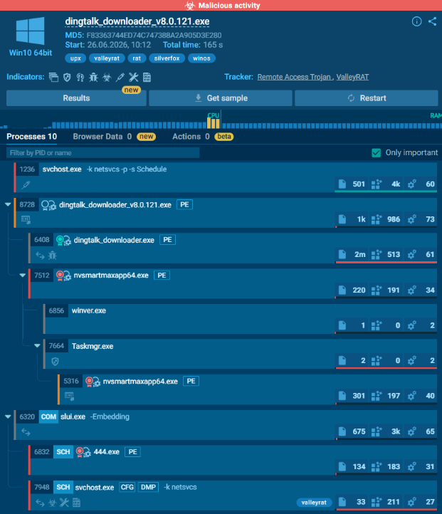
> *Full process tree in ANY.RUN, from the initial SFX dropper through the NVIDIA-signed carrier to the final injected `svchost.exe` (PID 7948) flagged with a VALLEYRAT YARA match.*

### Persistence Mechanisms

Three Scheduled Tasks are created by `svchost.exe` (PID 1236) under:

```
\Microsoft\Windows\UpdateOrchestrator\Schedule Work
\Microsoft\Windows\UpdateOrchestrator\Schedule Wake To Work
\Microsoft\Windows\UpdateOrchestrator\Schedule Maintenance Work
```

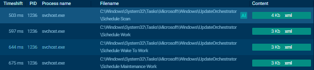
> *These masquerade as native Windows Update maintenance tasks. Memory forensics also recovered the string `Microsoft Compatibility system`, believed to be a forged display name used by the malware at the persistence layer.*

### Network Indicators

The visible HTTP/DNS traffic in the sandbox is mostly legitimate cover traffic (Microsoft CRL checks, Windows activation, WNS, and genuine DingTalk domains such as `dtapp-cast.dingtalk.com` and `dtupgrade.dingtalk.com`). The real C2, `206.238.115.209`, was recovered by ANY.RUN's **MalConf** module rather than the HTTP/DNS lists, consistent with the WebSocket-based, non-HTTP-monitored transport confirmed later via memory forensics.

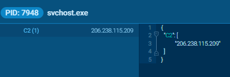
> *ANY.RUN's MalConf module automatically extracting the ValleyRAT configuration, including the C2 IP `206.238.115.209`.*

---

## Static Analysis

### Stage 2 - `nvsmartmaxapp64.exe` (the legitimate carrier)

Static analysis of the memory-dumped `nvsmartmaxapp64.exe` (identical hash to the dropped `444.exe`) confirmed this binary is **genuinely signed by NVIDIA** and not a forged clone.

| Field | Value |
|---|---|
| MD5 | `41aef580a3eabca0e0c2176c65dcc85b` |
| SHA256 | `faf8cee3884be9b2fc007df63cc5b9abaa3490eeb1d014e0bcf8a5a78332ad84` |
| Compile timestamp | 2018-03-23 22:26:58 |
| Embedded PDB path | `C:\dvs\p4\build\sw\rel\gpu_drv\r390\r391_33\drivers\ui\NvSmartMax\NvSmartMaxApp\bin\release64\NvSmartMaxApp64.pdb` |

**Authenticode chain:**
```
NVIDIA Corporation → VeriSign Class 3 Code Signing 2010 CA → VeriSign G5 Root
Certificate validity: 2015-07-28 to 2018-07-26
```

The certificate was valid at compile time but has since **expired**, which is why ANY.RUN flags the process with *"Executing a file with an untrusted certificate"* - this is not a forged signature, it is a legitimate but stale one, a hallmark of Silver Fox operators reusing the same old signed LOLBin across campaigns for years.

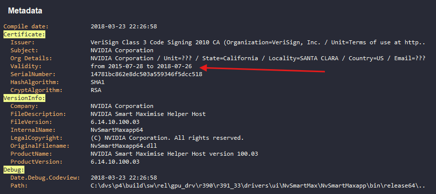
> *Malcat's certificate viewer showing `nvsmartmaxapp64.exe` genuinely signed by NVIDIA Corporation, with a validity window (2015-07-28 to 2018-07-26) that has since expired.*

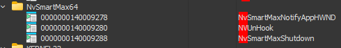
> *IAT for `NvSmartMax64.dll`, showing the three imported ordinals/names: `NvSmartMaxNotifyAppHWND`, `NVUnHook`, `NvSmartMaxShutdown`. This is the visual evidence for the sideload vector; the exe statically expects a companion DLL with these exact exports.*

The import table shows implicit linking against `NvSmartMax64.dll` for exactly the three functions above. This is the sideload vector: Windows resolves this import by searching the working directory, where the dropper has already placed a **malicious** `NvSmartMax64.dll` under the same file name.

---

### Stage 3 - `NvSmartMax64.dll` (the obfuscated loader)

| Field | Value |
|---|---|
| MD5 | `7638ddd85036b94d9a533a300e7508b2` |
| SHA256 | `f535731ad0dd84d1fe7f36638aaa5b285da1caea2ff040b9357cf2aecf3457c1` |
| Size | 5,437,441 bytes |
| TimeDateStamp | `0` (deliberately zeroed) |

#### Anti-Analysis Techniques Observed

- **All 7 section names are zeroed out**, and every section shares the same characteristics flag `0xE0000020` (**READ+WRITE+EXECUTE**), defeating heuristics that rely on canonical section names/permissions.
- **Import DLL name strings are deliberately corrupted**: `././KerNEl32`, `./OLe32`, `.\./MsVcrt`. The Windows loader normalizes and resolves these correctly at runtime, but string-matching static tools may fail to recognize them.
- The explicit import table is minimal by design (`VirtualAlloc`, `LoadLibraryW`, `GetProcAddress`, `GetModuleHandleExW`, plus MSVCRT file I/O - `fopen/fread/fseek/ftell/fclose`), meaning the remaining API surface (injection, networking) is **resolved dynamically at runtime**.

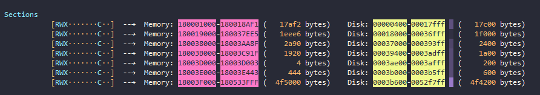
> *Malcat's section table for `NvSmartMax64.dll`: all 7 section names are zeroed out and every section carries identical RWX characteristics, a deliberate anti-analysis measure.*

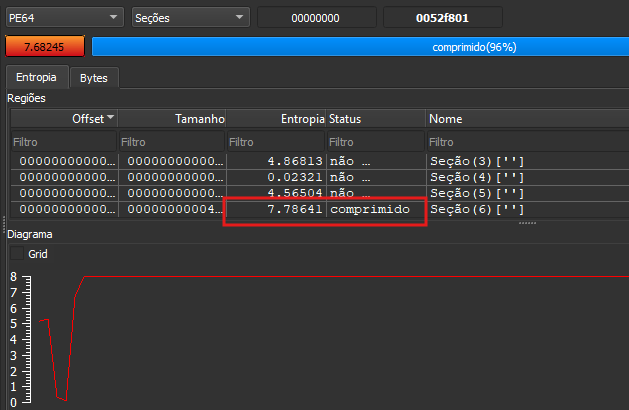
> *Entropy graph of `NvSmartMax64.dll`, showing a flat high-entropy plateau (~7.7–7.8) across the final ~5 MB of the file, consistent with an encrypted/compressed embedded payload.*

#### Export Table - Proxy DLL Pattern

All three exports (`NVUnHook`, `NvSmartMaxNotifyAppHWND`, `NvSmartMaxShutdown`) resolve to the **same address** (`0x180015840`), confirming this is a proxy DLL: none of the exports implement real NVIDIA functionality, they all funnel into a single dispatcher stub.

```asm
0x180015840: mov [rsp+8], rcx
             sub rsp, 0x68
             lea rax, [rip-0x1420]      ; function pointer #1
             mov [rsp+0x40], rax
             lea rax, [rip+0x4964]      ; function pointer #2
             mov [rsp+0x30], rax
             mov edx, 0x64              ; parameter/ID = 100
             lea rcx, [rsp+0x30]
             call 0x180005cc0           ; dispatcher / callback registration
             call qword ptr [rax]
             ret
```

RTTI strings recovered from the binary (`_Func_impl_no_alloc<lambda_...>`) confirm the loader is written in modern C++ using `std::function`/lambda-based callback dispatch - consistent with the modular, plugin-style architecture documented for Winos4.0/ValleyRAT.

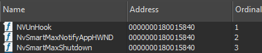
> *All three exports of `NvSmartMax64.dll` (`NVUnHook`, `NvSmartMaxNotifyAppHWND`, `NvSmartMaxShutdown`) resolving to the same address - confirming a proxy-DLL dispatcher pattern rather than genuine NVIDIA functionality.*

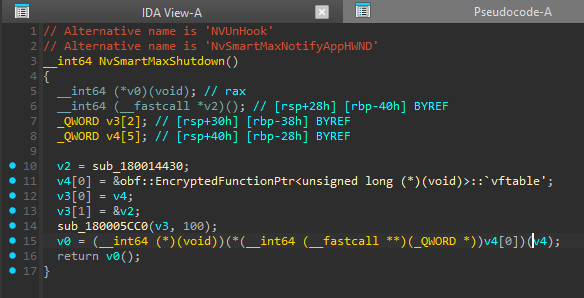
> *At `DllMain` (entry point `0x1800168b0`), when `fdwReason == DLL_PROCESS_ATTACH`, the loader immediately calls an initialization routine (`0x180016c80`) before handing off to the CRT, meaning malicious logic begins executing the moment `nvsmartmaxapp64.exe` sideloads this DLL.*

#### The Embedded High-Entropy Blob

The final, unnamed section (raw file offset `0x3b600` onward) spans roughly **5.06 MB** with entropy **7.786** - effectively random, i.e. encrypted/compressed. Embedded within it are valid PE headers (x86, Rich Header intact) whose recovered import strings reference:

- `WS2_32.dll`, `WININET.dll` - networking / C2
- `AVIFIL32.dll`, `MSVFW32.dll` - video capture (webcam)
- `WLDAP32.dll` - Active Directory enumeration
- `MPR.dll` - network resource / share enumeration

This capability set is consistent with the documented feature set of ValleyRAT (webcam access, keystroke/data collection). This blob is the encrypted container for the RAT's core module(s), decrypted and manually mapped into memory at runtime, the dropped `NvSmartMax64.bin` is read via the loader's file I/O imports and is believed to serve as the decryption key/config for this stage.

---

## Deep Dive: XOR Deobfuscation Routine and the Hardcoded Endpoint

Two functions inside the decrypted RAT core (`sub_6390` and `sub_c520`, cross-referenced from `sub_6390`) were disassembled in Binary Ninja to recover the string obfuscation scheme and confirm the nature of the hardcoded IPv4 address `206.238.115.209` first surfaced by ANY.RUN's MalConf module.

### `sub_6390` Environment Gate + String Deobfuscation + Endpoint Dispatch

```c
sub_2d616(arg1, arg2, 0, &var_7f8, 0x208)
0x18000a4e8()
0x18000c89c()
int32_t result = 0x7ffe4782eb10()

if (result == 0)
    ...
    __builtin_memcpy(dest: &var_838, src: "...", count: 0x40)   // encrypted blob, 64 bytes
    int128_t zmm0_1 = var_838.o ^ var_818.o                      // self-XOR against 2nd half of same buffer
    ...
```

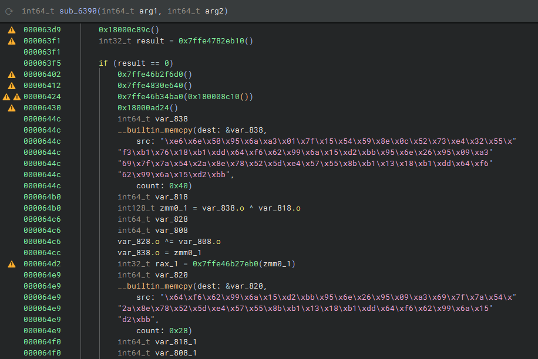
> *Binary Ninja HLIL view of `sub_6390`: an environment/anti-sandbox gate (`sub_2d616`) followed by unresolved dynamically-resolved API calls (⚠️) and the first XOR-obfuscated string block.*

**Anti-analysis gate.** The function opens with `sub_2d616(arg1, arg2, 0, &var_7f8, 0x208)`, which fills a 0x208-byte stack buffer, followed by several unresolved indirect calls (`0x18000a4e8()`, `0x18000c89c()`, etc. - flagged ⚠️ by Binary Ninja because they are runtime-resolved API pointers, not static imports). The entire string-decoding and C2-dispatch logic that follows is gated behind `if (result == 0)`, consistent with an environment/anti-sandbox check deciding whether to proceed.

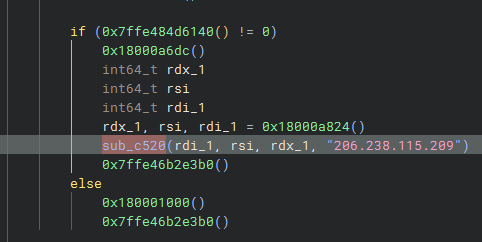
> *The hardcoded endpoint `206.238.115.209` passed directly as a literal argument into `sub_c520`, alongside three values recovered from the deobfuscation routine above it.*

**String deobfuscation scheme.** Every `__builtin_memcpy` block in this function copies an obfuscated buffer that is immediately XORed against a second window *within the same buffer* (e.g., `var_838.o ^ var_818.o`, where the two "variables" are simply overlapping stack offsets 0x20 bytes apart). In other words: **`plaintext = blob[0:N/2] XOR blob[N/2:N]`** - a self-referential split, not an externally-supplied key. This was verified by direct computation rather than pattern inference:

| Block offset | Size | Decoded (UTF-16LE) |
|---|---|---|
| `0x644c` | 64 B | `svchost.exe` |
| `0x6507` | 24 B | `Schedule` |
| `0x6641` | 24 B | `vssvc.exe` |
| `0x66fe`/`0x6745` | 16 B | `"%s\%..."` fragment (format string, completed in `sub_c520`) |

The recovered strings (`svchost.exe`, `Schedule`, `vssvc.exe`) indicate the routine dispatches on the **current host process name** - one code path when running inside `svchost.exe` (Task Scheduler-related), a different one for `vssvc.exe` (Volume Shadow Copy Service), and a fallback path (the one containing the hardcoded IP) for any other host process.

### `sub_c520` - Task Scheduler Registration Routine

Full disassembly of the callee referenced from the fallback branch above confirmed a coherent Task Scheduler workflow, with every XOR block independently computed and verified against the pseudocode:

| Block offset | Computation | Decoded (UTF-16LE) |
|---|---|---|
| `0xc5f3` XOR `0xc667` | 64 B ⊕ 64 B | `\Microsoft\Windows\AppID` |
| `0xc740` | half ⊕ half (32 B) | `"%s\%s"` (including literal quotes) |
| `0xc7bd` | half ⊕ half (32 B) | `SYSTEM` |
| `0xc7fc`, `0xc845` | half ⊕ half (32 B, identical halves) | `""` (empty string) |

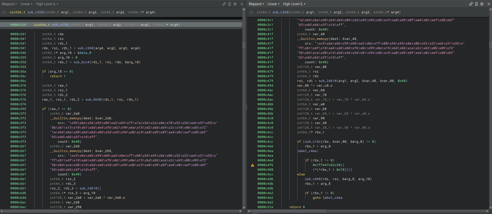
> *Full HLIL disassembly of `sub_c520`, reconstructing a Task Scheduler folder-lookup and task-registration workflow: task folder `\Microsoft\Windows\AppID`, a quoted command-line format string, principal `SYSTEM`, and a structured error-code return path.*

**Reconstructed logic:**
```c
uint64_t sub_c520(int64_t arg1, int64_t arg2, int64_t arg3, int64_t* arg4 /* target host */)
{
    // sub_c368 → likely connection/context init; sub_bcc4 → likely ITaskService-equivalent handle
    if (arg_18 == 0) return 1;                     // connection/init failure

    // sub_bb90 → resolves task folder; sub_c1dc → opens folder; sub_c048 → create/recover fallback
    if (arg_10 == 0) return 2;                     // folder open/create failure

    // command line built as: "\"%s\%s\"" (quoted path)
    // principal = "SYSTEM", auxiliary fields = ""

    if (sub_b3d4(rdi_4 + 0x670, rdi_4 + 0x738, r8_3, r9_1) == 0)
        return 4;                                  // task definition build failure

    int32_t rax_7 = sub_b90c(rdi_4, rsi_3, &var_2f8, rdi_4 + 0x670, r8_4);
    return (rax_7 != 0) ? 0 : 3;                    // registration success/failure
}
```

The final return expression (`zx.q(not.d(sbb.d(rax_8, rax_8, rax_7 != 0))) & 3`) is Binary Ninja's literal rendering of a compiled `neg`/`sbb`/`not` flag idiom; it was algebraically reduced and confirmed to be equivalent to `rax_7 != 0 ? 0 : 3`.

The two 0x100-byte (`0xC8` = 200-byte spacing) buffers passed to `sub_b3d4` (`rdi_4 + 0x670`, `rdi_4 + 0x738`) are consistent with two adjacent `wchar_t[100]` fields inside a task-context structure - most plausibly a task name and an executable path.

### Reassessing the Role of `206.238.115.209`

This finding **revises** the initial dynamic-analysis assumption that `206.238.115.209` is exclusively a WebSocket C2 endpoint:

**Evidence for a Task Scheduler / remote-execution role:**
- `sub_c520`'s four-argument signature (`server, user, domain, password`-shaped) and its internal logic (folder lookup under a disguised path, quoted command construction, `SYSTEM` principal, structured task registration) closely match the `ITaskService::Connect` → `GetFolder` → `ITaskDefinition` → `RegisterTaskDefinition` COM workflow.
- No socket/HTTP/WinInet API references appear anywhere in `sub_c520` itself.

**Evidence that a separate, genuine C2 channel also exists:**
- The in-memory configuration structure recovered from process memory (see below) stores `206.238.115.209` alongside an explicit **port (1234) and protocol ("TCP")** - a field layout that a COM-based `ITaskService::Connect` call has no use for, since Task Scheduler RPC does not take an explicit port in this way.
- Separate memory regions from the same injected process contain unambiguous **libwebsockets + zlib** strings, confirming an active WebSocket-based network channel exists in this binary regardless of this function's purpose.

**Working assessment:** the two mechanisms most likely coexist and reuse the same operator-controlled IP - a WebSocket-based C2 channel (confirmed via memory forensics) and, separately, this Task Scheduler-oriented remote-registration capability (confirmed via this static analysis), which may represent either an alternate lateral-movement/execution feature of the same module or a reused library component not necessarily exercised in this specific campaign run. This is not yet fully resolved and is called out explicitly rather than collapsed into a single conclusion - see confidence notes below.

#### Confidence Summary

| Finding | Confidence | Basis |
|---|---|---|
| Strings decoded via self-XOR (`svchost.exe`, `Schedule`, `vssvc.exe`, `\Microsoft\Windows\AppID`, `"%s\%s"`, `SYSTEM`) | **High** | Verified by direct byte-level XOR computation, not pattern inference |
| `sub_c520` implements a Task Scheduler folder-lookup/registration workflow | **High** | Structurally coherent argument shapes, decoded strings, and error-code paths all align |
| `sub_c368`/`sub_bcc4`/`sub_bb90` map to specific `ITaskService` COM methods | **Medium** | Behavioral/signature inference only - no CLSID/IID observed yet |
| `206.238.115.209` serves a genuine remote Task Scheduler role | **Medium** | Strong argument-shape match, but not confirmed via CLSID/IID or PCAP evidence |
| `206.238.115.209` is also used as a WebSocket C2 endpoint | **High** | Corroborated independently by the in-memory config structure (port + protocol fields) and libwebsockets/zlib strings recovered from separate memory regions |

---

## Memory Forensics (Post-Injection Dumps)

Four memory regions were dumped from the injected `svchost.exe` (PID 7948) process for further analysis.

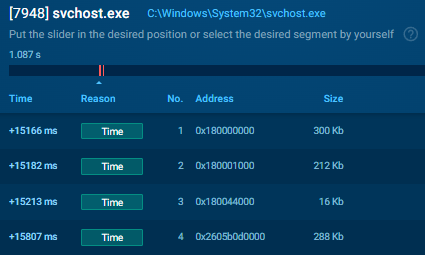
> *ANY.RUN's memory dump feature listing the four extracted regions from the injected `svchost.exe` (PID 7948) process.*

### Dump 1 - Decrypted C2 Configuration Structure (16 KB)

Low entropy (2.34 - plaintext/structured, not encrypted). Recovered a repeating 268-byte configuration record:

```
uint16  port      = 0x04D2 (1234)
wchar_t[]          "TCP"
char[]             "206.238.115.209"
```

This record repeats three times identically, consistent with ValleyRAT/Winos4.0 reserving multiple redundant C2 server slots even when a campaign only uses one.

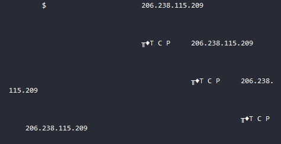

### Dump 2 - Raw Executable Code Region (212 KB)

Entropy 6.41, no readable strings - standard x64 function prologue/epilogue byte patterns only (`push rbx/rsi/...`, `pop r15/r14/...`). This is the RAT's `.text` region as mapped in memory; no PE header was preserved at this location (manual/reflective mapping, consistent with the loader behavior identified in `NvSmartMax64.dll`).

### Dumps 3 & 4 - Statically Linked Network Libraries (307 KB / 294 KB)

ASCII strings recovered:

```
deflate 1.2.13 Copyright 1995-2022 Jean-loup Gailly and Mark Adler
inflate 1.2.13 Copyright 1995-2022 Mark Adler
%s %s HTTP/1.1
258EAFA5-E914-47DA-95CA-C5AB0DC85B11
LRS_HEADERS: NULL ah
ah leak: wsi %p
bad wsi role 0x%x
```

The GUID `258EAFA5-E914-47DA-95CA-C5AB0DC85B11` is the fixed magic string used in the RFC 6455 WebSocket handshake, and strings like `LRS_HEADERS`, `wsi`, and `vhost` are unmistakable identifiers of the **libwebsockets** open-source library. Combined with the `zlib 1.2.13` strings, this confirms the RAT's C2 channel is implemented as a **WebSocket connection with compression**, not a raw custom TCP protocol as initially hypothesized from the dynamic analysis alone.

UTF-16 strings recovered from the same region:

```
444.exe
NvSmartMax64.bin
NvSmartMax64.dll
C:\Program Files\Common Files
Microsoft Compatibility system
\Microsoft\Windows
```

`"Microsoft Compatibility system"` is assessed to be a forged display name used at the persistence layer.

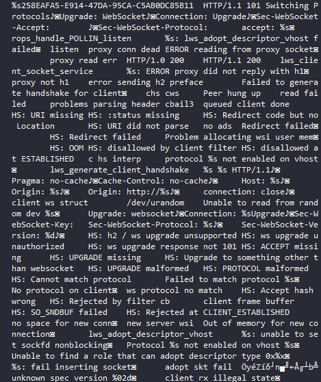
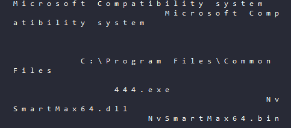
> *This cleanly demonstrates the embedded libwebsockets/zlib fingerprint*

---

## MITRE ATT&CK Mapping

| Tactic | Technique | ID |
|---|---|---|
| Initial Access | Trojanized software / Masquerading as legitimate installer | T1204.002 |
| Defense Evasion | Masquerading (fake NVIDIA vendor helper) | T1036.005 |
| Defense Evasion | DLL Side-Loading | T1574.002 |
| Defense Evasion | Obfuscated Files or Information (section/import name corruption) | T1027 |
| Defense Evasion | Process Injection | T1055 |
| Defense Evasion | Signed Binary Proxy Execution | T1218 |
| Persistence | Scheduled Task | T1053.005 |
| Command and Control | Application Layer Protocol: Web Protocols (WebSocket) | T1071.001 |
| Command and Control | Data Encoding / Compression | T1132 / T1560 |

---

## Indicators of Compromise (IOCs)

### Files

| Stage | File | SHA256 |
|---|---|---|
| Dropper | `dingtalk_downloader_v8.0.121.exe` | `BB1CB60FF6EEB6009668354FE7AF609A5495D1AA8998582F8E819DEDCE833930` |
| Decoy | `dingtalk_downloader.exe` | `91E6278F9B1756BAF0FE3A4F7F6A1897ED1C1811DE51AE3934E0360327EEB9EA` |
| Carrier (signed) | `nvsmartmaxapp64.exe` / `444.exe` | `FAF8CEE3884BE9B2FC007DF63CC5B9ABAA3490EEB1D014E0BCF8A5A78332AD84` |
| Encrypted blob | `NvSmartMax64.bin` | `5285FEA2296D848992025565DBAB08CD45CAC7AE62102428EE60FCA47E7F00D5` |
| Malicious loader | `NvSmartMax64.dll` | `F535731AD0DD84D1FE7F36638AAA5B285DA1CAEA2FF040B9357CF2AECF3457C1` |

### Network

- C2: `206.238.115.209:1234/TCP` (WebSocket protocol)

### Filesystem / Persistence

```
C:\uesr\dingtalk_downloader.exe
C:\uesr\nvsmartmaxapp64.exe
C:\uesr\NvSmartMax64.bin
C:\uesr\NvSmartMax64.dll
C:\Program Files\Common Files\444.exe
C:\Program Files\Common Files\NvSmartMax64.bin

\Microsoft\Windows\UpdateOrchestrator\Schedule Work
\Microsoft\Windows\UpdateOrchestrator\Schedule Wake To Work
\Microsoft\Windows\UpdateOrchestrator\Schedule Maintenance Work
```

### Strings / Artifacts

```
Microsoft Compatibility system
258EAFA5-E914-47DA-95CA-C5AB0DC85B11 (generic WebSocket GUID - context-dependent)
```

---

## Detection Recommendations

- Alert on `svchost.exe` child processes or memory regions exhibiting statically-linked **libwebsockets + zlib** signatures combined with co-occurring references to `NvSmartMax64.bin`/`NvSmartMax64.dll` - do not alert on the library strings alone, as they are common in legitimate software.
- Flag execution of vendor-named binaries (NVIDIA, or otherwise) launched from non-standard install paths (e.g., `C:\uesr\`, arbitrary subfolders of `Common Files`) with **expired** code-signing certificates.
- Monitor creation of Scheduled Tasks under `\Microsoft\Windows\UpdateOrchestrator\` with action paths pointing outside `C:\Windows\System32`.
- Hunt for PE sections with all-zeroed names combined with uniform `RWX` characteristics across every section - a strong packing/obfuscation indicator uncommon in legitimate compilers.

---

## Detection Engineering

To support hunting for anti-sandbox behavior across future ValleyRAT/Winos4.0 samples and their intermediate dumps, the Sigma rule *"Reads the date of Windows installation"* (ID `127761ea-d787-4a52-aefe-dde82dbf45c8`, T1012/T1082/T1497.003) was translated into a static YARA equivalent.

This is not a 1:1 port: Sigma's `registry`/`sandbox` logsource describes a **runtime telemetry event** (an EDR/sandbox observing a process read a specific registry value), while YARA inspects **static bytes** in a file or memory image. There is no direct static equivalent for "a process read this key" - what *is* portable is the underlying intent: detecting whether a binary **carries the logic** to perform this classic anti-sandbox/anti-VM timing check (T1497.003), which is exactly the kind of artifact expected inside a loader stage like `NvSmartMax64.dll` or an unpacked RAT core module such as the ones recovered from memory in this case.

The Sigma rule's `correction1/2/3` filters (which suppress known-legitimate callers by `Image` path - Search Host, Windows Terminal) also have no static equivalent, since process identity/path is execution context, not something present in an isolated file. To compensate, the YARA rule below requires the registry **key path**, the **value name**, and a **registry API call** to all be present together, rather than firing on any single string in isolation - reducing the surface for accidental matches against unrelated strings.

Two variants are provided: one constrained to PE files (for scanning samples/dropped binaries), and one unconstrained (for scanning raw, headerless memory dumps like the ones extracted from the injected `svchost.exe` in this investigation).

```bash
rule Anti_Sandbox_InstallDate_Registry_Check_File
{
    meta:
        description     = "Detects PE binaries with static references to the Windows InstallDate registry value + registry query APIs, consistent with an anti-sandbox/anti-VM environment check"
        sigma_reference = "127761ea-d787-4a52-aefe-dde82dbf45c8"
        sigma_title     = "Reads the date of Windows installation"
        author          = "0xOlympus"
        date            = "2026-07-04"
        mitre_attack    = "T1012, T1082, T1497.003"
        scope           = "file"
        level           = "medium"

    strings:
        // Registry key path (32-bit and 64-bit views, ASCII + wide)
        $key_a1 = "SOFTWARE\\Microsoft\\Windows NT\\CurrentVersion" ascii nocase
        $key_w1 = "SOFTWARE\\Microsoft\\Windows NT\\CurrentVersion" wide nocase
        $key_a2 = "SOFTWARE\\Wow6432Node\\Microsoft\\Windows NT\\CurrentVersion" ascii nocase
        $key_w2 = "SOFTWARE\\Wow6432Node\\Microsoft\\Windows NT\\CurrentVersion" wide nocase

        // Target value name
        $val_a = "InstallDate" ascii nocase
        $val_w = "InstallDate" wide nocase

        // Registry read APIs commonly used to pull this value
        $api1 = "RegQueryValueExA"
        $api2 = "RegQueryValueExW"
        $api3 = "RegOpenKeyExA"
        $api4 = "RegOpenKeyExW"
        $api5 = "RegGetValueA"
        $api6 = "RegGetValueW"

    condition:
        uint16(0) == 0x5A4D
        and any of ($key_*)
        and any of ($val_*)
        and any of ($api*)
}

rule Anti_Sandbox_InstallDate_Registry_Check_Memory
{
    meta:
        description     = "Memory/dump-scan variant: detects raw or headerless memory regions referencing the InstallDate registry value alongside registry query APIs (no MZ/PE constraint, for unpacked/manually-mapped modules)"
        sigma_reference = "127761ea-d787-4a52-aefe-dde82dbf45c8"
        sigma_title     = "Reads the date of Windows installation"
        author          = "0xOlympus"
        date            = "2026-07-04"
        mitre_attack    = "T1012, T1082, T1497.003"
        scope           = "memory"
        level           = "medium"

    strings:
        $key_a1 = "SOFTWARE\\Microsoft\\Windows NT\\CurrentVersion" ascii nocase
        $key_w1 = "SOFTWARE\\Microsoft\\Windows NT\\CurrentVersion" wide nocase
        $key_a2 = "SOFTWARE\\Wow6432Node\\Microsoft\\Windows NT\\CurrentVersion" ascii nocase
        $key_w2 = "SOFTWARE\\Wow6432Node\\Microsoft\\Windows NT\\CurrentVersion" wide nocase

        $val_a = "InstallDate" ascii nocase
        $val_w = "InstallDate" wide nocase

        $api1 = "RegQueryValueExA"
        $api2 = "RegQueryValueExW"
        $api3 = "RegOpenKeyExA"
        $api4 = "RegOpenKeyExW"
        $api5 = "RegGetValueA"
        $api6 = "RegGetValueW"

    condition:
        any of ($key_*)
        and any of ($val_*)
        and any of ($api*)
}
```

### Tuning Notes

- **File variant** anchors on `uint16(0) == 0x5A4D` (`MZ`) to scope the rule to PE files only - use this against the dropper, the carrier `.exe`, and the `NvSmartMax64.dll` loader.
- **Memory variant** drops the header check entirely, since reflectively-mapped/injected modules (such as the `.text` region recovered from PID 7948 in this case) do not preserve a DOS/PE header at their dump base.
- Both variants trade recall for precision by requiring key path + value name + API to co-occur, rather than matching on `InstallDate` alone - the bare string is common enough in legitimate telemetry/licensing code to be noisy on its own.
- As with the Sigma source rule, treat a hit as a **triage signal**, not a standalone verdict - legitimate browsers, Office, Adobe products, and archivers perform this same check for entirely benign reasons (installation-age telemetry, licensing).
- Applied to this investigation's artifacts specifically: this rule did not fire on the dumps recovered so far (`NvSmartMax64.dll`'s explicit imports do not include the registry API family, and the decrypted C2 config dump contains no registry-related strings) - worth re-running once the encrypted ~5 MB blob inside `NvSmartMax64.dll` is decrypted and mapped, since that is the most likely location for any anti-sandbox timing logic in this chain.

---

## Conclusion

This sample demonstrates a mature, multi-stage ValleyRAT deployment chain that leans heavily on **living-off-trusted-binaries** tradecraft: rather than forging a vendor identity, the operators repurpose a genuinely signed (if now-expired) NVIDIA utility to bootstrap a DLL sideload, hide their loader behind deliberate PE structural corruption, and finally establish C2 over a standard, encrypted-looking WebSocket channel to blend in with legitimate web traffic. The combination of dynamic detonation, static reverse engineering, and post-injection memory forensics was necessary to fully reconstruct the chain - no single vantage point exposed the complete picture on its own.
