## 1. Executive Summary

This report analyzes a multi-stage malware infection chain delivering XWorm RAT v5.6 using a JavaScript dropper masquerading as a PDF document. The malware employs heavy obfuscation, PowerShell-based in-memory loading, legitimate cloud infrastructure abuse, and weak custom cryptography to evade detection and analysis.

The final payload is a fully featured XWorm Remote Access Trojan, configured with a single DDNS-based command-and-control server and aggressive beaconing behavior.

## 2. Initial Access & Social Engineering

### 2.1 Malicious File

**Filename:**

```
Comprovante-Mercado-Pago-08012026--5560--0054--9892.pdf.js
```
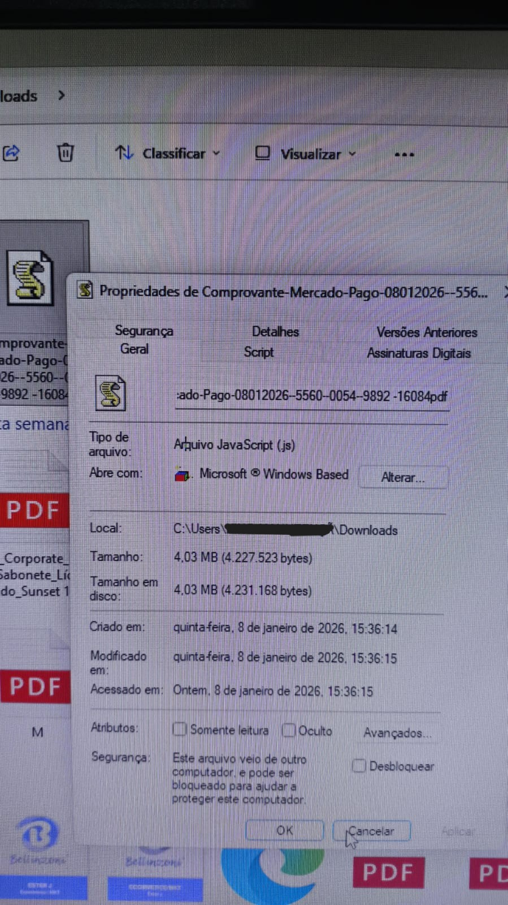

**Key observations:**

- Double extension to impersonate a PDF
- Uses a Brazilian financial theme (Mercado Pago)
- Targets Windows users via Windows Script Host

This file is a WSH JavaScript (`.js`) script, not browser JavaScript.

## 3. Stage 1 – JavaScript Dropper Analysis

### 3.1 Execution Environment

The script executes via:

```
wscript.exe / cscript.exe
```

It leverages:

- `ActiveXObject("Scripting.FileSystemObject")`
- `WScript.ScriptFullName`

This grants:

- Full filesystem access
- Awareness of execution directory
- Capability to drop or execute additional stages

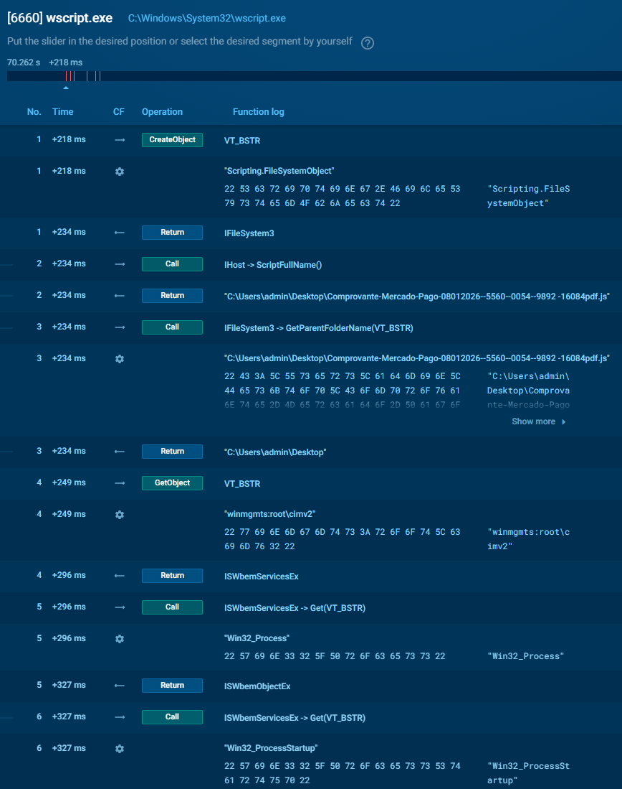

### 3.2 Obfuscation Technique

The script contains a large string variable composed of:

- Unicode homoglyphs
- Emoji
- Repeating delimiter characters

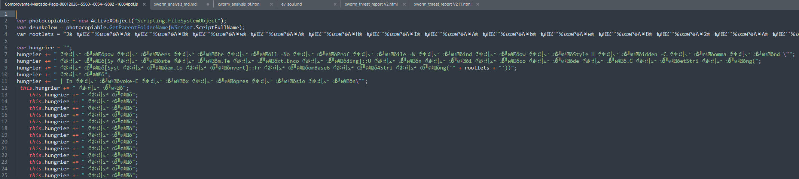

After removing the repeated Unicode junk, the remaining characters form a valid Base64 payload.

**Purpose:**

- Evade static AV signatures
- Break naive Base64 detection
- Bypass AMSI heuristics

This obfuscation style is commonly observed in commodity RAT loaders, including XWorm.

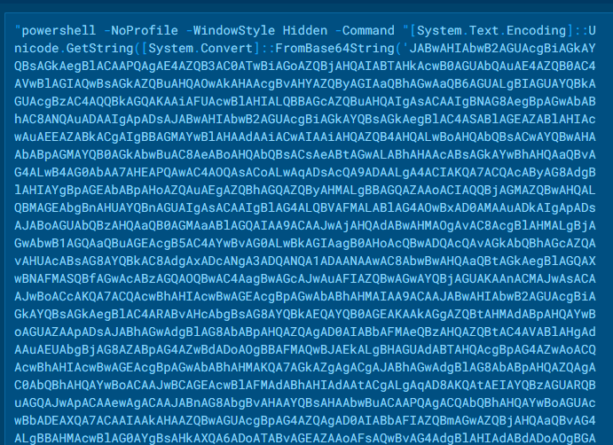

## 4. Stage 2 – PowerShell Loader

### 4.1 PowerShell Execution

The JavaScript launches PowerShell in hidden mode:

```powershell
powershell -NoProfile -WindowStyle Hidden -Command "<Base64>"
```

The command itself is:

- UTF-16LE Base64-encoded
- Decoded at runtime
- Executed using `Invoke-Expression`

### 4.2 Decoded PowerShell Logic

Once decoded, the PowerShell performs the following:

- Creates a fake browser WebClient
- Sets common HTTP headers
- Downloads remote content disguised as an image
- Extracts a Base64 payload between markers
- Loads a .NET assembly directly in memory
- Invokes the assembly's `Main()` method

No executable is written to disk at this stage.

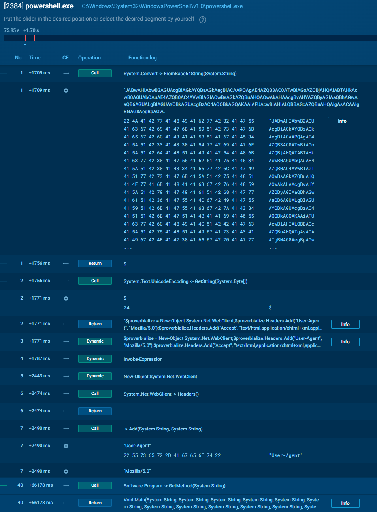

## 5. Stage 3 – Abuse of Legitimate Infrastructure

### 5.1 Cloudinary Decoy file Hosting

```
https://res.cloudinary.com/.../optimized_MSI_lpsd9p.jpg
```

**Observations:**

- Cloudinary CDN abuse
- Legitimate File as `.jpg`
- The file is downloaded just before the real payload

The downloaded file contains embedded markers:

```
BaseStart-<BASE64 DATA>-BaseEnd
```
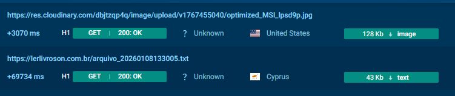

## 6. Stage 4 – Final Payload Retrieval

A second-stage download retrieves a `.txt` file hosted on a Brazilian domain:

```
https://lerlivroson.com.br/<random>.txt
```

### 6.1 Reversed Base64 Encoding

The file contents consist of:

- A fully reversed Base64 string
- When reversed and decoded → valid PE file

This technique is frequently observed in XWorm loaders and provides lightweight evasion against content scanners.

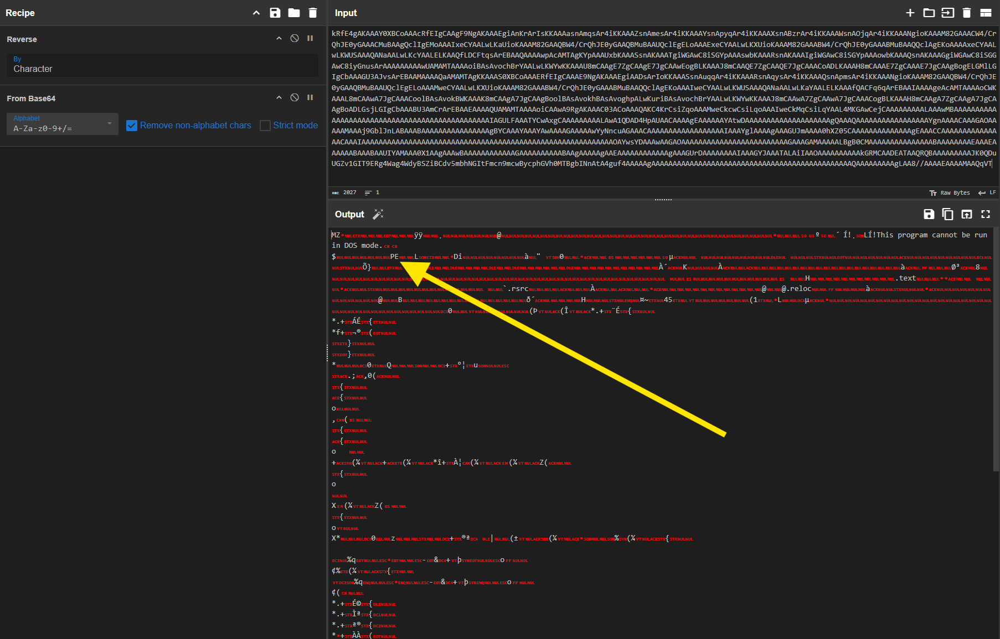

## 7. Payload Identification

The decoded PE is a .NET executable containing:

- XWorm protocol logic
- AES-encrypted configuration strings
- Mutex-based crypto key derivation
- USB propagation functionality

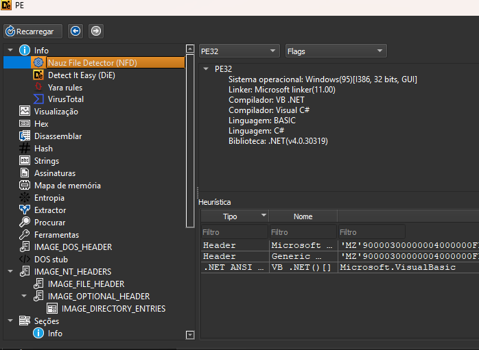

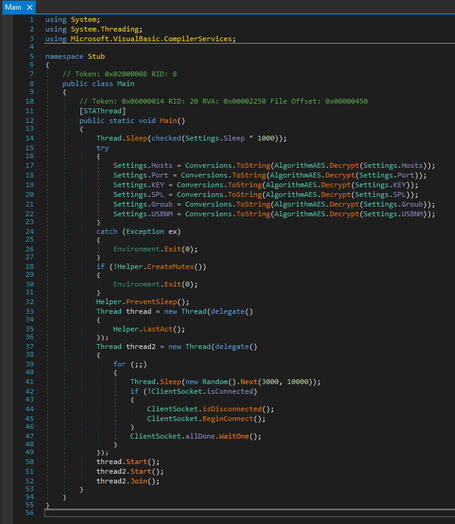

## 8. Cryptographic Analysis

### 8.1 Configuration Decryption Algorithm

The malware implements a custom AES routine:

```
MD5(Settings.Mutex) → 16 bytes
Key = MD5 || MD5 (overlapping)
AES-ECB
Base64 input
```
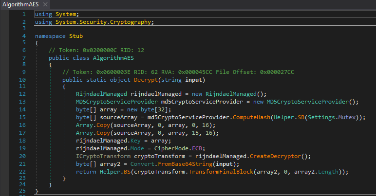

**Key weaknesses:**

- MD5 used for key derivation
- AES-ECB mode (no IV)
- Deterministic encryption

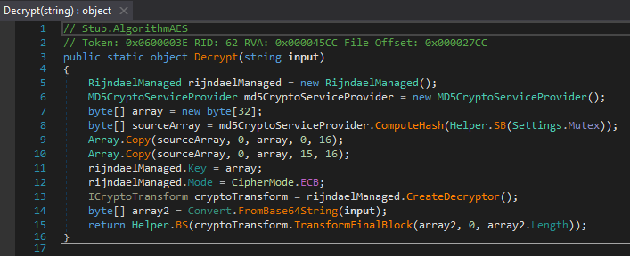

This allows offline config decryption once the mutex is known.

### 8.2 Decrypted Configuration

```json
{
  "C2": ["jholycf100.ddns.com.br:7000"],
  "Keys": {
    "AES": "<123456789>"
  },
  "Options": {
    "Splitter": "<Xwormmm>",
    "Sleep time": "3",
    "USB drop name": "XWorm V5.6",
    "Mutex": "S9khGfSNXLADIvc2"
  }
}
```
>note: Using AES in ECB mode to protect the configuration makes the key trivially recoverable, exposing the attacker's infrastructure without the need for dynamic execution. It's a basic cryptographic error that transforms malware 'protection' into mere obfuscation.

## 9. Behavioral Analysis

Dynamic analysis using ANY.RUN fully corroborated the static findings.

### 9.1 Runtime Execution

The malware executes entirely in memory:
- No PE payload is written to disk
- Final execution occurs under a legitimate .NET binary: `C:\Windows\Microsoft.NET\Framework\v4.0.30319\CasPol.exe`

Abuse of `CasPol.exe` (a .NET LOLBIN) aids in evasion by blending malicious execution with trusted system binaries.

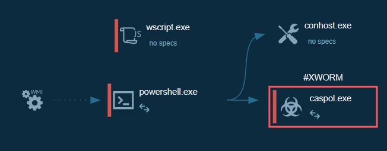

### 9.2 Mutex Confirmation

ANY.RUN observed creation of the mutex: `S9khGfSNXLADIvc2`

This confirms:
- Single-instance enforcement
- The exact cryptographic seed used for config decryption
- Correct attribution of the AES routine to the mutex

### 9.3 Network Behavior

Active TCP communication observed:
- Custom protocol in use
- Encrypted traffic consistent with XWorm
- No browser-based network artifacts

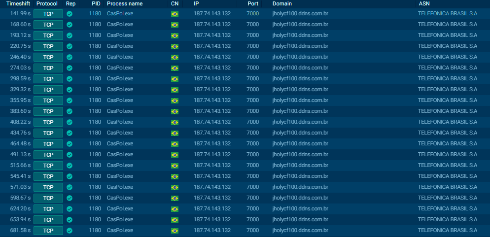

This behavior directly matches the decrypted configuration: `jholycf100.ddns.com.br:7000`

### 9.4 Runtime Characteristics

- High-frequency event and mutex operations
- Persistent background execution
- Aggressive beaconing behavior consistent with a 3-second sleep interval

ANY.RUN successfully captured PCAPs, memory dumps, and session data, enabling full traffic reconstruction if required.

## 10. Command and Control Characteristics

| Feature | Value |
|---------|-------|
| RAT Family | XWorm |
| Version | 5.6 |
| C2 | jholycf100.ddns.com.br |
| Port | 7000 |
| Protocol | Custom TCP |
| Encryption | AES |
| Beacon Interval | 3 seconds |

The `<Xwormmm>` string is used as a packet delimiter in network traffic.

## 11. Attribution Confidence

The following features conclusively identify this malware as XWorm v5.6:

- Mutex-derived AES config crypto
- `<Xwormmm>` splitter
- USB propagation naming
- Reversed Base64 payload delivery
- Cloud infrastructure abuse
- Port 7000 default


## 12. Full Infection Chain

```
Fake PDF (.js)
  ↓
WSH JavaScript dropper
  ↓
PowerShell (UTF-16 Base64)
  ↓
Cloudinary fake JPG
  ↓
Reversed Base64 .txt
  ↓
Caspol.exe Process Hollowing  
  ↓
XWorm v5.6 RAT
  ↓
C2: jholycf100.ddns.com.br:7000
```
**Key Event Sequence:**

1. Initial Delivery: The vector is a .zip file containing the malicious script, forcing a manual unpacking step to evade email gateway scanners.

2. Loader Execution: wscript.exe launches a hidden instance of PowerShell.

3. Process Hollowing/Injection: PowerShell does not execute the payload directly; it injects the malicious code into the legitimate process (Code Access Security Policy Tool).
```
C:\Windows\Microsoft.NET\Framework\v4.0.30319\CasPol.exe
```

4. Masquerading: All subsequent C2 traffic originates from the signed CasPol.exe process, attempting to blend in with the background noise of trusted Microsoft processes.


## 13. Indicators of Compromise (IOCs)

### Network

- `jholycf100.ddns.com.br` (C2 Domain)
- 187.74.143.132 (C2 IP)
- TCP port `7000`
- Payload delimiter: `<Xwormmm>`
- Stage 1 URL: `https://res.cloudinary.com/dbjtzqp4q/image/upload/v1767455040/optimized_MSI_lpsd9p.jpg`
- Stage 2 URL: `https://lerlivroson.com.br/arquivo_20260108133005.txt`


### Host Based Indicators

- Mutex: `S9khGfSNXLADIvc2`
- PowerShell `Assembly.Load`
- Suspicious Process Tree: wscript.exe → powershell.exe → CasPol.exe (Network connection initiated by CasPol.exe is highly anomalous).
- Cloudinary abuse
- Reversed Base64 `.txt` payloads
- Comprovante-Mercado-Pago-08012026--5560--0054--9892 -16084pdf.js (Dropper (JS), Dynamic Extraction)
- Payload SHA256: ```7befeacf0b3480fb675d0cab7767b5b9697edc9d0e05982025a06ead0054afd5```
- StartupProfileData (PowerShell artifact dropped during execution).

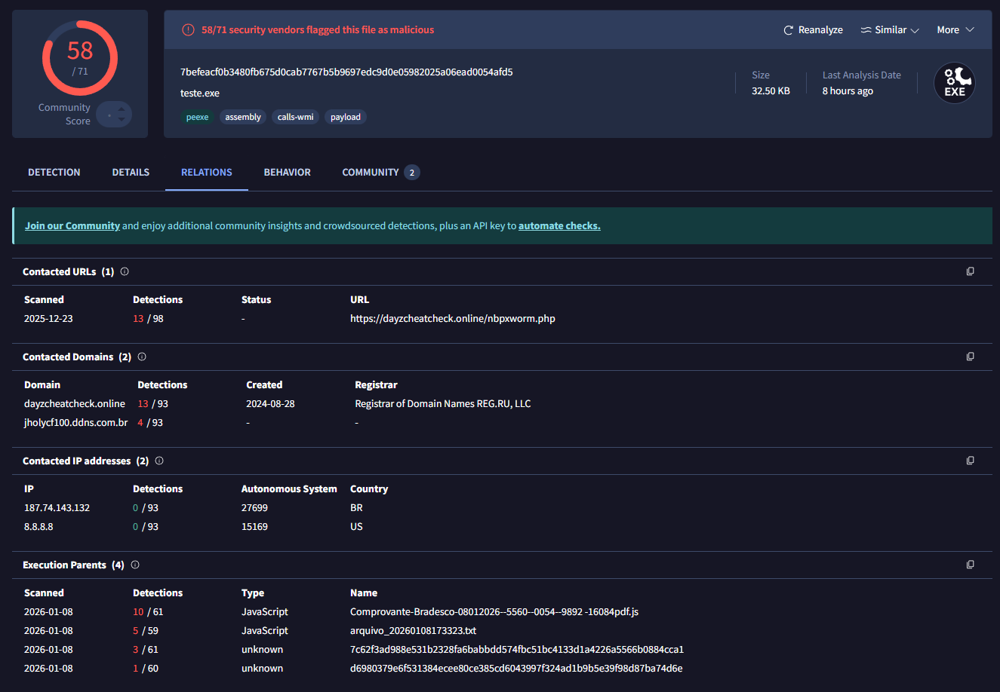

>Note: Using CasPol.exe for evasion is an interesting touch of "minimal effort," but the infrastructure (home DDNS and hacked WordPress site) can tell us that the attacker is an "amateur" operator. Blocking the DDNS domain and port 7000 kills the campaign instantly.

## 14. Detection Opportunities – YARA Rules

The following YARA rules were developed to detect the JavaScript dropper, PowerShell loader behavior, and the final XWorm v5.6 PE payload observed in this campaign. The rules prioritize high confidence and low false positives, leveraging stable family-specific artifacts rather than brittle indicators.

### 14.1 YARA – JavaScript Dropper (WSH)

This rule targets the initial JavaScript loader, focusing on Windows Script Host abuse, PowerShell invocation, and Unicode-based obfuscation used to conceal embedded Base64 payloads.

```yara
rule XWorm_JS_PowerShell_Dropper
{
    meta:
        description = "XWorm JavaScript dropper using Unicode-obfuscated Base64 and PowerShell loader"
        author = "0xOlympus"
        family = "XWorm"
        stage = "JS Dropper"
        confidence = "high"

    strings:
        // WSH primitives
        $wsh1 = "WScript.ScriptFullName" ascii
        $wsh2 = "ActiveXObject(\"Scripting.FileSystemObject\")" ascii
        $wsh3 = "WScript.Shell" ascii

        // PowerShell execution
        $ps1 = "powershell -NoProfile -WindowStyle Hidden" ascii
        $ps2 = "Invoke-Expression" ascii

        // Unicode / emoji obfuscation indicators
        $uni1 = /[\\u0E00-\\u2FFF]{5,}/ wide
        $uni2 = /[\x{1F300}-\x{1FAFF}]/ wide

        // Financial lure context
        $lure1 = "Comprovante" ascii nocase
        $lure2 = "pdf" ascii nocase

    condition:
        uint16(0) != 0x5A4D and
        2 of ($wsh*) and
        1 of ($ps*) and
        ( $uni1 or $uni2 ) and
        any of ($lure*)
}
```

**Note:**  
Unicode junk–based Base64 obfuscation combined with WSH and hidden PowerShell execution is rare in benign JavaScript and provides a strong behavioral signature.

### 14.2 YARA – PowerShell In-Memory Loader (Optional)

This rule is suitable for script content scanning, AMSI telemetry, or sandbox artifacts. It detects the in-memory .NET loading stage.

```yara
rule XWorm_PowerShell_InMemory_Loader
{
    meta:
        description = "XWorm PowerShell loader using Assembly.Load and Base64"
        author = "0xOlympus"
        family = "XWorm"
        stage = "PowerShell Loader"

    strings:
        $b64 = "FromBase64String" ascii
        $asm1 = "Reflection.Assembly" ascii
        $asm2 = "Assembly]::Load" ascii
        $net = "System.Net.WebClient" ascii

        $marker1 = "BaseStart-" ascii
        $marker2 = "-BaseEnd" ascii
        $img = ".jpg" ascii

    condition:
        all of ($b64, $net) and
        1 of ($asm*) and
        ( ($marker1 and $marker2) or $img )
}
```

**Note:**  
This captures the fileless loader behavior used to retrieve and execute the .NET payload directly from memory.

### 14.3 YARA – XWorm v5.6 PE Payload

This rule targets the final XWorm RAT binary, using protocol and cryptographic fingerprints that are stable across XWorm versions.

```yara
rule XWorm_PE_v56
{
    meta:
        description = "XWorm RAT v5.6 .NET payload"
        author = "0xOlympus"
        family = "XWorm"
        version = "5.6"
        confidence = "very high"

    strings:
        // Protocol splitter (strong family fingerprint)
        $splitter = "<Xwormmm>" ascii

        // Cryptographic implementation
        $crypto1 = "RijndaelManaged" ascii
        $crypto2 = "MD5CryptoServiceProvider" ascii
        $crypto3 = "CipherMode.ECB" ascii

        // Network functionality
        $net1 = "System.Net.Sockets" ascii
        $net2 = "NetworkStream" ascii

    condition:
        uint16(0) == 0x5A4D and
        filesize < 5MB and
        $splitter and
        2 of ($crypto*) and
        1 of ($net*)
}
```

**Note:**  
The `<Xwormmm>` splitter combined with AES-ECB + MD5 key derivation provides a near-unique signature for XWorm, resulting in very low false-positive risk.

### 14.4 Campaign-Specific Mutex Rule (Hunting)

This rule is intended for retro-hunting or incident response and should not be used for generic detection.

```yara
rule XWorm_Mutex_S9khGfSNXLADIvc2
{
    meta:
        description = "XWorm campaign-specific mutex"
        family = "XWorm"
        confidence = "very high"

    strings:
        $mutex = "S9khGfSNXLADIvc2" ascii

    condition:
        uint16(0) == 0x5A4D and
        $mutex
}
```

### Detection Coverage Summary

| Stage | Rule |
|-------|------|
| Initial Access | `XWorm_JS_PowerShell_Dropper` |
| Fileless Loader | `XWorm_PowerShell_InMemory_Loader` |
| Final Payload | `XWorm_PE_v56` |
| Campaign Hunt | `XWorm_Mutex_S9khGfSNXLADIvc2` |

### 14.5 MITRE ATT&CK Mapping (Per Detection Rule)

The following mappings align each YARA rule with observed adversary techniques based on static and dynamic analysis.

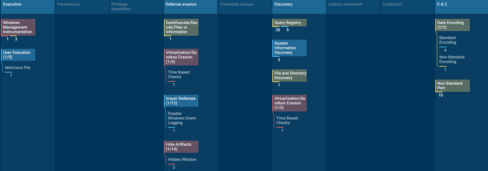

#### XWorm_JS_PowerShell_Dropper

| Tactic | Technique | ID |
|--------|-----------|-----|
| Initial Access | User Execution: Malicious File | T1204.002 |
| Defense Evasion | Obfuscated / Encrypted File | T1027 |
| Execution | Command and Scripting Interpreter: JavaScript | T1059.007 |
| Execution | Command and Scripting Interpreter: PowerShell | T1059.001 |

**Explanation:**  
The JavaScript dropper relies on user execution of a masqueraded file, uses heavy Unicode obfuscation, and spawns PowerShell to transition into the next stage.

#### XWorm_PowerShell_InMemory_Loader

| Tactic | Technique | ID |
|--------|-----------|-----|
| Execution | PowerShell | T1059.001 |
| Defense Evasion | Reflective Code Loading | T1620 |
| Defense Evasion | Fileless Execution | T1027.004 |
| Command and Control | Application Layer Protocol | T1071 |

**Explanation:**  
The PowerShell loader downloads encoded payloads and executes a .NET assembly directly from memory using `Assembly.Load`, avoiding disk artifacts.

#### XWorm_PE_v56

| Tactic | Technique | ID |
|--------|-----------|-----|
| Execution | Command and Scripting Interpreter: .NET | T1059.003 |
| Persistence | Boot or Logon Autostart Execution (optional modules) | T1547 |
| Defense Evasion | Masquerading | T1036 |
| Defense Evasion | Use of Legitimate Tools (LOLBIN – CasPol.exe) | T1218 |
| Command and Control | Custom Command and Control Protocol | T1094 |
| Command and Control | Encrypted Channel | T1573 |

**Explanation:**  
The final payload abuses legitimate .NET components (CasPol.exe) and uses a custom AES-encrypted protocol over raw TCP.

#### XWorm_Mutex_S9khGfSNXLADIvc2

| Tactic | Technique | ID |
|--------|-----------|-----|
| Defense Evasion | Indicator Removal / Single Instance Execution | T1070 |
| Execution | Mutex for Runtime Control | T1116 |

**Explanation:**  
The mutex prevents multiple executions and doubles as cryptographic material, enabling both runtime control and config protection.

## 15. Detection & Mitigation

This section provides actionable defensive recommendations derived directly from observed attacker behavior.

### 15.1 Email & Initial Access Prevention

**Detection**

- Block attachments with double extensions (e.g., `.pdf.js`)
- Flag JavaScript attachments originating from email
- Alert on Brazilian financial lures (Comprovante, Mercado Pago)

**Mitigation**

- Disable Windows Script Host where not required
- Enforce file extension visibility
- Apply attachment sandboxing for `.js`, `.vbs`, `.hta`

### 15.2 PowerShell & Script Monitoring

**Detection**

Alert on:

- `powershell.exe -WindowStyle Hidden`
- `Invoke-Expression`
- `FromBase64String`
- `Assembly::Load`

**Mitigation**

- Enable AMSI
- Enable PowerShell Script Block Logging
- Restrict PowerShell to Constrained Language Mode for non-admin users

### 15.3 Fileless & LOLBIN Abuse

**Detection**

Monitor suspicious execution of:

```
C:\Windows\Microsoft.NET\Framework\v4.0.30319\CasPol.exe
```

Alert on .NET assemblies loaded without corresponding files on disk

**Mitigation**

- Apply AppLocker / WDAC rules to restrict LOLBIN execution
- Monitor child processes spawned by scripting engines

### 15.4 Network-Based Detection

**Detection**

Alert on outbound TCP connections to:

- Port 7000
- DDNS domains

Inspect payloads for delimiter:

```
<Xwormmm>
```

**Mitigation**

- Block unused outbound ports
- Enforce DNS logging and anomaly detection
- Use IDS rules for known XWorm protocol markers

### 15.5 Endpoint & Incident Response

**Detection**

Hunt for mutex:

```
S9khGfSNXLADIvc2
```

- Look for reversed Base64 blobs in `.txt` downloads
- Identify Cloudinary CDN abuse with non-image MIME content

**Mitigation**

- Isolate infected endpoints immediately
- Reset credentials used on affected hosts
- Perform memory forensics (payload is fileless)

### 15.6 Strategic Defensive Insight

This campaign highlights a recurring theme in commodity malware:

**Weak cryptography and operational shortcuts create durable detection opportunities.**

Despite layered obfuscation, XWorm's:

- Stable mutex usage
- Predictable crypto design
- Reused protocol delimiters

…make it highly amenable to retrohunting, behavioral detection, and proactive blocking once properly analyzed.

## 16. Conclusion

This analysis demonstrates a complete end-to-end compromise chain delivering XWorm RAT v5.6, combining social engineering, script-based loaders, fileless execution, and weak cryptographic design. While the attack leverages multiple layers of obfuscation and trusted infrastructure abuse, it ultimately relies on commodity tradecraft rather than novel techniques.

The infection chain illustrates how relatively simple components—JavaScript executed via Windows Script Host, PowerShell in-memory loading, and cloud-hosted payload staging—can be composed into an effective delivery mechanism capable of bypassing superficial security controls. The use of legitimate services such as Cloudinary and trusted Windows binaries like CasPol.exe further reduces friction during execution, highlighting the continued effectiveness of living-off-the-land techniques in modern malware campaigns.

From a reverse engineering perspective, the malware's cryptographic implementation represents a critical operational weakness. The use of MD5-derived keys and AES in ECB mode, combined with a static mutex reused across execution and configuration protection, renders the configuration trivially recoverable through static analysis alone. This design flaw collapses the intended secrecy of the attacker's infrastructure and enables reliable attribution, retro-hunting, and proactive detection without the need for live execution or C2 interaction.

Dynamic analysis performed with ANY.RUN fully corroborated the static findings, confirming fileless execution, mutex usage, and active command-and-control communication consistent with the decrypted configuration. The tight alignment between static reverse engineering and runtime behavior underscores the stability of XWorm's internal architecture and its reliance on predictable implementation patterns.

From a defensive standpoint, this campaign reinforces an important lesson: complex-looking loader chains do not necessarily imply sophisticated malware. Despite multiple stages and obfuscation layers, XWorm exposes durable fingerprints across the filesystem, memory, network traffic, and cryptographic routines. These characteristics make it well-suited for detection using a combination of YARA rules, behavioral monitoring, and network inspection, particularly when defenders focus on technique-level indicators rather than superficial signatures.

In summary, this case represents a mature example of low-sophistication but highly reusable malware, effective against unprepared environments yet fragile under thorough analysis. The weaknesses identified—especially in cryptographic design and operational discipline—provide defenders with significant leverage to detect, disrupt, and attribute similar XWorm campaigns at scale.

Full behavioural analysis with ANY.RUN, can be found here: https://app.any.run/tasks/9432b29d-b8be-452b-8347-8af9b5d4430f