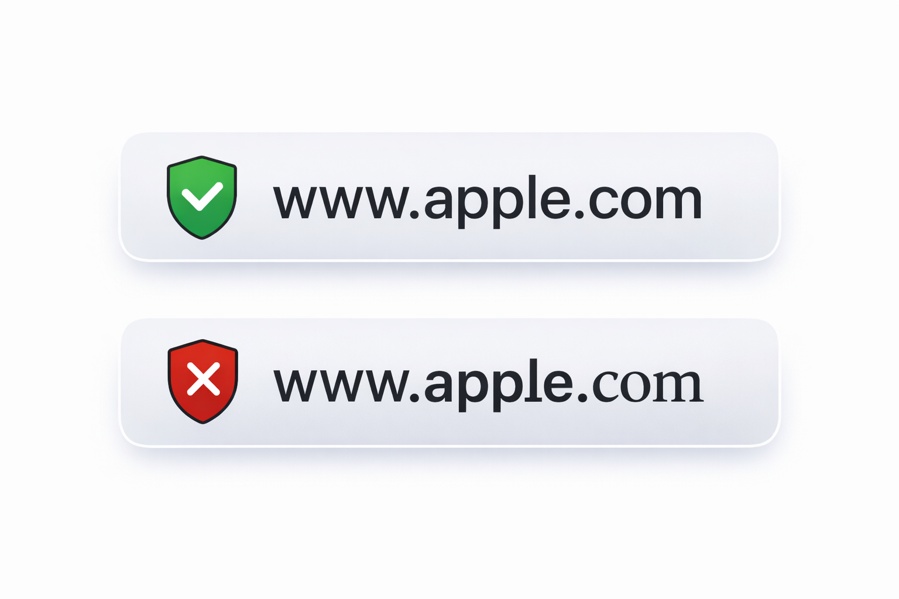

## Executive Summary

Modern phishing no longer depends on obvious mistakes or poorly written messages. In many cases, it exploits something far more subtle: **the way the human brain interprets text**.

A recent real-world example involving Apple illustrates this perfectly. An experienced developer, with more than a decade of daily exposure to official Apple emails and workflows, nearly fell for a highly convincing phishing message.

The core of the attack was the use of **Cyrillic characters in domain names**, a technique commonly referred to as an **IDN Homograph Attack**.

---

## The “Almost Perfect” Domain Trick

At first glance, the sender’s domain appeared completely legitimate. It followed the expected visual pattern and raised no immediate suspicion.

The difference only became apparent after carefully inspecting the domain **character by character**.

The attacker replaced a Latin character with its visually identical Cyrillic counterpart:

- Latin “a” → `a`
- Cyrillic “a” → `а`

To the human eye, there is virtually no visible difference.  
To the Domain Name System (DNS), however, these are **entirely different characters**, and the domain belongs to the attacker.

This attack does not exploit a technical flaw — it exploits **human perception**.

---

## Subtle Indicators That Revealed the Phishing Attempt

Even highly convincing phishing messages often share subtle behavioral patterns that can raise suspicion upon closer analysis:

- They frequently avoid mentioning the recipient’s name  
- They rarely reference specific applications, accounts, or ongoing processes  
- The content tends to remain intentionally generic, while still using brand-consistent terminology  

This balance is deliberate. By avoiding specificity, attackers reduce the risk of factual errors. Their objective is not accuracy, but the careful manipulation of **trust and timing**.

---

## Why Cyrillic Phishing Is So Dangerous

Cyrillic (homograph) phishing works because:

- Humans read words as **visual shapes**, not as encoded characters  
- Browsers may display Unicode domains without clear warnings  
- HTTPS and valid TLS certificates create a false sense of security  

If an attack like this can cause hesitation in a seasoned professional, it can easily deceive less experienced users.

---

## Conclusion

This case demonstrates how phishing has evolved. Today, simply “glancing” at a link or trusting the browser’s padlock icon is no longer enough.

Unicode homograph attacks are:
- Silent  
- Low-cost  
- Highly effective  

As these techniques become more common, detection must go beyond human attention alone. **Awareness, domain policies, and proper security tooling** are essential to reduce this risk.

