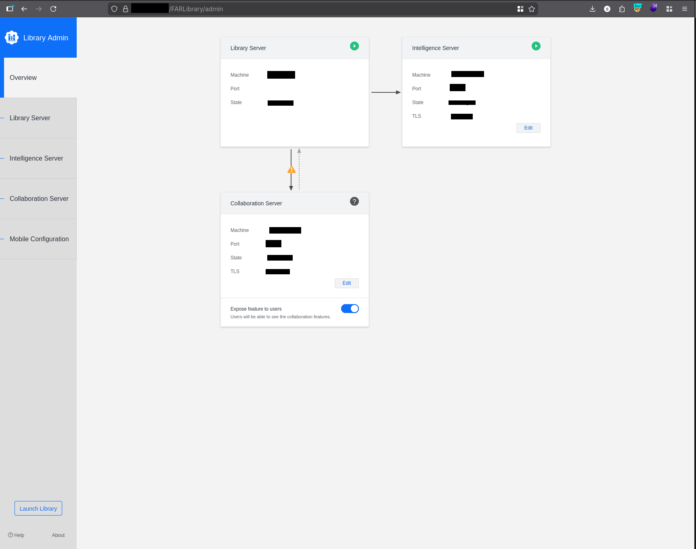

## Executive Summary

During a recent security assessment of a major target, I identified an exposed administrative interface for **MicroStrategy Library**. The endpoint was accessible over the public internet and protected only by factory-default credentials. 

By logging in as `admin:admin`, I gained full control over the Business Intelligence (BI) environment, including the ability to manipulate data servers, expose internal network topology, and potentially perform lateral movement via SSRF. This finding was triaged as **CVSS 10.0 (Critical)**.

**CVSS:3.1/AV:N/AC:L/PR:N/UI:N/S:C/C:H/I:H/A:H**

---

## Initial Discovery

While performing reconnaissance on the target's subdomains, I identified a web application running on an unusual path: `/FARLibrary/admin`. 

Standard fingerprinting confirmed this was a **MicroStrategy Library Administration Control Panel**. In a hardened environment, this interface should be restricted to internal VPNs or protected by Multi-Factor Authentication (MFA). However, this instance was directly reachable from the WAN.

---

## Technical Analysis

### 1. The Entry Point

Using standard credential testing, I attempted common default pairs. 
The combination `admin:admin` granted immediate access:
```http
POST /FARLibrary/admin/auth HTTP/1.1
Host: [REDACTED]
Content-Type: application/x-www-form-urlencoded

username=admin&password=admin
```

**Response:** `HTTP/1.1 302 Found` → Redirected to admin dashboard

The most basic security check—testing for default credentials—proved successful. Many enterprise systems are deployed with "ready-to-use" accounts that are often overlooked during the hardening phase.


- **Username:** `admin`
- **Password:** `admin`

The system granted immediate, unauthenticated access to the **Library Admin Dashboard** with full administrative privileges.

*Figure 1: Successful login showing server statuses and internal configuration options.*

#### Attack Flow
```
Recon → Code Source → Default Creds → Admin Panel → Full BI Access → Data Exfil / SSRF / DoS
```

### 2. Impact Breakdown (CVSS 10.0)

The severity of this finding is absolute due to the following factors:



*   **Confidentiality:** Access to all financial and strategic reports managed by the BI tool. Furthermore, internal IP addresses (e.g., `10.1▋▋.▋▋.▋▋▋`) were exposed, facilitating further internal reconnaissance.
*   **Integrity:** The dashboard allows administrators to edit "Intelligence Server" and "Collaboration Server" configurations. An attacker could modify connection strings to point to malicious endpoints or perform **Server-Side Request Forgery (SSRF)**.
*   **Availability:** An attacker could simply disconnect or shutdown the reporting services, causing a total blackout of the company's strategic data flow.

---

## Indicators of Compromise (IOCs) & Evidence


| IOC Type | Value | Notes |
|----------|-------|-------|
| Vulnerable Endpoint | `https://[REDACTED]/FARLibrary/admin` | Publicly accessible |
| Internal IP Range | `10.1██.██.███` | Intelligence Server |
| Service Ports | `1337`, `1337` | Non-standard ports |
| User Agent | MicroStrategy Library v11.x | Fingerprinted via headers |
| Default Account | `admin:admin` | Factory credentials active |
---

## Lessons Learned

**For Security Teams:**
- Default credentials should be changed during installation
- Administrative interfaces must never be exposed to the internet
- Implement network-level access controls (VPN/IP whitelisting)

**For Researchers:**
- Always test basic misconfigurations first
- Out-of-scope assets with critical flaws may still be accepted
- Document everything - even "simple" findings need proper writeups

## Responsible Disclosure & Remediation

Even though the asset was technically **Out of Scope (OOS)**, the critical nature of the flaw led the organization to accept the report under an **Exceptional** status. 

**Recommended Fixes:**
1.  **Change Default Credentials:** Immediately rotate all administrative passwords.
2.  **Network Segregation:** Restrict access to the `/admin` path to authorized internal IP ranges or via a corporate VPN.
3.  **Audit Logs:** Review access logs for the `admin` account to ensure no malicious activity occurred prior to this report.

---

## Conclusion

This case reinforces the "back-to-basics" principle in security research. While sophisticated exploits are impressive, simple misconfigurations like default credentials remain one of the most effective vectors for compromising large-scale enterprise infrastructures.

## References

- [OWASP Top 10 - A07:2021 Identification and Authentication Failures](https://owasp.org/Top10/A07_2021-Identification_and_Authentication_Failures/)
- [CWE-798: Use of Hard-coded Credentials](https://cwe.mitre.org/data/definitions/798.html)