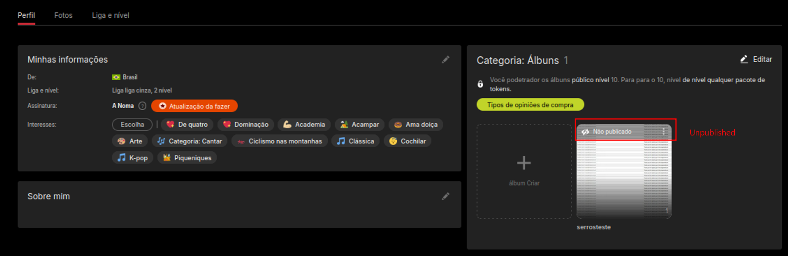
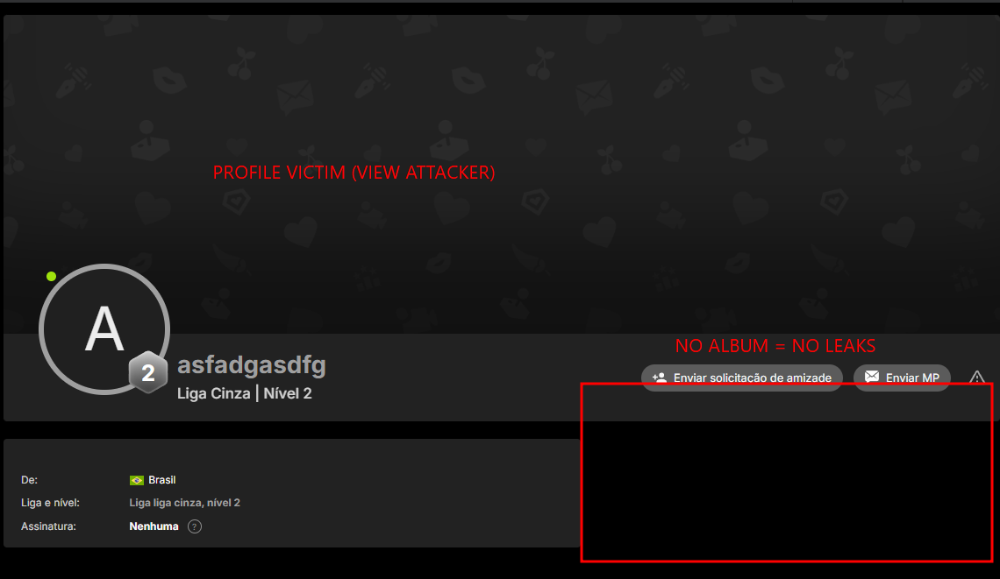
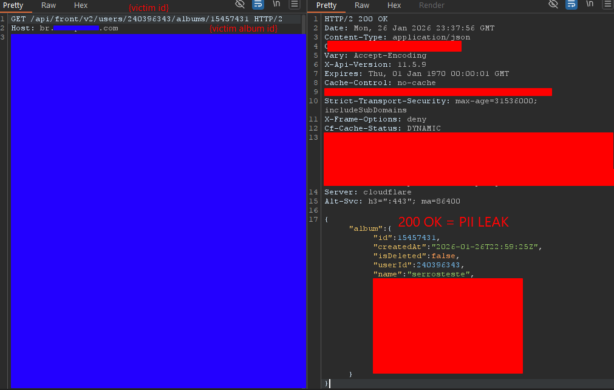

## Executive Summary

Broken Access Control is one of the most common classes of vulnerabilities in web applications. It occurs when an application fails to properly enforce what an authenticated user is allowed to access or modify.

One of the most common manifestations of this problem is **Insecure Direct Object Reference (IDOR)**.

> An application exposes a direct reference to an object — a user ID, album ID, document ID, or order ID — but fails to verify whether the current user is authorized to access that object.

This article dissects an IDOR vulnerability affecting the API of a real-world application. The vulnerable functionality involved **private/unpublished photo albums**. Although the web interface correctly prevented other users from seeing these albums, the backend API did not enforce the same restriction.

This post covers:

- What IDOR is and how it works
- Common IDOR/BOLA patterns
- How to identify potential IDORs during reconnaissance
- A practical case study involving a private album API
- The reasoning process behind the discovery
- Comparison with real-world IDOR and access-control reports from other researchers
- Detection and mitigation strategies

> **Note:** This case is based on a vulnerability disclosed through a responsible/coordinated process. Session tokens, cookies, and other identifying material have been fully redacted or replaced with placeholders.

---

## Theory

### What is IDOR?

**Insecure Direct Object Reference (IDOR)** occurs when an application uses a user-controllable identifier to reference an internal object but does not properly verify whether the requesting user is authorized to access that object.

Consider an API such as:

```http
GET /api/users/123/profile
```

If user `123` is the authenticated user, everything works as expected. But what happens when the identifier is changed?

```http
GET /api/users/124/profile
```

If the server returns user `124`'s private information without verifying authorization, there's an access-control vulnerability.

The important part isn't that the identifier *can be changed* — it's that **the server trusts the identifier without performing the necessary authorization check**.

### IDOR is an Authorization Problem, Not an "ID Problem"

A common misconception is that IDOR means "I changed an ID and got another object."

Changing an ID is only the **test**.

The actual vulnerability is:

```text
Attacker-controlled identifier
        ↓
Backend lookup
        ↓
Missing authorization check
        ↓
Unauthorized object returned
```

A secure implementation performs an authorization decision before returning the object:

```javascript
album = database.getAlbum(album_id)

if album.owner_id != authenticated_user.id:
    return 403 Forbidden

return album
```

### IDOR vs Broken Access Control vs BOLA

* **Broken Access Control** is the broader category — any failure to properly enforce authorization rules, including unauthorized object access, privilege escalation, role bypass, and similar failures.
* **IDOR** is a common manifestation of Broken Access Control, where a direct object reference can be manipulated by the user.
* **BOLA (Broken Object Level Authorization)** is the terminology commonly used in API security to describe authorization failures involving individual objects.

In practice, IDOR remains one of the most widely recognized terms for this pattern, while BOLA is especially useful when discussing API-specific object authorization failures.

### Common IDOR Variations

| Operation        | Example                                                        | Risk                                                                                 |
| ---------------- | -------------------------------------------------------------- | ------------------------------------------------------------------------------------ |
| Read             | `GET /api/users/100/orders/500` → `501`                        | Data disclosure                                                                      |
| Modify           | `PUT /api/users/100/profile` (attacker's session, victim's ID) | Unauthorized modification                                                            |
| Delete           | `DELETE /api/documents/500`                                    | Data loss                                                                            |
| Nested resources | `/users/{user_id}/albums/{album_id}`                           | False sense of security — both IDs may exist, but ownership may not be cross-checked |

The nested-resource pattern is exactly what is examined in the case study below.

---

## Practical Laboratory — Private Album IDOR

### Case Study

The functionality analyzed involved a photo album feature. Users could set an album's access mode to **Unpublished** — hiding it from their public profile.

This creates a security assumption worth testing directly:

> If another user cannot see the album through the normal interface, the album should not be accessible to that user through the backend either.

The goal was to determine whether this restriction was enforced only by the frontend, or also by the API.

### Victim Setup

A test album was created and configured as `Unpublished`.



At this point, the album existed but was intentionally not publicly visible.

### Verifying the Access-Control Boundary

Using a separate authenticated account, I navigated to the victim's profile and confirmed the unpublished album was **not visible through the normal UI**.



The frontend appeared to respect the intended privacy model — but that doesn't prove the backend does.

The next question was:

> What happens if the API is accessed directly using the victim's object identifiers?

### Mapping the API

Traffic analysis revealed an endpoint following this pattern:

```http
GET /api/front/v2/users/{user_id}/albums/{album_id} HTTP/2
Host: [REDACTED]
```

Two direct object references in one request — `user_id` and `album_id` — were immediately worth testing for object-level authorization.

### Building the Hypothesis

Authenticated as the attacker account, I replayed the request against the victim's identifiers:

```http
GET /api/front/v2/users/{victim_user_id}/albums/{victim_album_id} HTTP/2
Host: [REDACTED]
Cookie: [REDACTED — attacker's own session]
```

### The Unexpected Response

Instead of a `403 Forbidden` or `404 Not Found`, the API returned:

```http
HTTP/2 200 OK
Content-Type: application/json
```



The response contained the album object:

```json
{
  "album": {
    "id": 15457431,
    "createdAt": "2026-01-26T22:59:25Z",
    "isDeleted": false,
    "userId": 240396343,
    "name": "serrosteste",
    ...
    "accessMode": "unpublished"
  }
}
```

The critical field was `"accessMode": "unpublished"`. The API was returning the album object to an unrelated authenticated user even though the album was configured as unpublished.

### Why This Is an IDOR

```text
Session owner ≠ Object owner
```

Yet the object was still returned.

The vulnerability isn't that `album_id` is guessable — it's that the backend failed to enforce **object-level authorization** when serving the requested object.

### UI Authorization vs API Authorization

This case illustrates a principle that generalizes to almost every modern web application:

| Layer         | Behavior                             |
| ------------- | ------------------------------------ |
| Web interface | Private album correctly hidden       |
| API           | Private album returned with `200 OK` |

> A resource being hidden from the UI does not mean access to the resource is properly authorized. The backend must enforce authorization independently.

### Methodology

```text
1. Create private object
2. Identify object ID
3. Authenticate as a second, unrelated account
4. Confirm object is hidden in the UI
5. Locate the underlying API request
6. Replace target identifiers with the victim's
7. Observe the server's response
8. Compare the returned object against the victim's actual object
```

This methodology generalizes to any endpoint exposing user-owned resources: `/orders/{id}`, `/documents/{id}`, `/messages/{id}`, `/projects/{id}`.

The question is always the same:

> **Does the server verify that the current user is allowed to access this specific object?**

---

## Impact

The direct impact was unauthorized disclosure of private album metadata: ID, owner ID, name, description, access mode, and other attributes — even though photo content itself was not retrieved in this specific request.

### Privacy Implications

Metadata alone can be sensitive. An album name could reveal information about the user's activity, relationships, or private organization of content, even without exposing the underlying files.

### Potential Enumeration

Numeric, sequential object identifiers raise the possibility of scaling the flaw into mass enumeration.

That said, a responsible severity assessment should distinguish between **demonstrated impact** — what was actually confirmed within authorized scope — and **theoretical impact** — what predictable identifiers could potentially enable.

Claiming more than what was tested undermines the credibility of a security report.

---

## Why the Vulnerability Happened

A vulnerable implementation might look conceptually like this:

```javascript
# Vulnerable
album = getAlbum(album_id)
return album
```

The authorization check is missing entirely. A safer implementation would be:

```javascript
# Fixed
album = getAlbum(album_id)

if album.owner_id != authenticated_user.id:
    return 403 Forbidden

return album
```

An even stronger approach is to scope the query itself to the authenticated user:

```sql
-- Vulnerable
SELECT * FROM albums WHERE id = ?

-- Fixed
SELECT * FROM albums WHERE id = ? AND user_id = ?
```

The second form makes the ownership constraint part of the data retrieval itself, rather than relying on a separate authorization step that can be forgotten or bypassed elsewhere.

---

## Real-World Cases

### Case #2 — Unauthorized Account Deletion

IDOR vulnerabilities are not limited to unauthorized data access. When an object reference is accepted without verifying that it belongs to the authenticated user, the same authorization flaw can expose **read, modification, or destructive operations**.

#### Mozilla — Firefox Accounts

This case demonstrates the **delete** variant of the authorization flaw.

The vulnerable endpoint was:

```http
POST /v1/account/destroy
```

The server failed to verify that the session performing the deletion belonged to the account specified in the request. As a result, an authenticated attacker could use their own session while supplying another user's account information, causing the victim's account to be permanently deleted.

The reporter, **z3phyrus**, submitted the vulnerability to Mozilla on **May 20, 2025**.

During the report's lifecycle, Mozilla initially adjusted the severity while investigating the issue. The reporter later demonstrated that accounts created through Google SSO could be deleted when the victim's email address was known — no access to the victim's credentials required. Mozilla subsequently raised the severity to **High**, noting that the issue allowed deletion of another user's account.

| Field     | Value                                             |
| --------- | ------------------------------------------------- |
| Report ID | [#3154983](https://hackerone.com/reports/3154983) |
| Reporter  | [z3phyrus](https://hackerone.com/z3phyrus)        |
| Program   | [Mozilla](https://hackerone.com/mozilla)          |
| Reported  | May 20, 2025                                      |
| Disclosed | June 3, 2025                                      |
| Weakness  | Insecure Direct Object Reference (IDOR)           |
| Severity  | High                                              |
| CVE       | None                                              |
| Status    | Resolved                                          |

The key takeaway is that an IDOR affecting a **destructive operation** can have substantially greater impact than a read-only IDOR. The missing ownership/session validation did not merely expose another user's data — it allowed an attacker to perform an irreversible action against the victim's account.

[Full Report](https://hackerone.com/reports/3154983)

### Case #3 — High-Impact Privilege Escalation

Privilege escalation demonstrates how an access-control failure can become significantly more severe when it crosses **privilege boundaries**.

#### Shopify — Unrestricted Administrative Account Creation

This case demonstrates the **privilege escalation** variant of an access-control failure.

The vulnerable endpoint was:

```http
POST /users/create_admin
```

A non-privileged user could directly invoke the administrative account creation endpoint using their existing authenticated session. After authenticating, the researcher obtained a request containing cookies and an authenticity token from the `/users/me` endpoint, then modified it to target `/users/create_admin` with the required account creation parameters.

Forwarding the modified request resulted in the successful creation and login of an **administrator account**, granting access to sensitive actions including updating inventory and stock, managing vendors, and placing purchase orders.

The vulnerability was reported by **@stapia** on **June 27, 2021**. Shopify had issued a token that was valid across multiple endpoints — properly scoping that token to the intended endpoint would have prevented it from being accepted by `/users/create_admin`.

| Field               | Value                                        |
| ------------------- | -------------------------------------------- |
| Reported by         | [@stapia](https://hackerone.com/stapia)      |
| Program             | Shopify / Stocky                             |
| Reported            | June 27, 2021                                |
| Vulnerability       | Privilege Escalation / Broken Access Control |
| Vulnerable endpoint | `POST /users/create_admin`                   |
| Initial privilege   | Non-privileged user                          |
| Resulting privilege | Administrator                                |
| Impact              | Unauthorized administrative access           |
| Bounty              | $1,600                                       |
| Fix deployed        | August 25, 2021                              |

A seemingly ordinary authenticated session became a **high-impact compromise** when the application failed to enforce privilege boundaries.

[Full Case Study](https://www.hackerone.com/blog/how-privilege-escalation-led-unrestricted-admin-account-creation-shopify)

### Comparing the Cases

| Case                      | Operation            | Target                       | Impact                             |
| ------------------------- | -------------------- | ---------------------------- | ---------------------------------- |
| Private album (this post) | Read                 | Private album metadata       | Privacy violation                  |
| Case #2                   | Delete               | User account                 | Permanent account deletion         |
| Case #3                   | Privilege escalation | Administrative functionality | Unauthorized administrative access |

> **Lesson:** IDOR is a pattern, not a severity level. The same underlying authorization failure can range from low-impact metadata leakage to destructive actions or administrative compromise.

---

## Detection

### What to Monitor

From a defensive standpoint, detecting IDOR isn't about pattern-matching numeric IDs in URLs — it's about correlating three things:

```text
Authenticated identity + Requested object + Authorization decision
```

Useful log fields include:

```text
user_id = <requester>
requested_object_id = <target>
object_owner_id = <actual owner>
authorization_result = allowed | denied
```

### Indicators

* One account requesting objects belonging to many different owners
* High-volume requests involving sequential object IDs
* Repeated `403` / `404` responses across varying identifiers from the same session
* Object-access patterns inconsistent with the account's normal usage

Logging supports detection — it does not replace the fix. The primary defense remains **server-side, object-level authorization**.

---

## Mitigation

### Server-Side Authorization

**Enforce authorization on every object access**, not just authentication. Scope queries to the authenticated user wherever ownership applies:

```sql
-- Vulnerable
SELECT * FROM albums WHERE id = ?

-- Fixed
SELECT * FROM albums WHERE id = ? AND user_id = ?
```

**Never rely on frontend visibility as a security control.** Hiding a resource in the UI is a UX decision, not an authorization boundary.

### Testing Procedure

Test systematically with two accounts:

```text
1. Create object as Account A (owner)
2. Note the object identifier
3. Authenticate as Account B (unrelated)
4. Request A's object directly via the API
5. Compare the response — should the object be inaccessible?
```

Any endpoint referencing `user_id`, `album_id`, `document_id`, `order_id`, `message_id`, `project_id`, or `file_id` should be treated as a candidate for object-level authorization testing.

---

## Conclusion

IDOR vulnerabilities are deceptively simple — the exploitation technique can be nothing more than changing `123` to `124`. But the underlying security failure can be significant.

The private album case demonstrates a lesson that generalizes well beyond one application:

> A resource being hidden from the UI does not mean it is protected. The backend must independently verify that the authenticated user has permission to access the requested object.

The Mozilla case demonstrates how the same class of authorization failure can affect **destructive actions**, allowing an attacker to delete another user's account. The Shopify case demonstrates how an access-control failure can cross a **privilege boundary**, turning a regular authenticated session into administrative access.

When testing APIs, any user-controllable identifier should immediately raise one question:

> **Can this specific user actually access this specific object?**

That question — not simply "can I change the ID?" — is the core of testing for IDOR and BOLA.

---

## References

* [OWASP — Broken Access Control](https://owasp.org/www-community/Broken_Access_Control)
* [OWASP API Security Top 10 — API1:2023 Broken Object Level Authorization](https://owasp.org/API-Security/editions/2023/en/0xa1-broken-object-level-authorization/)
* [PortSwigger Web Security Academy — Access Control](https://portswigger.net/web-security/access-control)
* [Case #2 — Mozilla / HackerOne Report #3154983](https://hackerone.com/reports/3154983)
* [Case #3 — HackerOne: How Privilege Escalation Led to Unrestricted Admin Account Creation on Shopify](https://www.hackerone.com/blog/how-privilege-escalation-led-unrestricted-admin-account-creation-shopify)